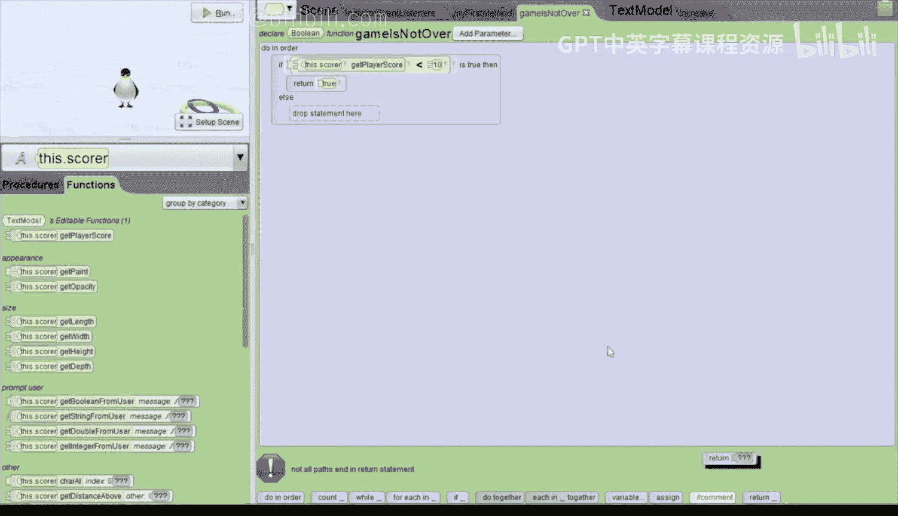

# 爱丽丝编程与动画入门：104_06_04：带计分器的点击企鹅街机游戏 🐧🎮

## 概述
在本节课中，我们将学习如何为“点击企鹅”游戏添加一个计分系统。我们将修改现有游戏，使其目标变为在规定时间内点击10只企鹅，并实时显示玩家的得分。通过本教程，你将掌握在Alice中创建和更新分数显示、使用变量追踪状态以及修改游戏循环逻辑的方法。

---

## 第一步：创建分数显示 📊

上一节我们完成了基础的点击企鹅游戏。本节中，我们首先需要创建一个视觉上的分数显示器。

以下是创建分数显示的步骤：

1.  点击 `setup scene` 按钮进入场景设置。
2.  点击 `Shapes` 选项卡下的 `text` 标签。
3.  将一个 `text` 模型拖拽到屏幕的右下角区域。
4.  将这个文本模型命名为 `score`。
5.  将文本的 `paint` 颜色从白色改为蓝色，以便在雪地场景中清晰显示。
6.  将文本的 `value` 设置为自定义字符串 `0`。
7.  由于游戏运行时摄像机会切换到俯视角度，我们需要让分数牌旋转。添加一个指令，让 `score` 向后旋转 `1/4` 圈。
8.  最后，将分数牌的位置调整到合适的地方，确保它不会与企鹅重叠。

## 第二步：添加分数变量 🧮

创建了显示分数的文本后，我们需要一个变量来在后台追踪玩家的实际得分。

以下是添加分数变量的步骤：

1.  点击 `edit code` 返回代码编辑界面。
2.  点击 `scene` 选项卡。
3.  选中我们刚刚创建的 `score` 文本模型。
4.  为它添加一个属性（property）。
5.  将属性类型设置为 `whole number`（整数）。
6.  确保勾选 `variable` 选项，因为我们需要在游戏过程中改变这个值。
7.  将变量命名为 `playerScore`。
8.  将其初始值设置为 `0`。

## 第三步：编写增加分数的程序 📈

现在，我们需要创建一个程序（procedure），每当玩家点击一只企鹅时，这个程序就会被调用，用于增加分数并更新显示。

以下是编写 `increase` 程序的步骤：

1.  点击黄色的六边形（创建程序按钮）。
2.  选择 `score` 文本模型，然后为其添加一个新的程序。
3.  将程序命名为 `increase`。
4.  在程序内，首先拖入一个 `do in order` 指令块。
5.  在 `do in order` 块内，首先设置 `playerScore` 的值。使用 `set` 指令，将其值设为 `playerScore + 1`。这可以通过调用 `math` 操作中的加法来实现。
6.  接着，更新屏幕上的分数显示。拖入一个 `set value` 指令，将文本的值设置为一个空字符串。
7.  然后，点击下拉菜单，选择 `append` 操作，并附加 `playerScore` 这个整数变量。这样就将后台的分数变量显示在了屏幕上。

## 第四步：修改鼠标点击事件 🖱️

我们已经有了增加分数的程序，现在需要修改游戏逻辑，让点击企鹅的动作触发分数增加，而不是将企鹅变红。

以下是修改鼠标点击事件的步骤：

1.  点击 `initialize event listeners` 选项卡。
2.  找到当前的 `mouse clicked` 事件。
3.  将其中“将企鹅涂成红色”的指令拖到垃圾桶删除。
4.  将事件对象从 `penguin` 改为 `this score`。
5.  将我们刚刚创建的 `increase` 程序拖入到鼠标点击事件中。

## 第五步：修改游戏循环条件 🔄

游戏的核心循环需要改变。原来的条件是“至少有一只企鹅是白色的”，现在我们需要将其改为“游戏尚未结束”，即分数未达到10分。

以下是修改游戏循环的步骤：

1.  首先，我们需要创建一个新的场景函数来判断游戏是否结束。点击 `scene`，创建一个名为 `gameIsNotOver` 的新函数，返回类型为 `Boolean`。
2.  在这个函数中，使用一个 `if/else` 语句。
3.  在 `if` 条件中，判断 `this score` 的 `playerScore` 属性是否小于 `10`。
4.  如果小于10，则返回 `true`（游戏未结束）。
5.  否则，返回 `false`（游戏已结束）。
6.  完成函数后，回到 `my first method` 中的 `while` 循环。
7.  将循环条件从原来的函数替换为我们新建的 `gameIsNotOver` 函数。

## 第六步：测试与调整 🧪

现在，让我们运行游戏进行测试。点击 `Run` 按钮，尝试点击企鹅。你会发现分数会随着点击而增加，当点击满10次后，游戏循环结束。

测试中可能会发现一些小问题，例如：
*   分数牌的位置可能仍会被企鹅遮挡，可以返回 `setup scene` 微调其位置。
*   玩家如果点击速度极快，可能对同一只企鹅进行双击，导致分数意外增加两次。
*   在点击满10次后，玩家可能仍能继续点击企鹅。

你可以思考如何修复这些细微的漏洞，例如通过事件处理或增加状态检查来完善游戏逻辑。

---

## 总结
本节课中，我们一起学习了如何为Alice游戏添加一个完整的计分系统。我们创建了分数显示器，添加了用于追踪得分的变量，编写了更新分数的程序，并修改了事件和游戏循环条件，使游戏目标转变为积累分数。这些是构建交互式游戏的基础技能，你可以将这些概念应用到更复杂的游戏开发中去。