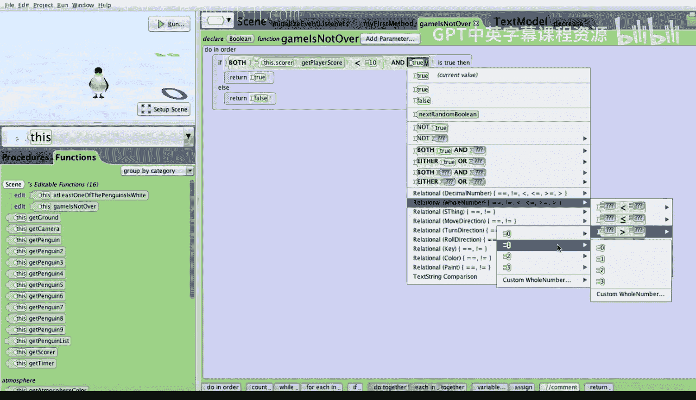
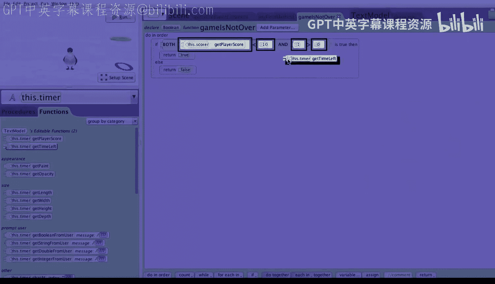
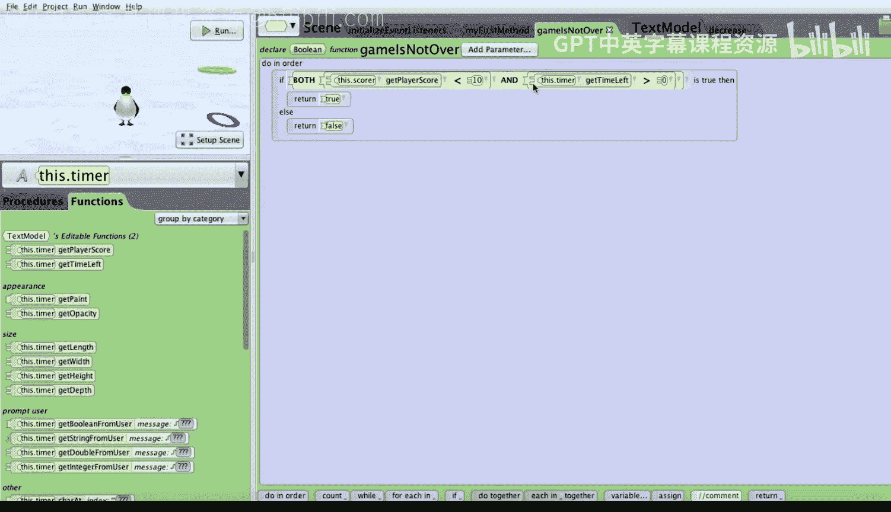

# 杜克大学《爱丽丝编程与动画入门｜Introduction to Programming and Animation with Alice》中英字幕 p106 106_06_06_带计分器和计时器的点击企鹅街机游戏.zh_en -BV1QrB6BcEWW_p106-

In this last lesson， we need to make the game complete。

We need to add a timer to only give the player 30 seconds in which to click 10 penguins。

Just as we needed to add a score， we now need to add a timer。

We'll start this project from where we left off last time。

We need to add a timer and we'll follow the same process we did to add a scorer。Well。

 we start by clicking on setup scene。Now we're going to do exactly the same thing we did before。

 So we'll click on the shapes dot text， and then we'll drag a new text model into our scene slightly above。

The score may be right about there。We'll go ahead and name this text model timer。

We'll make its paint color How about a green， It's a nice color and a good contrast and will initialize its value to the string。

30。And I'll go ahead and click on OK。And then we'll click OK again。

The last thing we'll do is just as we did for the zero。

 we'll invoke a one shot to be able to turn the timer backward a quarter revolution。Just like that。

Perfect， next， we'll go ahead and click on， editit code。Then we'll go to the scene。

We'll click on the text model。And just as we did before for the score。

 we'll go ahead and add a text model property。We'll make it， of course。

 a variable because it's going to change。We'll specify it to be a whole number。

We'll name it time left。And we'll initialize it to the custom whole number。30。I'll click on OK。

And okay， to create the property or variable time left。

Let's also create a text model procedure decrease， which decreases the value of time left by one。

So let's go ahead and create a text model。Procedure。Decrease。

And decrease will be quite similar to the increase we created before。

So we'll start by dragging in a do order。Next， we'll drag in a set time left。

Which will will initially be the time left。And we'll invoke the math。To make it the value， time left。

 minus1。Then just as we did before for the increase。

 we need to do our double bookkeeping where we'll set the value。

We'll chooseCustom text string immediately click on OK， which specifies the null custom text string。

And then we will go ahead and append to the end of this text string， the whole number。Time left。

Great。Next， we need to go ahead and create our event。We click on the initialize Even listeners tab。

We need to create a timer event， namely every second we'd like to decrease the time remaining by one。

Let's go ahead and add click on the Add event listener button。We'll select scene， activation or time。

And we'll go ahead down to select the time listener to add a time listener。

 and we'd like the time listener to run every one second。

This means every second the time or listener procedure will get called。What would we like to do well。

 just decrease the time？So we'll click from this to this dot timer。

And we'll invoke the timer decrease。Procedure。Every single time， basically every single second。

 we still need to make two other changes to our game。

The first is to modify the scene function game is not over。So let's go ahead and click on this。

And then we'll click on the functions。And then we'll choose to edit the game is not over。

The game is not over if the player score is less than 10 and the time left is greater than zero。

So let's go ahead and click on the little triangle next to the right of the bulloleing expression and say what we would like is both this scores player score is less than 10 and it'll choose as a placeholder true。

And just as we did before， we want to specify the time left is bigger than zero。

 so we'll click on the little arrow to the right or the triangle to the right of true and choose relational whole numbers。

And we want to choose greater than， and for the first number。

 we'll just choose one as a placeholder and then greater than zero。

Now we'll just go ahead and select。This dot timer。And。Drag the this。timer。

 get time left over top of the one。

The last thing we need to do is to tell the player whether they won or lost。

We have two possible reasons why we would have exited the while loop。

So if we look at my first method。We've exited the wild loop because the game when the game is over。

The game is over， either the player score has reached 10 or the time has reached zero。

So let's go ahead here and we'll drag in an if statement after all the penguins pop up again。

Or select true as a placeholder。And let's build the expression， player score bigger than nine。

So we'll change the true to relational whole number。And we' use greater than。

 and for the first we'll just put one as for the player score as a hold， placeholder。

 and for the second we'll choose the custom whole number9。Now we'll change from this dot timer。

To this dot score。And we'll get the player score。And we make our bulloleying expression if the player score is bigger than nine。

In that case， we know that the player has won。If the player has one。

 let's go ahead and have the penguin say playerer one。

So we can just basically drag in a say instruction and say。Player。Wan。If for the L's case。

 we can drag in a say instruction。And say。Player。Bost。Let's run the project。

I'm not the best penguin clicker， but I'm trying to get close。This project almost works。

The problem is that the time keeps decreasing， even after the game has ended。

 let's go ahead and fix that。So let's click back on the initialized event listeners。

We only want the timer to decrease if the game has not ended。

 so let's go ahead and drag in an if statement into the procedure for decreasing the time。

We'll initially select true。We'll go ahead and select this。And for functions。

We will say we only want to decrease the time if the game is not over and if the game is not over。

 we will drag in the decrease procedure。To decrease the time。

Let's go ahead and run the project one more time。Fantastic now when we run the project。

 everything works。And you have just built a rather sophisticated game。

