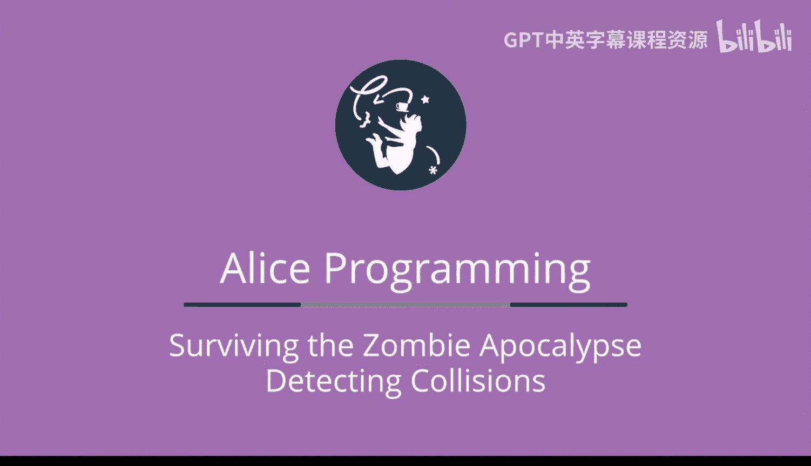
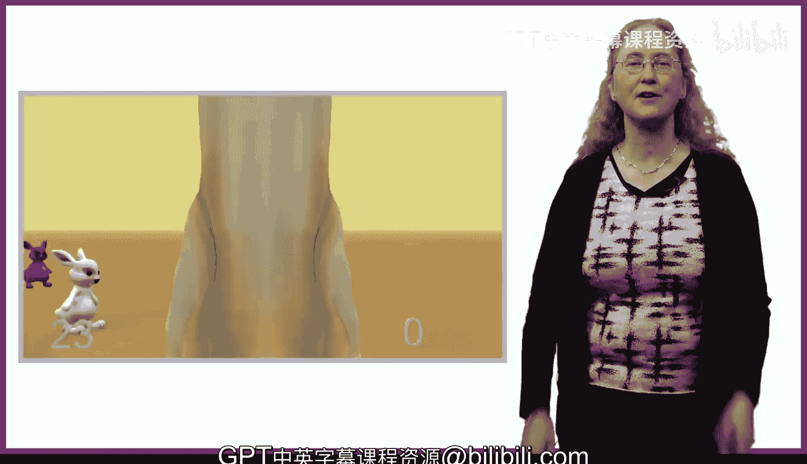

# 杜克大学《爱丽丝编程与动画入门｜Introduction to Programming and Animation with Alice》中英字幕 p109 109_07_01_第七周概述.zh_en -BV1QrB6BcEWW_p109-

This week， we are going to build a game in which there is a ghost and lots of bunnies。

 The game player gets points every time the player is able to steer the ghost into colliding with a bunny。

😊，In order to build this game， we introduced two new events for game playing in Alice。

 The first is collision detection。😊，Well introduce a new event in Alice to process collisions。

 or rather， when Alice detects when one object has collided with another object。

In the specific game example we'll be presenting， the player of the game will try to steer a ghost in the bunnies。

 which are hopping around。When the ghost collides with a bunny。

 we want Alice to run code to process that collision。The second event is keys being pressed。

 The player of the game will need to steer the ghost。

 We'll explore how Alice processes keyboard keys that get pressed and how to move the ghost forward and to turn the ghost to the right and left in response to keys being pressed。

😊，After building a simple collision detection game， we'll spice it up a bit。First。

 we'll use the timer we learned about last week to try to challenge the game player to collide with all of the bunnies within 30 seconds。

We'll next modify the game to randomly turn Bonnie's red， white， or blue。

Colliding with blue bunnies will give the player extra points while colliding with a red bunny will take points away from the game player。

We'll need to change the winning condition from clicking on all of the bunnies to beginning getting a score of at least five points in the 30 seconds。

To accomplish this， we can reuse the scores we learned about last week。Finally。

 we'll make the game more realistic through the addition of multiple levels。

 where the later level will be more challenging than the first level。

 We'll accomplish this modification through the use of a scene variable to keep track of the level。

 We'll also solve the challenge of placing all of the objects into their correct starting positions before the start of each level。

 I can't wait to get started。😊。

