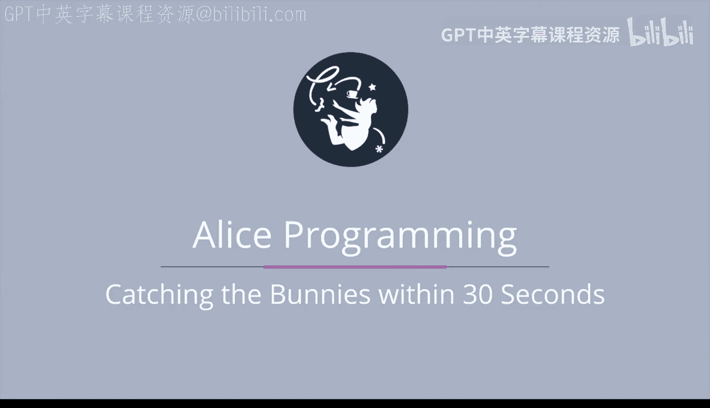

# 爱丽丝编程与动画入门：114：30秒内捕捉兔子

在本节课中，我们将学习如何修改现有的“碰撞兔子”游戏，为其增加一个30秒的时间限制。我们将探讨实现此功能所需的具体修改步骤。

## 概述

上一节我们完成了基础的兔子碰撞游戏。本节中，我们将为游戏增加一个计时器，并修改游戏逻辑，使玩家必须在30秒内完成所有碰撞任务。这涉及到添加新对象、修改事件以及调整主驱动循环。

## 详细修改步骤

以下是实现30秒时间限制所需的五项核心修改。

### 1. 添加计时器

首先，我们需要在游戏场景中添加一个可视化的计时器。计时器本质上是一个**3D文本对象**，用于显示剩余时间。你可以复用上周创建的计时器，或者新建一个。

同时，我们需要创建一个变量来**追踪剩余时间**，并编写一个**递减过程**。这个过程需要完成两项工作：减少时间变量，并更新屏幕上显示的文本。

### 2. 解决计时器跟随问题

本游戏中，幽灵会移动，而摄像机以幽灵为载具，会随之移动。这会导致一个问题：一旦幽灵开始移动，固定在场景中的计时器将不再显示在屏幕上。

解决方案是：将计时器的**载具**也设置为幽灵。这样，计时器会始终跟随幽灵移动，稳定地停留在屏幕左下角。

### 3. 修改事件

我们需要对事件系统进行两处修改。

第一，添加一个**每秒运行一次的事件**。只要还有剩余时间，这个事件就会调用上述的递减过程，将剩余时间减少一秒。

第二，修改**按键响应过程**。我们只希望在还有时间时，左、右、上方向键的按下操作才有效。因此，我们可以在整个按键处理过程的外层包裹一个**if语句**，仅在时间大于零时才处理按键。

### 4. 修改主驱动循环

接下来，我们需要在`my first method`中的主游戏驱动循环里做两处调整。

目前，只要至少有一只兔子未被碰撞，它就会持续跳跃。我们需要修改这个条件：**只有当还有剩余时间时**，兔子才继续跳跃。

### 5. 处理游戏失败情况

最后，我们不能总是祝贺玩家。存在一种情况：玩家未能在30秒内成功碰撞全部10只兔子。

在这种情况下，我们需要让幽灵告诉玩家，他/她**未能成功**完成挑战。

## 总结

本节课我们一起学习了为“碰撞兔子”游戏增加30秒时间限制的完整方案。构建精彩游戏的主要难点在于理解**游戏流程**，即清晰地知道在项目的哪些位置需要进行修改。请确保你理解每一项修改的必要性，并对为何要调整特定事件和主循环形成良好的直觉。

在理解了这些修改方案后，让我们进入下一节课，动手实现这些变化。