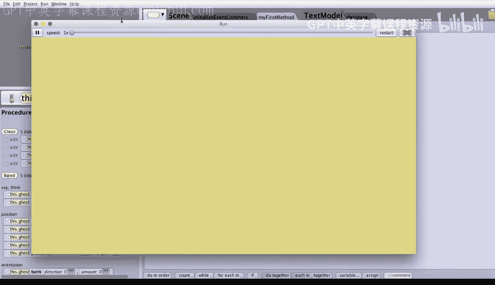

# 杜克大学《爱丽丝编程与动画入门｜Introduction to Programming and Animation with Alice》中英字幕 p115 115_07_04_限时碰撞兔子演示.zh_en -BV1QrB6BcEWW_p115-

As we have just described， we'd like to modify our previous ghost colliding with Bunnie's project to give the game player 30 seconds to collide with all the bunnies。

We start with a project that is the same as the base project we just completed。

We need to add a timer， create and modify some events， and modify our main game playing loop。

Let's get started。The first step is to create a timer。

Let's go ahead and move into scene setup mode so that we can go ahead and add our timer。

So let's click on shapes and texts， and as we've been doing before。

 let's drag a new text model and let's put it in the lower left hand corner of the screen。

 maybe right about there。Let's name our text model， timer。We can give it the initial value。

 we'll start with maybe 30 seconds left， so let's set it to the initial value of 30。

And white seems fine because we're on a tan background and the opacity should be one so we can see it。

 So it sounds okay， oh。That's a little bit too big for us。

 So let's go ahead and change the height and we'll change it proportionally。

 So maybe a quarter of that size， a quarter of 0。76 should be 0。19。 Let's see how that looks。Yeah。

 that one looks a little bit better。Now， we also need to have the score follow the ghost。

 because if the score or not the score follow the， the time left has to follow the ghost because if the ghost starts moving as we're going to try and click on the monies。

 we won't be able to see the amount of time left。So let's go ahead and change the vehicle for the timer to be the ghost。

Now， one slight note of warning。Alice makes the vehicle red。Typically。

 when Alice marks something in red， it means there's an error。However。

 Alice is a bug in that it erroneously reports an error when we try to set the vehicle of an object as part of scene set up。

 Hopefully， by the time you'll be watching this video。

 the Alice team will have corrected the bug and your vehicle won't appear in red as mine unfortunately is。

Setting the vehicle in this manner does actually work， so we should be okay。Next。

 we need to add a variable to store the amount of time left on the timer。

 so we'll start by clicking on editit code。Then we'll go into scene。

And then we'll click on the text model。And now we can add a property or variable。

 So let's go ahead and add a definitely has to be a variable because we're going to want to change the amount of time left。

We're going to make it to be a whole number。Will name it， perhaps time left。

And we can initialize it to be 30， as we'll initially have 30 seconds left。Next。

 we need to create a decreased procedure as a way to decrease the amount of time， so let's go ahead。

 we'll go into textex model， and we'll go ahead and add a text model procedure。

Which we can go ahead and call。Decrease。And again， we've seen this before。

 so we're going to do the same exact double book keeping trick， so we'll do an order。

The first thing we're going to do is we need to decrease the time left。

 so we'll go ahead with the set time left。We'll initially set it to be the current value of time left。

And then we'll click on the little triangle and we'll change it to be math and we can change it to be this dot time left minus1。

Now is the double bookkeeping part， we're going to need to update the text。

 so we'll do the set value。For the text。And we'll set it to be the custom text string immediately clicking on OK to make it the empty string。

And now we can basically click on the plus to append the whole number。

Time left to the end of the string so that will get a visual representation of the amount of time left。

 Next， we need to work with creating and modifying events。

So let's go ahead and click on the initialized event listeners tab。

And let's go ahead for decreasing the time to run a timer， so let's go ahead and add。

 click on the Add event listener。We'll go ahead for scene activation time and add a time listener。

 which let's have it run every one second。Now， as we've done before。

 what we want to do is decrease the time left as long as the time left is greater than zero。

So we'll first drag in an if statement。And we'll start with true。

 and then we'll change true to relational whole number because the time left is always going to be a whole number。

 and we want to say if the time left is bigger than 0， so we'll choose bigger。

 we'll initially put one as a placeholder and we'll ultimately want to compare the time left against0。

Good so far and we'll change this to this dot timer。

And we can click on this do timer' functions and say that get the time left and drag that over top of the one。

So if we scroll down， we'll see if the time left is bigger than 0。

 What would we like to do is simply we'll click on this timers procedures and call our decreased procedure to decrease the time left by one。

 the only other thing we need to do is to add the exact same if statement around all of the code in the key pressed event handler。

 because we only want to process the players key。 if the time hasn't expired。

 once they run out of time， they can't move their ghost anymore。

 So let's go ahead and drag in an if statement right here before this massive if statement around the key pressed。

We'll initially select true。And again， we're going to do exactly the same thing we just did a second ago。

 We'll change relational whole numbers。 And we want to basically say if the time left is bigger than 0。

 So we'll choose bigger then we'll use one as a placeholder and compare it against 0。

And instead of the one， we'll click on this timer's functions and choose this timer's time left。

And so if the time left is bigger than0， and if it is， we'll drag this massive if statement。

 I will grab it by the left side and drag it right into that if statement。

 so if the time left is bigger than0， we'll go ahead and process the key that the user。

 the game player has pressed。That's it。The last change we need to make is to the driver loop。

 so let's go ahead and click on my first method。We need to change the Boolean condition of the while loop to be time left bigger than zero。

We should have probably just written a function already。But as we have not。

 let's go ahead and just simply change the Boolean expression to be relational whole number。

 And again， we've done this twice。 So we're getting better at this greater than we'll put one in as a placeholder and compare it against 0。

And then we'll drag in this timers's get time left and say， while the time left is bigger than 0。

 I'll go ahead and have the bunnies pop up that are still visible。 Lastly。

 instead of having the ghost just say great job， we need to check if the player collided with all of the bunnies。

So let's go ahead and add an if statement。To check first， we'll again， initially select true。

Then let's go ahead and check to see if at least one bunny can be seen。

 So we have our function for this scene。 And if at least one of the bunnies can be seen， well。

 in that case， the player did not do a very good job。 So let's have the ghost。

 I she was say to say something like better luck next time。So we'll click on the ghost。

And the procedures。And we can have the ghosts say because the player has not won。Perhaps。Better luck。

Next time。Alternatively， if there are no bunnies left。

 then let's drag the Gose into the L statement where the player actually has done a great job by clicking on all 10 bunnies within 30 seconds。

That's it。Let's go ahead and run the game。Now， let's try and steer thee。There's one of them。

There's another one。I see another bunny right there。The air's a great bunny。U。

 I've got a couple more bunnies to go。Got that one。Where are the bunnies now？There's another bunny。

Got that one。I got that one。Oh， sadly， I wasn't able to click on all of the bunnies in time。But wow。

 we have a game that is more challenging to play。