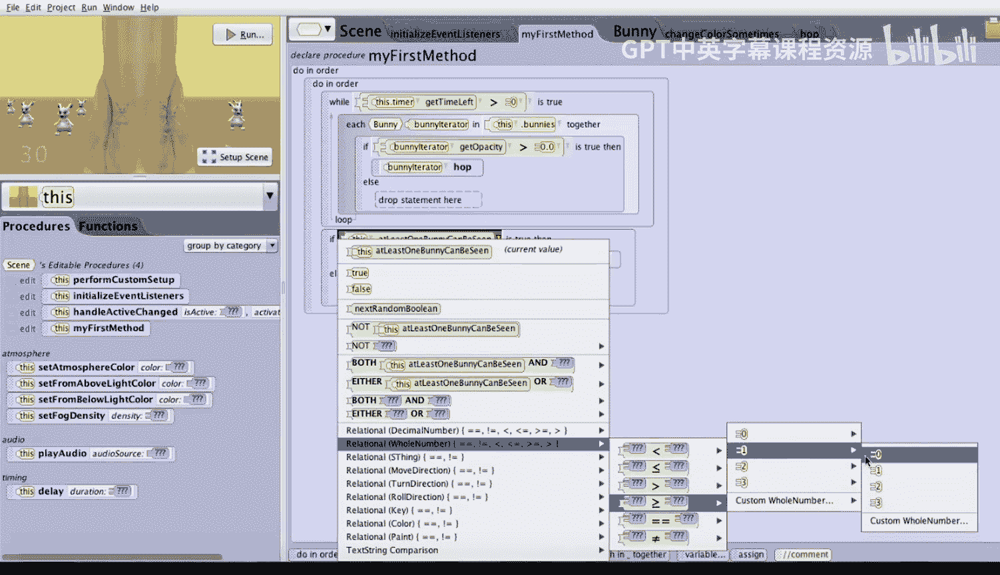

# 杜克大学《爱丽丝编程与动画入门｜Introduction to Programming and Animation with Alice》中英字幕 p117 117_07_06_碰撞红白蓝三色兔子演示.zh_en -BV1QrB6BcEWW_p117-

Let's change our game to handle different valued bunnies。 Blue bunnies will be worth two points。

 White bunnies will be worth one point， and red bunnies will be worth -1 points。

The new goal will be for the game player to get a score of at least five。As we noted earlier。

 there are four tasks we'll need to do。First will be to periodically change the bunny's paint。

Second will be to change winning to be achieving a score of five。

 rather than colliding with all the bunnies。Third is to change the increased procedure to allow for the different values of the different bunnies。

And fourth is to change the collision detection algorithm to increase or decrease the gameplayer score based on the paint of the bunny that the player collided with。

Let's start with the first task， periodically changing a bunny's paint。

 We have already written this procedure。If we click on this dot bunny。

 so we can click on this dot bunny。We can click on edit for change color sometimes。

This procedure is just as has already been described in the previous session。

 when this procedure is called approximately 25% of the time， this bunny will change its color。

 whichever bunny gets this procedure called。 Let's now edit the hop procedure。

Let's drag a call to change color sometimes into the hot procedure immediately before the bunny starts to move up and back down again。

 If we'd like to check this out， let's just click on the run。

 and watch to see that the bunnies periodically change their colors randomly from red to white to blue。

 et cetera。 So this looks like this is working。Next。

 we need to change the condition for winning to be achieving a score of at least five。

 so let's go ahead and click on my first method。We're going to need to change the Boolean condition of the if statement。

 and what we want it to be is to be that the score the player has is bigger than or equal to5。

 So let's go ahead and change this by clicking on the drop down。

Because the score is going to be a whole number， we'll use relational whole number。

 and we'll choose greater than or equal to for the first value。

 we're just going to put one as a placeholder and then for the second value we're going to choose custom whole number and we'll enter in a value of five。

Now， because we'd like to access the player score， we're going to need to change from this。

To this dot score。And we can simply click on the functions and choose this player。

ge playerer score and drop that over top of the one。Now。

 the last thing we need to do is we need to switch the two conditions because in a sense。

 we flipped it。 If the player score is at least five， the ghost should probably say great job。

Whereas if the score is not at least5， the ghost should instead say， sorry， better luck next time。

Next， let's update the score's increase procedure to allow the caller to specify the amount to increase。

So we'll simply click on this do scoress Proc and then let's go ahead and edit the increase procedure。

What we're going to do is we're going to add a parameter。Which should be a whole number。

And we can name our whole number amount。Finally， because we already have a call out of the event handler to this the old version of this procedure。

 we're going to need to click on the checkbox to indicate we'll later go into the event handler and change the call where we'll specify the amount we wish to pass to this procedure so we'll go ahead and click on okay。

The last thing we need to do is simply instead of increasing the score by one。

 to simply to drag the amount over top of the one so that now we're increasing the score by the amount that's passed as a parameter。

That's it。Finally， we need to change the collision detection handler to call the increase parameter of the increase procedure with the right value。

 depending on the color of the bunny that got collided with。

 So let's go ahead and click on the initialized event listeners in collision started before we call increase。

 We're going to need to check the paint of the bunny to see how much we need to increase the score by。

So after the comment for adjusting the score， I'm going to go ahead and we can do this together and add a variable to refer to the color of the bunny iterator。

 so let's go ahead and create a variable。Which is going to be。None of these types seem to do。

 Let's click on other types and set the variable to be of type paint because it's going to be the color of the paint and we'll call it。

Iterator paint to refer to the color of the iterator's paint。For initially。

 let's just set it to a color as a placeholder， we can just set it to black。And click on O。

But what we really want it to be is the iterators get paint。

 and of course this is a two step process we'll click down on this bunny。And this bunny's functions。

And we can say we can drag in this bunny's get paint and then change from this bunny to bununny iterator's paint color。

Next， we need to add an if statement to be able to test the color that pretty much the iterator paint color to determine how many points to increase the score by。

 so let's drag in an if statement。We'll put it right after the declaration of the iterator paint。

We'll select initially true， and then we'll click down and we'll go ahead and test for relational paint。

 whether paint equality。And we will ask the question， is the iterator paint equal to red？

And if the iterator paint is equal to red， we can now drag our score increase procedure。

 and we can specify a value here of minus1， so we'll have to say custom hole number minus1。

And that covers the case for the iterator paint being red。Well， if it's not red。

 let's drag in another， if statement。Into the else case。

 we'll initially select true and again do the exact same thing will'll change the true to relational paint。

And we' test for equality。 And we can ask， is the iterator paint equal to white。

And if the iterator paint is equal to white， we can click on this score。And the procedures。

 and we can choose to increase the score。This time， by one。

And if the paint isn't red and it's not white， then it must be blue。

 And in the case of the second else， we can simply call。Increase specifying an amount of two。

Now let's go ahead and play the game and try and win。Oh， trying to steer。

 I better not go to that one。 That one's red。 How about that one。 What changed to white Omni。

 but that's still we get a point for that one。Theres another one。 Oh。

 it changed the blue just in time。 So I get two points。Another couple points。

 is's try and get a couple more scores just to be safe。Oh。

There's another bunny to collide with its's blue， better not collide with that one because that's a red one right now。

There it goes a blue， o， unless it changed to the bad way。U， well， we made it past five。

This is a fun game to play。