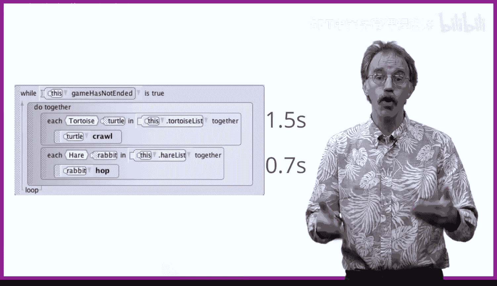

# 杜克大学《爱丽丝编程与动画入门｜Introduction to Programming and Animation with Alice》中英字幕 p119 119_07_03_场景激活监听器事件.zh_en -BV1QrB6BcEWW_p119-

It is often the case that we would like different animations to occur at the same time。

Consider the following example where we have an array of tortoises and an array of hairs。

At the same time， all of the tortoises crawl and all of the hairs hop。

Because each of the iterations occur at the same time as we're using each in together。

 It does not matter if we have a different number of hairs than tortoises。

 All of the hairs hop at the same time， and all of the tortoises crawl at the same time。Suppose。

 however， that the hot procedure requires 0。7 seconds to complete。

 and the crawl procedure requires 1。5 seconds to complete。

What will happen is that the bunnies will all hop。 Then the bunnies will do absolutely nothing for 0。

8 seconds， waiting for the tortoises to complete their crawl。 As we mentioned earlier。

 all of the animations in they do together should take the same amount of time to complete。

That's easy to say， but in practice can be hard to implement。

Toortoises just crawl more slowly than hairs hop。 and if we have a project that contains both tortoises and hairs and those tortoises and hairs need to repeatedly crawl and hop。

 we seem to have a problem。

Alice provides an event scene activation listener to help with this problem。

 When the user clicks on the run button， Alice looks for scene activation listeners and immediately starts to run them。

😊，We can take advantage of the scene activation listener rather than having the tortoises crawl and the hairs hop as part of my first method。

 We can simply create two scene activation listeners。 In doing so。

 we no longer need to worry about the relative time it takes a tortoise to crawl or a hair to hop Independ。

 the tortoises crawl at their speed and the hairs hop at their speed。😊。

Seeing activation listeners can be quite useful when objects need to move。

 when they should not be coordinated with other objects moving。

But also be aware that scene activation events only run once when you click on the Run button。

That is different than some events we have seen like the collision event that occurs every single time a collision happens。

 We'll see a cool example of using scene activation listeners next。

