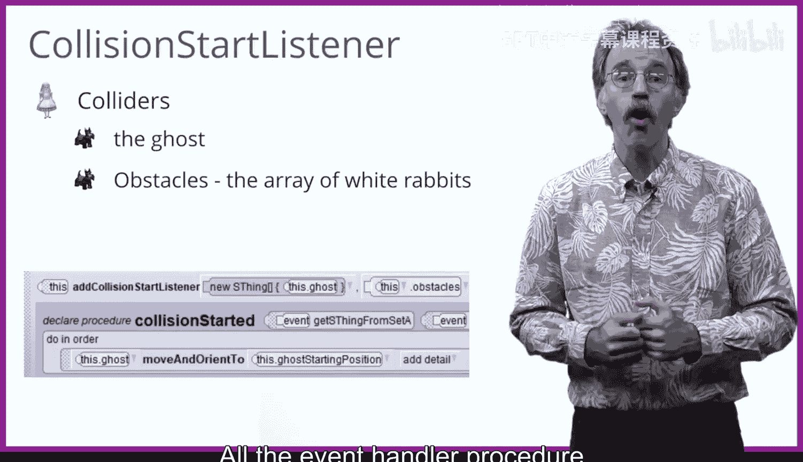

# 杜克大学《爱丽丝编程与动画入门｜Introduction to Programming and Animation with Alice》中英字幕 p120 120_07_04_躲避障碍物碰撞兔子.zh_en -BV1QrB6BcEWW_p120-

In the game we're about to build， we'd like to make the game play somewhat harder。

 The idea is that we'll introduce some obstacles， specifically， we'll introduce five white rabbits。

 The white rabbits will wander around If the ghost collides with one of the white rabbits。

 The ghost will be moved back to its starting position。To implement this game。

 we will need two new events， a scene activation listener to start the rabbit's wandering about。

 and a collision start listener to detect when the ghost and the white rabbits collide。

The first event will be a scene activation listener。When the project starts to run。

 the white rabbits will start wandering about。We'll use an iterator to simultaneously have each white rabbit in the array。

 wonder。The second event will be an ad collision start event。

 the colliding groups will be the ghost and the array of white rabbits。

All the event handler procedure needs to do when a collision happens is to move the ghost back to its original starting position。

