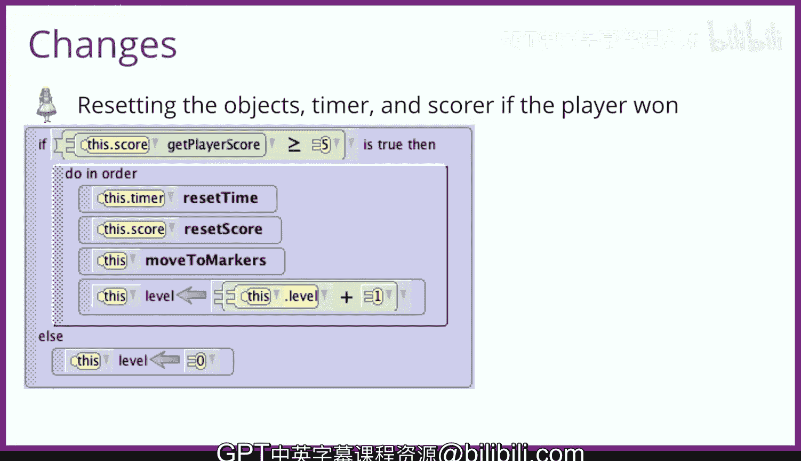

# 爱丽丝编程与动画入门：123_07_07：准备修改碰撞游戏 🎮

在本节课中，我们将学习如何修改现有的障碍物碰撞游戏，以支持多个关卡。我们将添加一个场景属性来追踪关卡，调整兔子的跳跃行为，并重构游戏的主循环逻辑。

---

上一节我们讨论了为游戏添加关卡功能的需求。本节中，我们来看看具体需要实施哪些修改。

我们需要对现有的障碍物碰撞游戏进行几项修改，以实现多个关卡。

我们已经讨论过需要添加一个场景属性来追踪当前关卡。

我们也描述了重置兔子、障碍物和幽灵的过程。

我们需要让兔子在玩家进行第1关（较低难度）时执行一种跳跃动作。

如果玩家成功通过第1关并进入第2关，兔子应该执行一种徘徊跳跃，而不是上下跳跃。这使得与兔子碰撞变得更加困难。

一个更复杂的修改是，我们需要在每个游戏流程外围包裹一个外层的while循环。条件是当关卡为1或2，并且玩家尚未输掉或赢得游戏时，执行一次游戏迭代。

这个循环需要放置在场景激活事件中障碍物随机移动的代码周围。

它也需要放置在我的第一个方法中的主while循环周围。

我们需要做的最后一项修改是，如果玩家成功完成一个关卡（得分至少为5分），则重新定位兔子、障碍物和幽灵，并重置分数和计时器。

如果玩家未能成功完成一个关卡，我们将关卡设置为0，表示玩家已失败。

我们需要将这段代码放入我的第一个方法中，位置是在玩家尝试与蓝白兔子碰撞30秒之后。

让我们开始修改游戏。

---

以下是实现多关卡功能的核心步骤列表：

*   **添加关卡追踪**：创建一个场景属性（例如 `level`）来记录当前关卡。
*   **调整兔子行为**：使用条件判断，在第1关让兔子执行 `hop`，在第2关执行 `wanderHop`。
*   **重构游戏循环**：在主游戏逻辑外添加一个 `while` 循环，条件为 `level == 1 or level == 2`。
*   **重置游戏状态**：在玩家通过关卡后，重置所有对象位置、分数和计时器，并将关卡数加1。
*   **处理游戏结束**：若玩家失败，将 `level` 设置为0。

---

本节课中我们一起学习了如何为碰撞游戏添加多关卡支持。我们引入了关卡追踪属性，根据关卡改变了游戏角色的行为，并使用外层循环控制了游戏的整体流程。最后，我们设定了关卡成功或失败后的状态重置逻辑。这些修改将使游戏更具挑战性和可玩性。