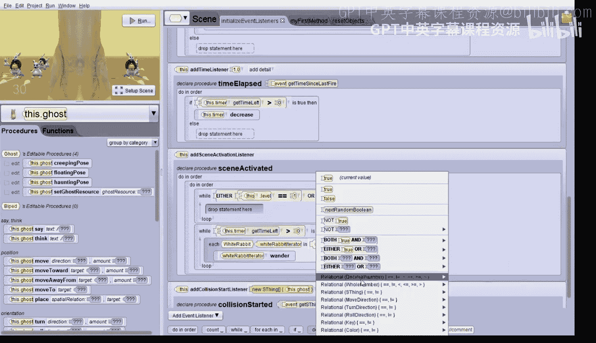

# 杜克大学《爱丽丝编程与动画入门｜Introduction to Programming and Animation with Alice》中英字幕 p124 124_07_08_多关卡碰撞兔子演示.zh_en -BV1QrB6BcEWW_p124-

Let's get started with the game modifications。 You'll notice that this project is very similar to the previous project with two significant differences。

 The first is that we have added an object marker for every single bunny and for every single obstacle。

 you can see all the object markers。The second change can be seen if we click on the scene tab。

And scroll to the bottom。We've added two new arrays。 The first is Bunny starting positions。

 It contains each of the bununny markers in the same order as the bunny's array。

 and the second is white rabbit starting positions。

It contains each of the white rabbit markers in the same order as the obstacles array。

Let's go ahead and add a scene property。We'll name it level。It will be a whole number。

It's also going to be a variable。And we'll set it to one initially。Click， O。

The level variable is representing the level of the game， so we set it to level1。

 which is the first level that we'll play。Next， in the main driver loop in my first method。

Let's have bunnies do a hop when the level is one and a wander hop when the level is2。 Fortunately。

 we have already written the wander hop procedure。 so we'll just need to add the appropriate logic into my first method。

Let's add an if statement into the if Bunny iterator's opacity is greater than zero。

We'll drag up an if。Right here。And select true for the placeholder。

We'll change the true to a relational whole number。Right here。

 and we're going to compare if two things are equal。And we'll put pick level。And we'll pick one。

So if the level is one， we want to do something。What do we want to do？We want to do the hop。So。

 we'll drag in。Bunny iterator， hop。If the level is not one， it must be two。

 so we need to have the bununny iterator invoke the W hot procedure， so let's click onBunny。Now。

Alice has organized all of our bunnies together， so we have to go follow the little right arrow here。

 and there's Bunny。And then we can drag in W hop into the else part of the if。So if it's level one。

 we do Bunny iterator hop and if it's level2。We do， oh， we need to change Bunny to Bunny iterator。

And we'll do。Bunny iterator， Wnderhop。That's great。Now comes the longest part。

 we're going to write a procedure to get the bunnies。

 the obstacles and the ghosts back to their starting positions。

 something that must happen if the game player has successfully navigated level one and is ready to move on to level2。

Let's add a new scenem procedure。We'll just click on here and say seen。Add a same procedure。

And will call it Re objects。Click， O。We're going to start by dragging in a do an order。

As we need to reposition three groups of objects， so let's start with the bunnies。

 we'll add a comment first。And well say。Resetting。😔，Bunnies。Back to their original positions。

To accomplish this， we will start by adding a whole number variable。We'll drag up variable。

We'll select whole number， we're going to call it index。It needs to be a variable。

 and we're going to set it initially to zero。Which represents the first position in the array。

We'll click， O。Next， we need to add a while loop。So we'll drag that up。

And select true as a placeholder。We're going to use the while loop to go through all of the bunnies in the array。

We'd like to build thebuoant expression index less than Bnies dot length。So we change the true。

To hold number。Less than。Index is there so we can pick it。And then we just need a placeholder。

 so I'll pick zero。Now if we click on the zero， we get more options and Bny's。Li is one of them。

 so we'll pick that。Now， inside the while loop， we need to do three things。

 First is to move and orient each bunny back to its starting position。So we click on this up bunny。

We got to find the bunny。 There it is。Then we're going to drag the move Orient to procedure over。

 I have to scroll down to find it。There it is。Bunny。

 move in orient to and we'll just pick ground as a placeholder。

So we're first going to change now the bunny。Two we need to pick the bunnies array and we need to pick an index。

 we're going to actually use our variable index。There we go。

We need to do the same thing with the ground。 We're going to pick on ground， and we want to pick。Oh。

 we have to go really far down to find it。The bunny starting positions。

 it's all the way at the bottom。And。In that array， we want to use index。

Now let's make this happen instantaneously by setting the duration to zero。

So the Bny at indexex0 will move to the Bunny starting position object marker that's also at indexex0。

And the Bunny at index1 will move to the Bunny starting position objectic marker at index1， etc ce。

Next， we need to reset the paint to white in case the bunny had last been red or blue。

 So we're going to follow this same process。 First， find Bunny's set paint。It's down near the bottom。

And we'll drag that in。Right here。And we'll set it to white。And then we need to change the bunny。

Two we need to find the bunnie's array， and then we pick the index。There we go。And also。

 let's make this happen instantly by picking the duration of zero。Now， third。

 we need to do the exact same thing for resetting the bunny's opacity back to one。

Let's drag the set opacity over。And we'll just pick one there。

And then we need to change the bunny again to the bunny's array and use index for the specific bunny。

There we go。Let's make this happen instantly by setting the duration of the instruction to zero。

And finally， we need to increase our index variable。So in the last line we' using the assign tile。

 we'll drag that up and we'll select indexdex and we'll set it to index。

And then we'll use math to add one to it， so select math。Index plus something and we'll pick one。S。

 that was a long procedure。Wait， we're not done yet。

 we need to do something quite similar for the array of obstacles。

 so let's start with the comments right after the loop。And we'll say。Resetting the obstacles。

Back to their original position。Now， let's add a new variable。This one we'll call index 2。

It's also a whole number。And also a variable。And we'll initialize it to zero。

We'll add a second while loop。Oops， we got to click OK。We'll add a second while loop。And select true。

We want to build the expression while index 2 is less than the obstacles arrays length。

So we'll do a whole number。And we'll pick less than。We can select index2。

And here we just have to put a placeholder， I'll just put zero。Now we can click on zero。

And we can see obstacles length。Next we click on this white rabbit。

And we want to drag in its move orient to procedure， so we have to scroll down to see it。

We'll drag that over for the white rabbit。And we want it to move and orient to。

 we'll just pick the ground as a placeholder。We're going to change white rabbit to the obstacles array。

 and we're going to use index 2 with that。And then for the ground， we're going to look for the。

Obscle markers array， which is called all the way down at the bottom。

 it's called the white Rabbit starting positions， and we also want to use index2 with that array。

Let's set the duration of this instruction to zero。And then finally。

 we need to increase index2 by one just as we did for index in the previous loop。

So we drag up an assignment statement， we pick index2， we set it to itself。And then we add one to it。

 we look for math。And then we see index 2 plus something， and we add one。

The last thing we need to do in this procedure is to reset the ghost back to its starting position。

Again， we'll start with a comment。Resetting。The ghost。Back to its starting position。

Then we're going to click on the ghost。It's right there。And we drag its move orient to procedure。

've got to find it， there it is。We drag that over。And we reset the ghost to the ghost starting position。

That was simpler because there's only one ghost。We do need to change the duration also to zero。Wow。

 that was a long procedure to write。What do we need to do next。

 we need to change the driver loop in my first method。

 and then later in the scene activated procedure that starts the obstacles wandering。

 so let's go to my first method。The reason we need to change the driver loop is that the current loop plays only one level of the game。

Let's add another while loop before the first while loop right there and we'll select Troop。

We'd like to make the condition of this while loop B while level 1 equals 1 or level equals 2。Sorry。

 let me say that again。We'd like to make the condition of this while loop B while level equals 1 or level equals 2。

We start by changing the true to be either true or true。Then we can change the first true to be。

Hhole number。And then we're going to select the equals。And we want to know if level 1。Is equal to1。

For the second true， we're also going to select comparing whole numbers。

And we're going to select the equals。And then we're going to select this level equal2。

Inside the wild loop， let's have the ghosts say the level。So we'll just drag over， go say。

Customom text string。Level is。Blank。And then click OK， and then we'll add to that。Plus， something。

 And the something is going to be a whole number。Which is the value of the level。

So he'll tell us which level we're playing。Next， we drag both the lower while loop。

And the if statement into the first while loop。So there's the while loop。And now， we'll drag in。

The if statement。We need to change what happens if the player gets at least a five。

The ghost shouldn't say anything as the player has just successfully completed the level。

We need to do four things in order。Firstt， we need to increase the level by one。

We need to change what happens if the player gets at least a five。

The ghost shouldn't say anything as the player has just successfully completed the level。

 so we're going to take out the statement where the ghost is sayingGreat job。

So let's just get rid of that。First， we need to increase the level by one。

So we need to go find the level。 It's going to be in this。There it is。

 we can drag over the set level。And we're going to set the level。To， actually， the level。

And then we'll add one to it using math。So find the level plus1。Next， we need to call our that。

Next we need to call our this reset objects procedure。

 so we just drag it over and put it right after where we set the level。

Next we need to click on this dot score。There's the score。

And we need to call it reset score procedure。Fortunately。

 we've already written this procedure for you， this procedure simply sets the score to be zero and updates the display。

So let's drag over， reset score。Finally， we need to click on this dot timer。Right here。

And drag its reset time procedure。Reset time。We've already written this procedure for you。

 it sets the time left to be 30 and updates the display。For the else case。

 we should set the level to zero， the player has lost。

So let's find back to the scene or this we can find set level and we'll drag it into the else part。

And set the level to 0。 the player has lost。After finishing this outer while loop。

 we should tell the player whether they have won or lost， so let's drag in a last if statement。

Below the loop and select truee。We build the buoyant expression is the level equal to three。

 because if the level is three， the player has one。Let's scroll up a little bit so we can see it。

So we're going to click on the true。And do another whole number。Relational equals。

 and we're going to ask if the level。Is equal to3。Now if the level's three。The player won。

 so let's click on the ghost。And let's have the ghost say。Nice job。Youan。Click， O。

Now if the level isn't three， let's have the ghost say better luck next time， In fact。

 we can just drag that down from here。All the way to the outtstate。For the last change。

 we also need to modify the scene activated event for starting the obstacles off wandering。

So let's click on initialized event listeners。And we need to scroll down to find the scene activated event。

There it is。Let's drag in a while loop as the first instruction of the scene activated event。

There's a while， so we're going to put it before the other while loop and select true。

We want to build the Boolean expression while the level is one or the level is 2。

 so we'll build that the same way as we did before。 we'll pick either true or true。

And for the first one， we'll ask the question if the level is one。So， whole number。😔，Double equals。

Level and pick one。And for the second true。We'll pick again。

 whole number compare with double equals and we'll pick。

Level。And two this time。So if the level is 1 or if the level is 2。

 we're going to now drag the while loop for the time being greater than0。

Into the outer while loop right there。After the game for one level has completed。

 let's drag a this do ghost delay procedure into the outer while loop to delay for one second。

We have to scroll down to fund that delay。It's near the bottom。

And we'll drag that after the while loop to say delay one second。

The reason we're putting that delay in is because we want the objects of the game to be able to have time to reset to their original positions。

That's it。 We have built the game。 Let's play the game and try to win both levels。

 I'm going to click on the run button and let's see what happens。It's level one。

 let's get some bunnies。Let's see there's a blue bunny， ah， the white rabbit。

 we hit the white rabbit。Okay， here's a white rabbit。There's a blue bunny。It turned white， though。

Let's see， here's a bunny。T blue， just in time。We need one more point。A。That was a red bunny。

we didn't make it， let's try again。Okay， this is level one。We need white and blue bunnies。

 we hit the white rabbit。Let's go over here。We got a blue bunny。 Sk the red one。

We got a white rabbit。And we got a blue bunny， a， we got five points， we made it。

We still have a few seconds left， make sure we don't hit any red bunnies。All right。

 there we go now we're at level  two， let's do it again。Not， that's a red bunny。We got a white bunny。

We got another white bunny。What are bunnies。There's a blue bunny。We need one more。 that one's red。Oh。

 it turned white just in time， we got five points。I think we're gonna do it。Awesome。😊，It says。

 nice job。We hope that you enjoyed watching us try to play this game。

