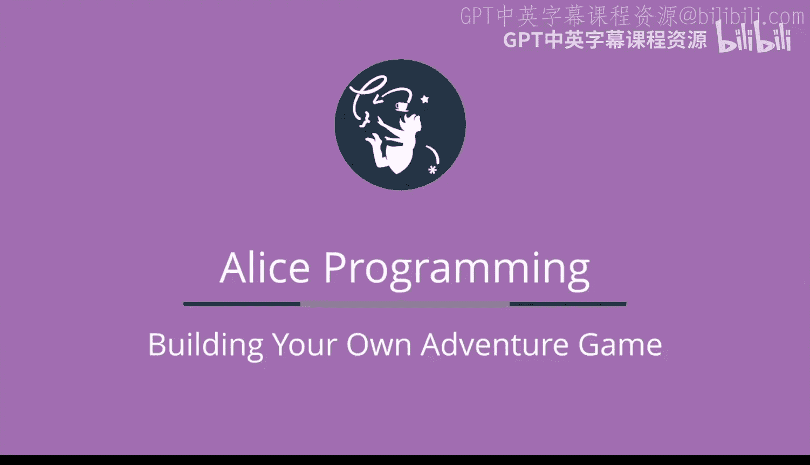
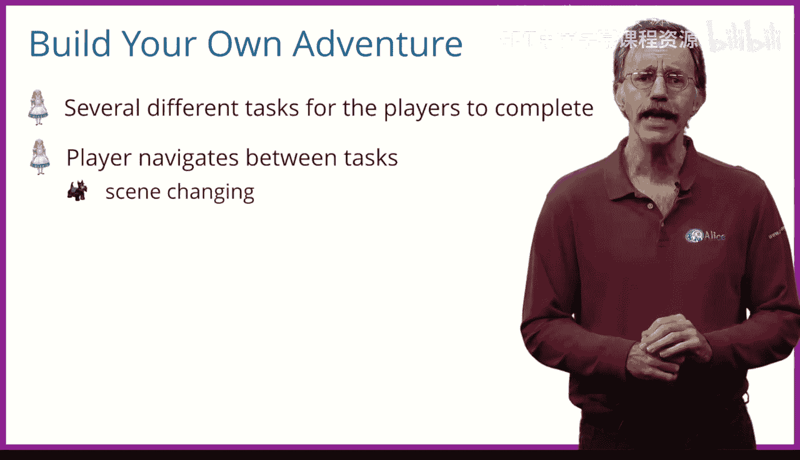

# 爱丽丝编程与动画入门：第八周：构建你自己的冒险游戏概述 🎮

在本节课中，我们将学习如何整合之前学到的所有编程概念，构建一个“构建你自己的冒险”游戏。我们将创建三个独立的小游戏，并学习如何在它们之间切换场景，最终将它们组合成一个完整的冒险游戏。

---

上一节我们介绍了本周的目标，本节中我们来看看“构建你自己的冒险”游戏的基本概念。

这类游戏的核心思想是，玩家需要完成一系列不同的任务才能获胜。玩家可以自行选择完成这些任务的顺序。在我们的设计中，大部分任务本身就是玩家需要玩的小游戏。成功完成一个小游戏后，玩家将获得某种**令牌**。这些令牌将帮助玩家达成游戏的最终胜利目标。

为了在不同任务（即不同小游戏）之间导航，我们需要学习如何在Alice中切换场景。

---

在开始构建具体游戏之前，我们先来了解一下本周将要创建的三个小游戏。

以下是本周我们将要构建的三个独立游戏：

1.  **记忆游戏**：我们将创建一组被打乱顺序的兔子，它们会快速按随机顺序变成紫色。玩家需要按照兔子变色的顺序点击它们。
2.  **逻辑解谜游戏**：这是一个著名的计算机科学逻辑谜题。计算机会生成一个随机**代码**，然后玩家需要通过重新排列一组铃铛来猜测这个秘密代码。
3.  **配对游戏**：几张不同颜色的卡片会面朝下放置在地面上。玩家需要找出颜色相同的卡片对。

这三个游戏将成为整个冒险游戏的一部分。对于冒险游戏，我们需要描述如何在Alice中切换场景来玩每一个独立的游戏。每个场景将代表玩家必须掌握的一个不同游戏。

---

上一节我们介绍了三个小游戏，本节中我们来看看实现冒险游戏的一个关键技术：场景切换。

我们将从一个包含四个不同场景的简单项目开始学习场景切换。例如，在一个场景中，我们的角色可能在沙漠里。然后，我们希望有一个过渡效果：世界变暗，然后再次变亮，此时我们的角色已经来到了一个被水环绕的岛屿上。这是我们构建这个游戏需要学习的动画技巧之一。

我们的计划是，首先设计和构建玩家需要赢得的各个小游戏。然后，我们将把这些游戏组合成一个整体的“构建你自己的冒险”游戏。

---

本节课中我们一起学习了“构建你自己的冒险”游戏的基本框架。我们概述了三个将要构建的小游戏（记忆游戏、逻辑解谜游戏和配对游戏），并介绍了将它们串联起来的关键技术——场景切换。现在，让我们从学习如何进行场景切换开始吧。