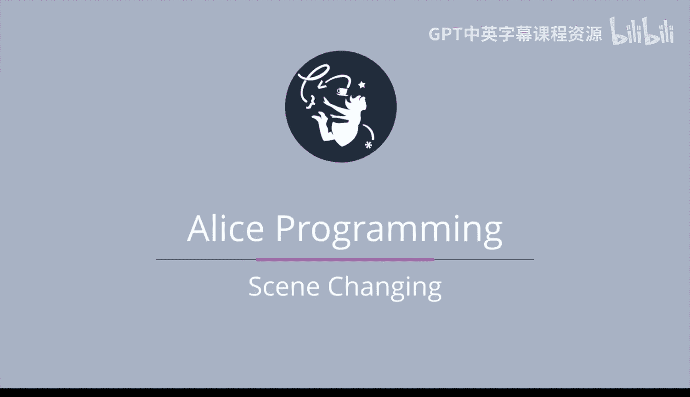
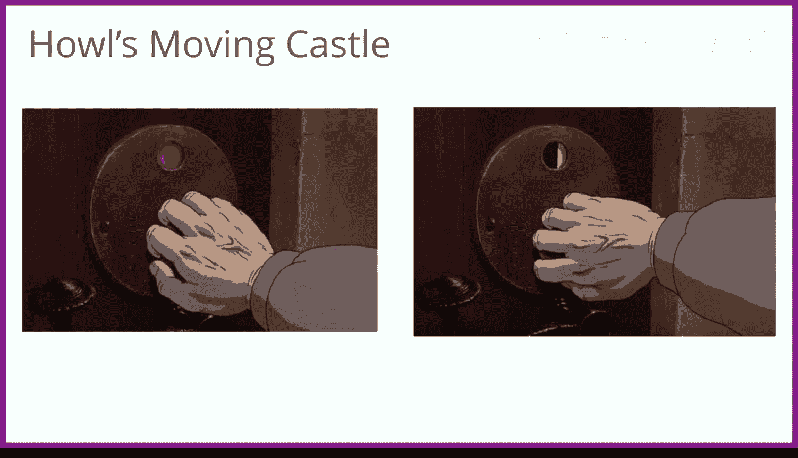
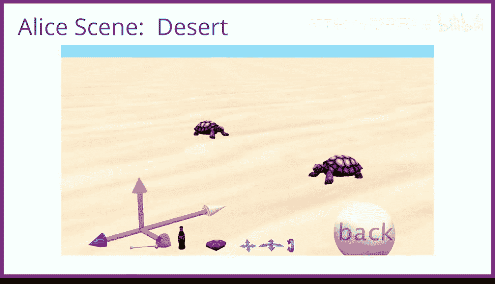
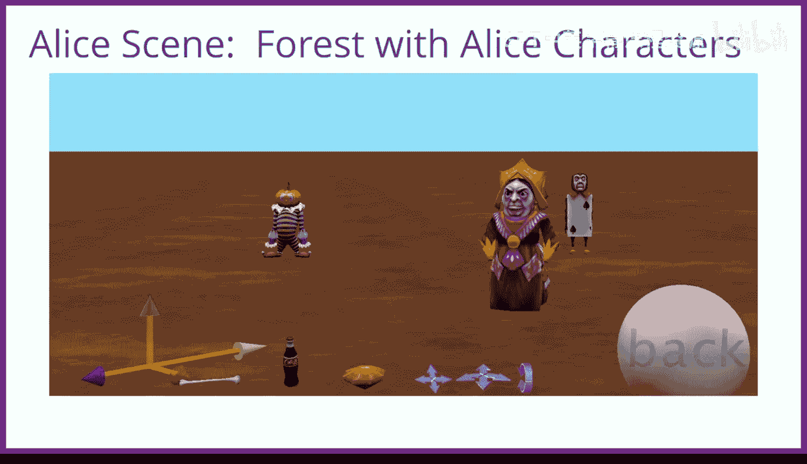
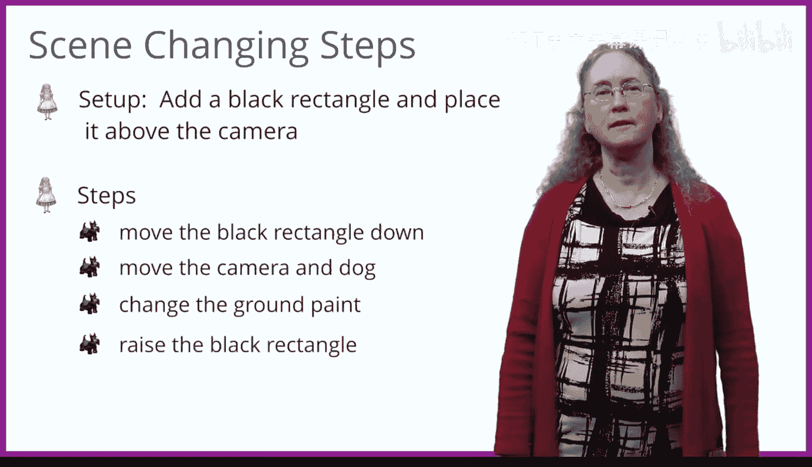

# 杜克大学《爱丽丝编程与动画入门｜Introduction to Programming and Animation with Alice》中英字幕 p127 127_08_03_场景切换.zh_en -BV1QrB6BcEWW_p127-

The first step of building a design your own adventure game is learning how to change scenes。

In this session we are going to see how to change scenes。

 and then we will do a little demonstration illustrating seeing changing in practice。

What does it mean to change scenes， perhaps when watching a TV show or a movie or even when playing a video game。

😊，Well， we are watching some characters interacting with one another。

Then the scene darkens， and we cannot see anything。Then when the scene lightens again。

 we see something completely different。 One of my favorite movies is Miyazaki's classic Howl's moving castle。

😊。

When exiting the castle， there's a knob， one can open the door to exit into four different locations。

 Initially， one can select green to exit the castle to the hills above market Chiping or to set it to blue to exit into Port Haven。

 red to exit into Kingsbury and black to exit into Wales。

 Each of these illustrates a scene change from the inside of the castle to the appropriate locale。😊。

How can we do this in Alice， Well， the scene in Alice is quite large。

 It is possible to create several many scenes。 In this example， we have created four。

The first is an initial scene。 There's a dog and three possible gates into which the player of the game might steer the dog in order for the dog to have three possible adventures。

😊，The ruby， Coke and armbone will be the rewards that the player can receive for successfully winning an adventure。

😊，And the back button will be used to get the player back from an adventure to the original scene。

The tiger will tell the player the initial challenge。

 and the Adelaide bus will be the reward once the player has won the game。

Let's look at the next scene。It's actually just the result of moving the camera to a different part of the ground and changing the ground to look like an ocean。

 We've added an island， a monkey， and some palm trees。We also see an object marker。

 which is where we will move the Dalmatian to when it needs to complete the island adventure。

We still see the Ruy， Coke bottle， bone and back button。

 The reason for this is that we have made the vehicle of the Ruy Coke bottle。

 bone and back buttons to be the camera。So whenever we move the camera， these objects move too。

Let's now have a look at the third scene， a desert scene。

All we have done to produce this scene is to move the camera， change the ground color to desert。

 and add a couple of turtles。There's also another object marker for where we will move the Dalmatian to when it enters a scene。

And let's have a look at the fourth scene。 We have done nothing more than moving the camera to point to an empty location。

 changing the ground to a forest ground， and then adding a few als in Wonderland characters。 In fact。

 if we look at the scene from the top view， we can see all four scenes。

 even though some are pretty tiny。😊。

On the left is the castle wall with the Dalmatian and ti。At the top middle is the island scene。

At the top right is the desert scene with the two turtles。

And in the bottom right is the forest scene with the queen。

Our challenge will be to move between scenes。To move between scenes will be a several step process。

 First， during scene setup， we need to add a black rectangle and place above the camera just at a view of the camera。

When it's time to change the scene， we simply move the black rectangle down so that the only thing visible through the camera is the black rectangle。

Next， we move the camera to point at one of the other scenes。 We also move the dog to the new scene。

 and we need to change the ground paint， such as setting it to water for the island scene。Finally。

 we raise the black rectangle andvoila， we have the dog in a new scene。

Let's go code this。