# 爱丽丝编程与动画入门：128：场景切换演示

在本节课中，我们将学习如何在一个多场景项目中实现场景切换。我们将通过一个具体的示例，演示如何让角色通过不同的“门”进入不同的场景，并在每个场景中完成特定任务，最终赢得游戏。

---

## 项目概览

首先，我们来查看这个部分完成的项目。我们可以看到场景中的所有对象。

如果我们进入“设置场景”模式，可以让摄像机移动到摄像机标记点。

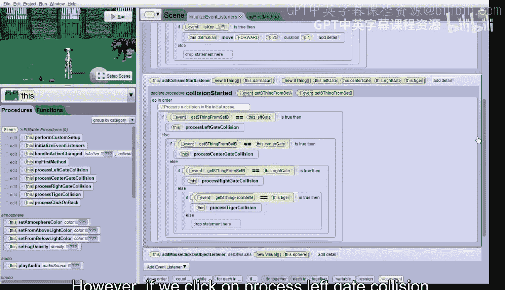

点击“摄像机标记”，然后选择“查看岛屿”。

在这里，我们可以看到除了地面颜色需要改变外，岛屿场景的一切都已设置好。

我们可以对沙漠中的乌龟场景和女王场景进行同样的设置。

我们也可以查看顶视图。从这里，我们可以拖动视图，或者向上移动。我们还可以拖动地面，看到老虎所在的场景、岛屿场景、乌龟场景，以及向下滚动一点，看到女王和其他爱丽丝角色的场景。

让我们回到摄像机的起始位置，并将摄像机移回起始位置。

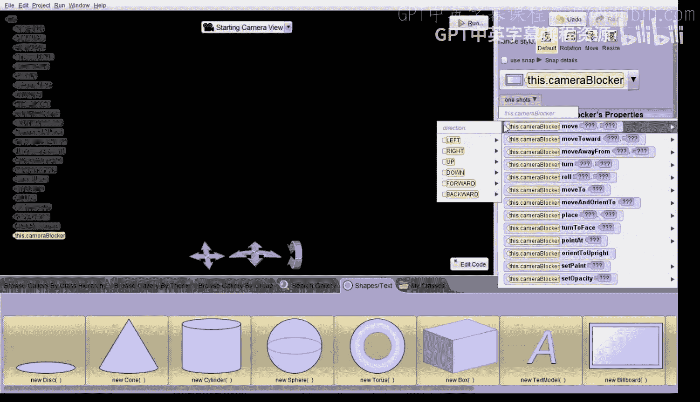

现在，点击“编辑代码”，以便查看一些预先构建的代码。

如果我们点击“初始化事件监听器”，可以看到已经创建了几个事件。滚动到顶部，可以看到按键事件已经编码好，允许小狗移动：当玩家按下左箭头键时，小狗向左移动；按下右箭头键，小狗向右移动；按下上箭头键，小狗向前移动。

我们还有一个事件，当小狗与每个门或老虎发生碰撞时触发。然而，如果我们点击“处理左门碰撞”事件（让我们试着找到它），会发现还没有为这个程序编写任何代码。我们需要编写所有这些程序，以及“我的第一个方法”。

但在开始编码之前，我们仍然需要添加一个黑色矩形，以便在需要切换场景时使场景变黑。

---

## 添加场景切换遮罩

让我们回到“设置场景”模式。我们将添加一个广告牌。在“形状”文本选项卡中查找，然后拖入一个广告牌。

我们将它的背面涂成黑色，并将其命名为“CameraBlocker”，然后点击“确定”。

接下来，我们发出一个“一次性”指令，将摄像机遮罩移动并定向到摄像机的位置。使用“一次性”程序“移动并定向到”。摄像机遮罩飞过了我们。我们再发出额外的“一次性”指令，让摄像机遮罩向前移动半个单位。现在我们可以看到它了。

接着，我们让它向下移动半个单位。现在，我们只能看到黑色，这很完美。但我们还要发出最后一个“一次性”指令，将摄像机遮罩向上移开，所以让它向上移动两个单位。

最后，将摄像机遮罩的载体设置为摄像机，这样当摄像机移动时，摄像机遮罩也会随之移动。

现在，我们准备好开始编码了。点击“编辑代码”。

---

## 初始化游戏场景

让我们从“我的第一个方法”开始。我们需要在这里初始化初始场景。

首先，放入一个“顺序执行”块。我们需要同时执行几条指令，让一些物品在游戏开始时不可见。

我们需要让阿德莱德半身像不可见，因为它是在玩家获胜时出现的奖品。找到阿德莱德半身像（它是一个道具），然后找到“不透明度”属性，将其拖入并设置为0。

这将是多个需要变为不可见的命令之一，所以我们添加一个“同时执行”块，让所有这些操作同时发生。将阿德莱德半身像的不透明度设置为0，并将此操作的持续时间也设置为0，使其瞬间完成。

我们还需要让红宝石、可乐瓶和臂骨在游戏开始时不可见，因为玩家尚未成功赢得这些奖品。我们可以将此指令复制到剪贴板，然后拖入，并依次更改为红宝石、可乐瓶和臂骨。

最后，对返回按钮也进行同样的操作。这个按钮用于让玩家返回初始场景，而玩家是从初始场景开始的。返回按钮实际上是一个球体，其不透明度被设置为0.7，以便能看到球体内部，以及一个写着“返回”的3D文本。因此，我们需要将球体和名为“返回文本”的3D文本的不透明度都设置为0。

再次复制指令，拖入并更改为球体，然后再复制一次，更改为“返回文本”。

现在，我们已经将所有需要在游戏开始时隐藏的东西都设置好了。

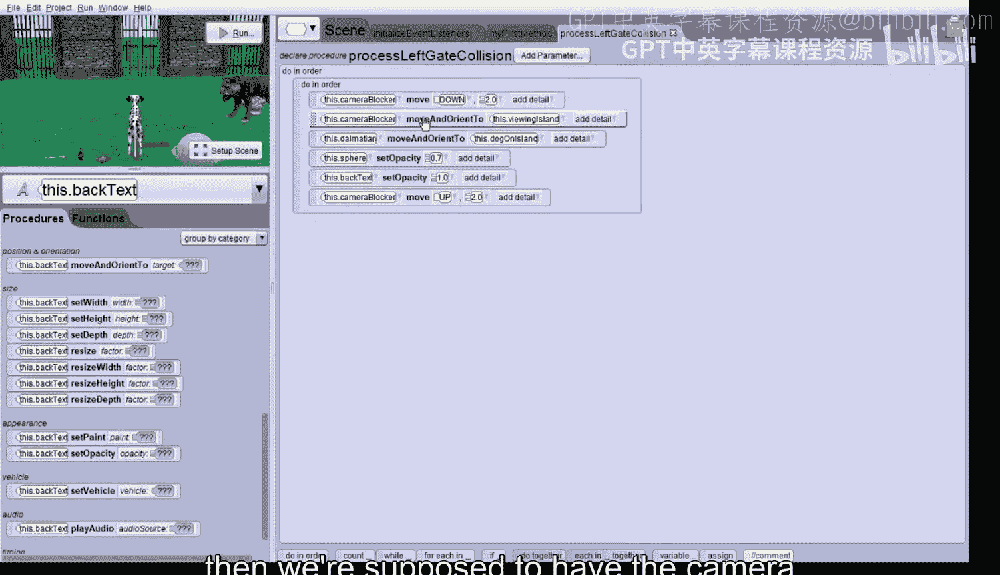

在将所有物品设为不可见之后，让老虎说玩家需要给老虎带来一瓶可乐和一根骨头。找到老虎，让它说：“请给我一瓶可乐和一根骨头来赢得奖品。”这句话有点长，所以将其持续时间设置为2秒。

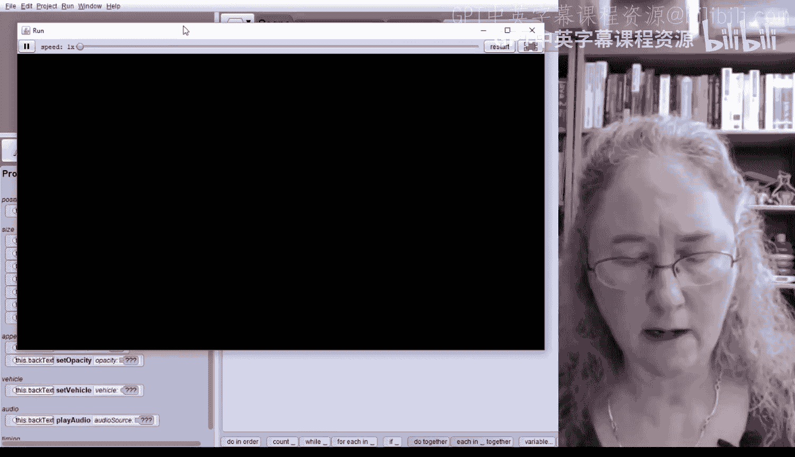

最后，让斑点狗告诉玩家如何移动以及与游戏中的物体互动。找到斑点狗，让它说：“使用箭头键移动我。如果你把我移到门那里，我会穿过去。让我与物体碰撞，其中一些会和你说话。”这句话也较长，将其持续时间也设置为2秒。

运行项目，查看一切是否设置正确。点击“运行”，许多东西都不可见了，老虎和斑点狗都说话了，看起来很好。

---

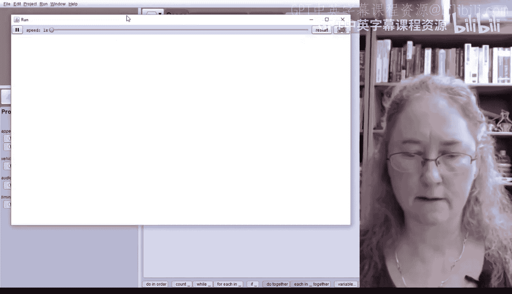

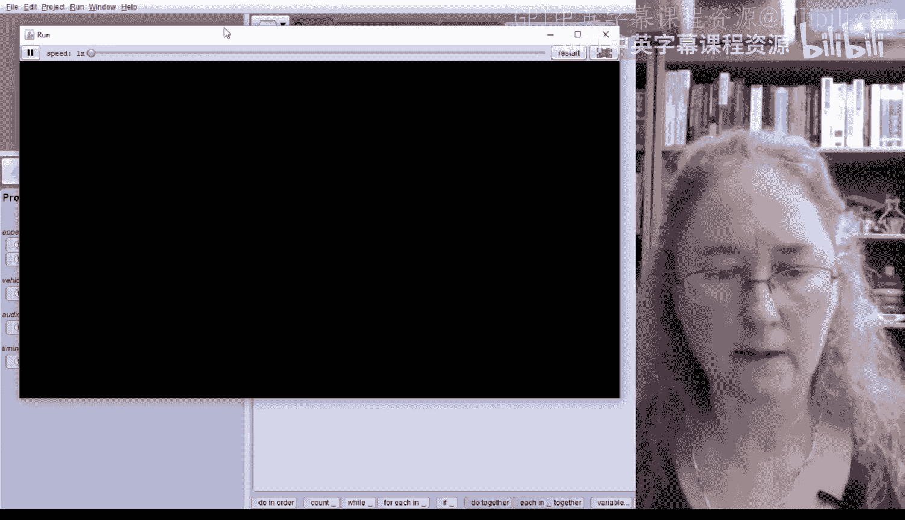

## 处理左门碰撞

我们要求玩家必须先获得红宝石，才能获得可乐瓶。左门是玩家获得可乐瓶的途径。

让我们开始编写处理与左门碰撞的程序。点击“处理左门碰撞”并编辑。我们需要在这里做几件事，以便将摄像机和狗移动到岛屿场景。

首先，放入一个“顺序执行”块。首先，让摄像机遮罩向下移动两个单位，这将使一切变黑。

接着，让摄像机移动并定向到“查看岛屿”标记点，以改变视图。

然后，还需要让狗移动并定向到“岛屿上的狗”标记点。

我们还需要让返回按钮可见，以便玩家在获得可乐瓶后可以点击它返回初始场景。添加代码将球体的不透明度设置为0.7，然后将“返回文本”的不透明度设置为1。

最后，将摄像机遮罩向上移回两个单位。

运行项目进行测试。我们看到指令，然后引导斑点狗进入左门。哎呀，场景没有切换到岛屿，摄像机没有移动。检查代码，发现第二行指令没有将移动对象改为摄像机。修正这个错误。

再次运行世界。引导斑点狗进入左门。这次切换到了岛屿，但地面是草地而不是水。我们可以修复这个问题。

---

## 优化场景切换

第一个问题是场景变黑的时间太长。我们可以通过将所有“移动并定向到”命令放入一个“同时执行”块中来修复，让它们同时发生。这样，摄像机遮罩降下，在变黑的同时我们改变一切，然后摄像机遮罩再升起。

更严重的问题是切换到岛屿时地面不是蓝色的。在“同时执行”块中，我们需要改变地面。找到地面，使用“设置颜料”操作，将其更改为“海洋”。

再次运行项目。这次场景切换更快了，并且有了海洋，看起来好多了。

---

## 添加岛屿场景事件

我们仍然需要为这部分冒险添加事件处理。我们将添加狗与猴子之间的碰撞事件。

如果红宝石可见（即狗已经完成了获取红宝石的任务），猴子将通过将其不透明度设置为1来给狗可乐瓶。否则，猴子会告诉狗需要先获得红宝石。

点击“初始化事件监听器”，添加一个新的“碰撞开始监听器”。在“位置方向”下选择“添加碰撞开始监听器”。需要为集合A和集合B选择自定义数组。

集合A只包含斑点狗。集合B只包含金丝猴。

对于代码，我们只需要一个“如果”语句。检查红宝石的不透明度是否等于1（即可见）。如果可见，让金丝猴说“这是一瓶可乐”，然后让可乐瓶可见（不透明度设为1）。

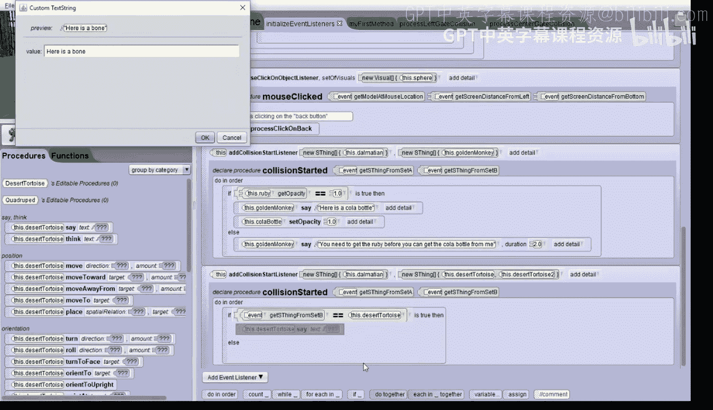

对于“否则”情况，让金丝猴告诉狗需要先获得红宝石。

运行项目测试。引导斑点狗进入左门，然后引导它撞向金丝猴，它会说需要先获得红宝石。

---

## 处理中门碰撞

接下来处理中门。由于代码与左门相似，我们首先复制“处理左门碰撞”中的所有代码。

然后打开“处理中门碰撞”程序，将复制的代码拖入。我们需要做一些更改：让摄像机移动并定向到“查看乌龟和沙漠”，让狗移动到“沙漠中的狗”标记点，并将地面颜料更改为“沙漠”。

我们还需要为狗与任意一只乌龟的碰撞添加一个事件。添加一个新的碰撞事件，集合A是斑点狗，集合B包含两只沙漠龟。

如果发生碰撞，我们首先需要一个“如果”语句来判断碰撞的是哪只乌龟。使用“事件”中的“从集合B获取物体”功能。如果碰撞的是第一只沙漠龟，让它说“这是一根骨头”。否则，让第二只沙漠龟说同样的话。

在“如果”语句之后，将臂骨的不透明度设置为1，使其可见。

---

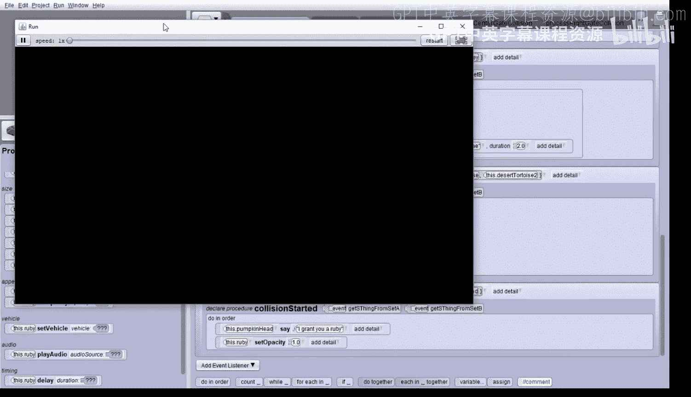

## 处理右门碰撞

现在编写“处理右门碰撞”的代码。从“处理左门碰撞”复制代码，然后打开“处理右门碰撞”程序并粘贴。

进行更改：让摄像机移动并定向到“查看爱丽丝角色”（女王场景），让狗移动到“爱丽丝中的狗”标记点，并将地面颜料从“海洋”改为“森林地面”。

添加另一个碰撞事件，这次只处理斑点狗与南瓜头的碰撞。集合A是斑点狗，集合B是南瓜头。

当发生碰撞时，首先让南瓜头说“我赐予你一颗红宝石”，然后让红宝石出现（不透明度设为1）。

---

## 处理返回按钮

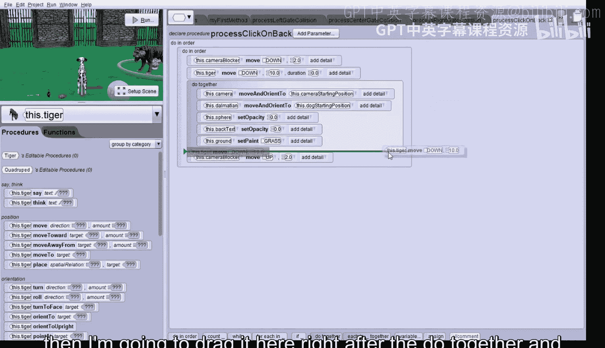

我们忘记了为返回按钮添加处理代码。让我们现在完成它。

再次从“处理左门碰撞”复制所有代码。然后打开“处理点击返回”程序，将代码拖入。

当点击返回按钮时，我们希望回到原始起始场景。因此需要更改几处：摄像机应移动并定向到“摄像机起始位置”，狗应移动并定向到“狗起始位置”。

还需要将球体和返回文本的不透明度都设置为0，因为它们在原始场景中应该是不可见的。

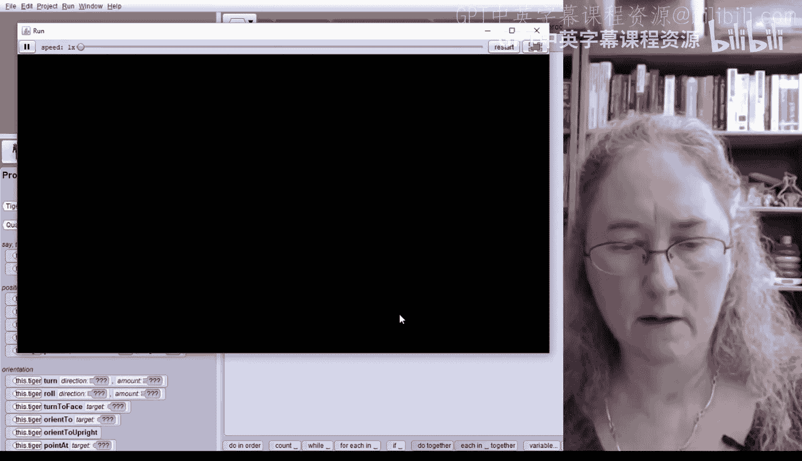

最后，将地面颜料改回“草地”。

此外，因为将狗移回原始场景可能会导致它立即与老虎碰撞，我们需要避免这种情况。在降低摄像机遮罩后，添加一个指令让老虎向下移动10个单位（持续时间设为0，瞬间完成）。在升起摄像机遮罩之前，立即让老虎再向上移动10个单位（同样瞬间完成）。这样可以有效避免斑点狗与老虎的意外碰撞。

---

## 处理老虎碰撞

最后，我们需要处理与老虎的碰撞。编辑“处理老虎碰撞”程序。

我们需要构建一个“如果”语句，检查可乐瓶和臂骨的不透明度是否都为1，这意味着你已经收集了所需的两件物品。

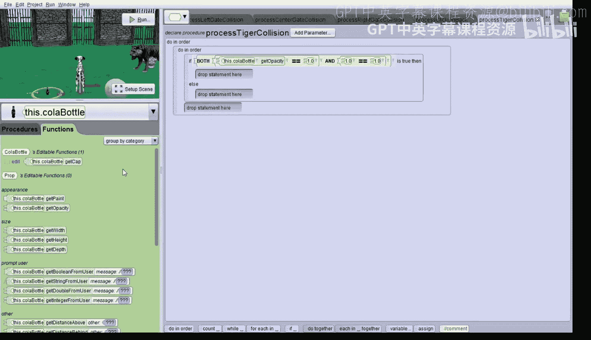

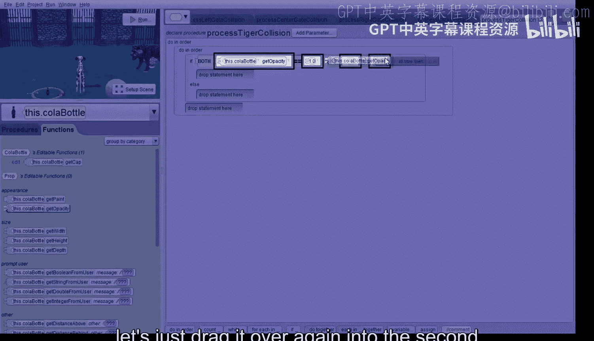

在“顺序执行”块中添加一个“如果”语句。条件是两个比较的“与”运算：检查可乐瓶的不透明度是否等于1，以及臂骨的不透明度是否等于1。

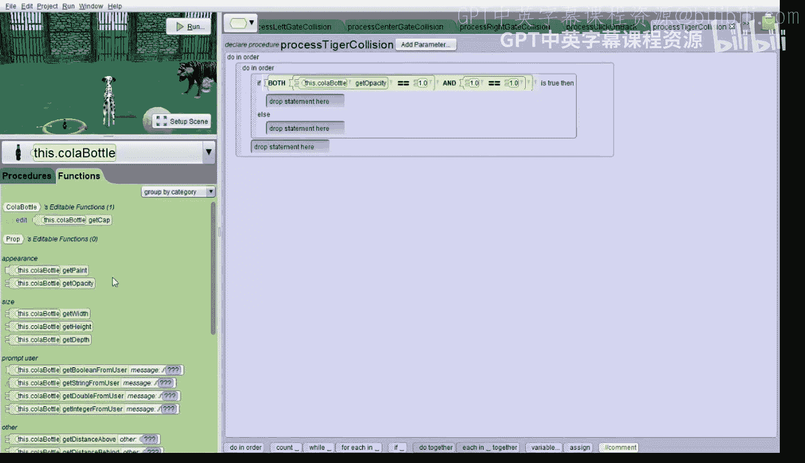

如果条件为真，我们同时做两件事：让老虎消失（不透明度设为0），让阿德莱德半身像出现（不透明度设为1）。然后，让阿德莱德半身像说“你赢了”。

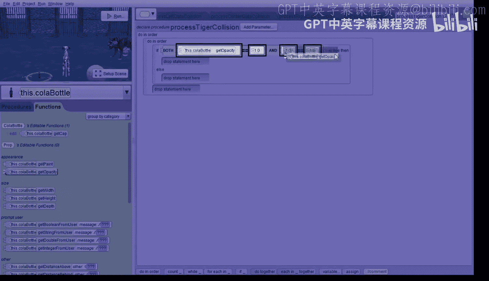

对于“否则”情况，让老虎说“你必须给我带来一根骨头和一瓶可乐”。

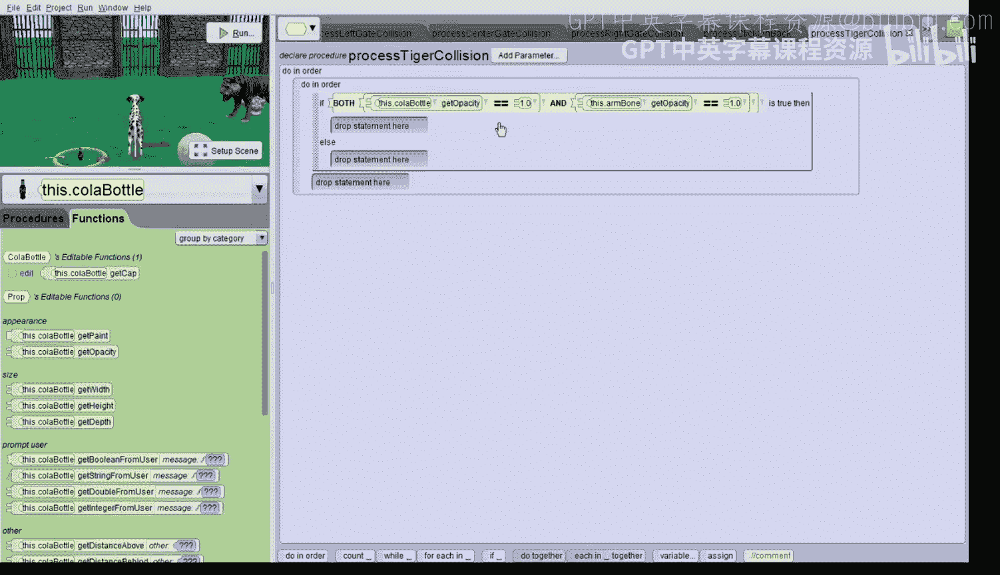

---

## 游戏测试

让我们最后测试一次游戏。我们收到指令。首先尝试直接走向老虎，它会说需要骨头和可乐。

然后我们进入右门，撞向南瓜头，获得红宝石。返回后，进入左门，现在猴子会给我们可乐瓶。我们还需要骨头，所以进入中门，撞向任意一只乌龟获得骨头。

点击返回按钮，现在所有三件物品都齐了。最后走向老虎，老虎消失，半身像出现并说“你赢了”。太棒了！你现在可以玩你的第一个大型游戏了。

---

## 总结

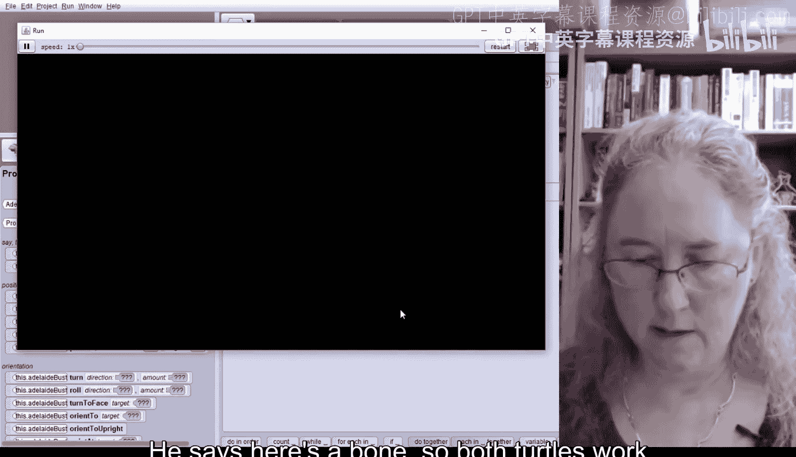

在本节课中，我们一起学习了一个多场景游戏项目的核心构建流程。我们掌握了如何使用摄像机遮罩实现平滑的场景切换，如何通过碰撞事件触发不同的场景逻辑和物品获取，以及如何通过条件判断来管理游戏进度和胜利条件。关键步骤包括初始化场景状态、编写各个场景的切换逻辑、为每个场景添加特定的事件交互，并最终将所有部分连接成一个完整的、可玩的游戏。