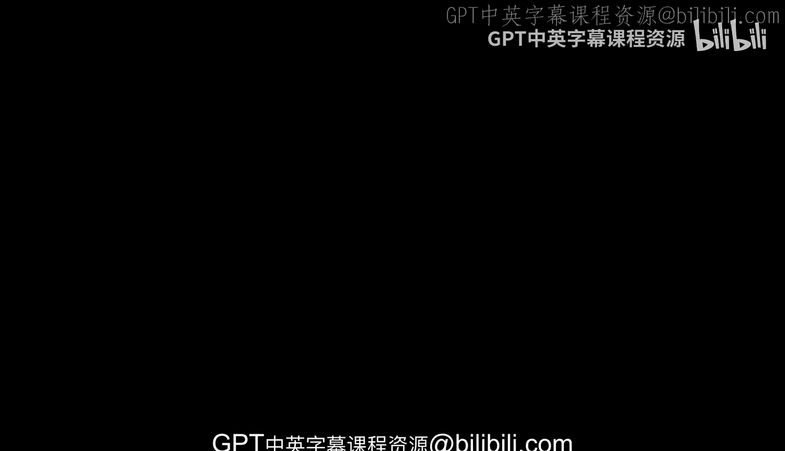
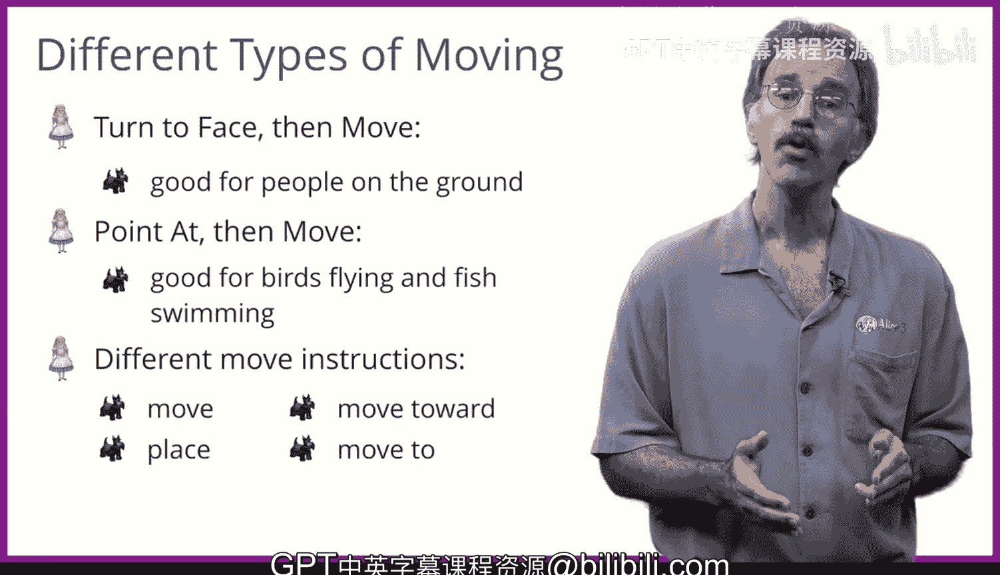

# 爱丽丝编程与动画入门：013：更多控制与指令比较 🎬

在本节课中，我们将学习爱丽丝（Alice）动画环境中的更多控制指令，特别是关于物体运动与旋转的各种组合方式。我们将探讨不同指令的工作原理、适用场景以及它们之间的区别。

## 运动与旋转的基础

上一节我们介绍了动画的基本概念，本节中我们来看看爱丽丝中物体运动与旋转的具体类型。这些指令是构建动画的基础。

### 平移运动指令

平移运动是描述物体普通移动的术语。物体可以在三维空间中沿着三个轴，朝六个不同的方向移动。

以下是三个运动轴及其方向：
*   **前后轴**：向前或向后移动。
*   **左右轴**：向右或向左移动。
*   **上下轴**：向上或向下移动。

### 旋转运动指令

旋转运动指令描述了物体所有可以转动或翻滚的方式。与平移运动类似，旋转也可以通过三种方式在六个方向上实现。

以下是三种旋转类型：
*   **前后翻转**：这类似于滑雪时向前摔倒，身体面朝下向前翻转。
*   **左右转向**：这可以通过门的开合来形象地说明，物体围绕垂直轴左右转动。
*   **左右翻滚**：这类似于转动门把手，物体围绕其自身的轴线进行旋转。

### 对物体部件的操作

动画不仅可以施加于整个物体，也可以施加于物体的某个部件。然而，你应当只对部件使用`turn`（转向）或`roll`（翻滚）指令。

> 注意：尝试移动一个物体部件会导致奇怪的变形，因为该部件是附着在物体主体上的。

## 指令执行的顺序与组合

接下来，我们将探讨顺序执行运动/旋转指令与同时执行它们之间的区别。理解这一点对于创建流畅、符合预期的动画至关重要。

## 使物体移动的指令

最后，我们需要了解几种能使物体产生移动的指令。选择合适的指令取决于你希望物体如何移动以及移动的目标是什么。

### 面向与移动

第一种是常规的`move`（移动）指令。它前面通常会有`turn to face`（转向面对）或`point at`（指向）指令。

*   `turn to face` 指令使一个物体转向以面对另一个物体。随后，当第一个物体向前移动时，它会朝着第二个物体的方向在地面上移动。这个组合最常用于模拟人的行走，因为他们需要保持在地面上。
*   `point at` 指令使一个物体指向另一个物体。随后，当该物体向前移动时，它会朝着第二个物体移动，但可能不保持在地面上。这个指令序列非常适合鸟类或鱼类，而不太适合人类。

### 其他移动指令

除了常规的`move`指令，还有三个指令可以直接让物体向另一个物体移动。

以下是这三个指令：
*   `place`（放置）
*   `move towards`（移向）
*   `move to`（移动到）

根据你想要实现的具体运动效果，这些指令可能比常规的`move`指令更好或更差。

---

**本节课总结**：我们一起学习了爱丽丝中物体平移与旋转的各种指令，包括对整体和部件的操作。我们比较了指令顺序执行与组合执行的区别，并详细介绍了`move`、`turn to face`、`point at`等关键移动指令及其适用场景。掌握这些指令的组合使用，是创建复杂动画的基础。