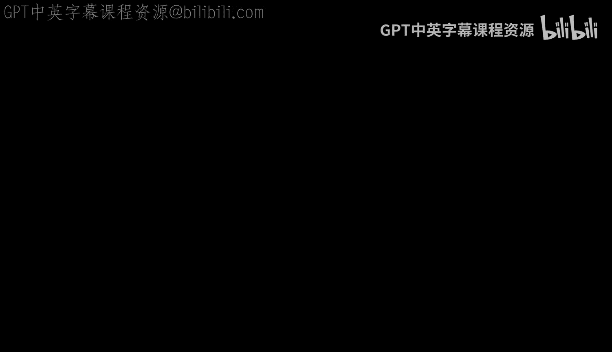
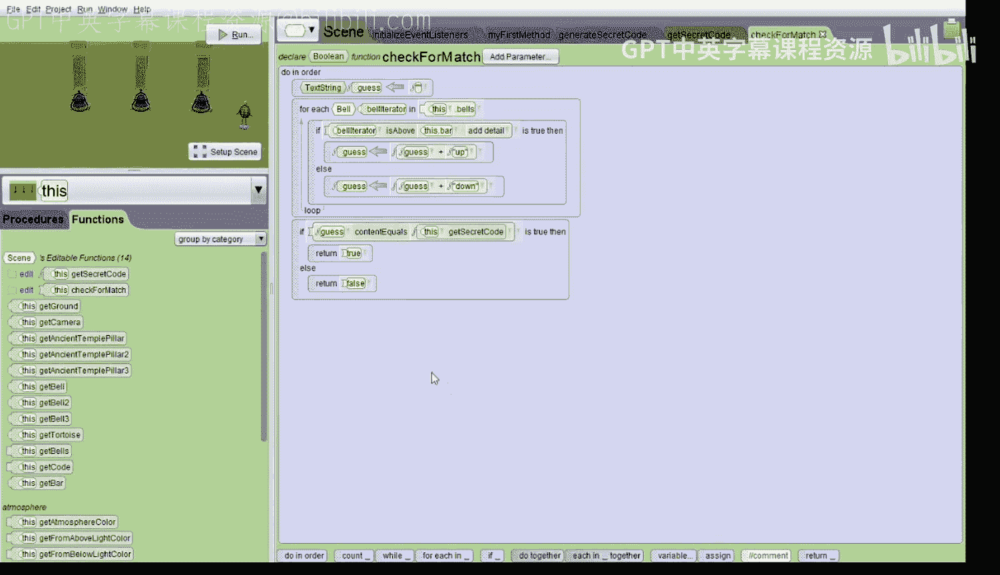

# 爱丽丝编程与动画入门：134：逻辑游戏演示



## 概述
在本节课中，我们将学习如何使用爱丽丝（Alice）编程环境创建一个简单的逻辑游戏。游戏的目标是让玩家通过点击铃铛来猜测一个由“上”和“下”组成的随机秘密代码。我们将分步完成三个核心任务：生成秘密代码、处理玩家点击事件以及检查玩家是否猜中了代码。

---

## 游戏初始设置

我们已经部分设置好了这个游戏。我们在三个古老的柱子前放置了三个铃铛。我们还添加了一只乌龟，它将用于提供游戏说明。

如果我们点击运行，现在来试一下。系统会询问我们是否需要说明。如果我们输入“是”，乌龟会告诉我们如何玩游戏。你需要猜测一个秘密代码，即铃铛的位置。从左到右，每个铃铛的状态是“上”或“下”。你将通过点击铃铛来上下移动它们，使其处于正确位置。

但是，如果我们点击一个铃铛，让我们试试看。什么也没有发生。让我们关闭运行窗口。

---

## 第一步：生成秘密代码

上一节我们看到了游戏的基本界面，本节中我们来看看如何生成随机的秘密代码。

我们点击场景选项卡，滚动到底部。我们看到底部有一个名为 `bells` 的铃铛数组和一个名为 `code` 的文本字符串数组。

首先，我们需要创建一个场景过程来生成秘密代码。

1.  创建一个场景过程，命名为 `generateSecretCode`。
2.  我们需要遍历 `code` 数组的每个元素，并随机将其设置为“上”或“下”。由于爱丽丝不允许在迭代的数组中进行赋值，我们不能使用迭代器，而是使用计数循环。
3.  创建一个名为 `index` 的整数变量，初始化为0。
4.  在变量后添加一个计数循环，循环次数为 `code.length`。
5.  在循环内添加一个 `if` 语句，条件为 `nextRandomBoolean`，表示50%的概率。
6.  在 `then` 分支中，使用赋值语句将 `code[index]` 设置为“上”。
7.  在 `else` 分支中，将 `code[index]` 设置为“下”。
8.  最后，在 `else` 语句后，将 `index` 增加1。

以下是生成秘密代码的核心代码结构：
```alice
变量 index = 0
循环 从 1 到 code.length 执行
   如果 nextRandomBoolean 为真 则
      赋值 code[index] = "上"
   否则
      赋值 code[index] = "下"
   结束如果
   赋值 index = index + 1
结束循环
```

为了验证我们生成了不同的随机代码，我们最好编写一个函数，将秘密代码从字符串数组转换为单个字符串。

现在创建一个场景函数，命名为 `getSecretCode`，返回类型为文本字符串。

1.  创建一个名为 `theCode` 的文本字符串变量，初始化为空字符串。
2.  添加一个 `forEach` 循环来遍历 `code` 数组。
3.  在循环内，将 `theCode` 赋值为 `theCode + oneCode`（即拼接每个代码）。
4.  循环结束后，返回 `theCode`。

为了测试，我们可以在 `myFirstMethod` 中调用 `generateSecretCode`，然后让乌龟说出生成的秘密代码。运行几次项目，可以看到每次生成的代码都不同。测试成功后，记得注释掉让乌龟说出代码的那行代码，否则游戏就失去乐趣了。

---

## 第二步：处理玩家点击

上一节我们成功生成了秘密代码，本节中我们来实现游戏的核心交互：处理玩家点击铃铛。

我们需要初始化事件监听器，添加一个“鼠标点击对象”监听器，并指定监听对象为 `bells` 数组，这样我们只处理对铃铛的点击。

在监听器内部的过程中，我们需要按顺序做两件事：首先移动被点击的铃铛，然后（作为第三步的一部分）检查玩家是否赢得了游戏。

1.  添加一个 `doInOrder` 块。
2.  我们想要实现：如果被点击的铃铛在“下”位置，就向上移动；如果在“上”位置，就向下移动。
3.  添加一个 `if` 语句，条件为 `getModelAtMouseLocation`（获取鼠标位置的模型）是否在横杆 `bar` 之上。
4.  如果条件为真（铃铛在横杆之上，即“上”位置），则将其向下移动1.5个单位。
5.  如果条件为假（铃铛在横杆之下，即“下”位置），则将其向上移动1.5个单位。

以下是处理点击移动的核心逻辑：
```alice
如果 getModelAtMouseLocation 在 bar 之上 则
   getModelAtMouseLocation 向下移动 1.5
否则
   getModelAtMouseLocation 向上移动 1.5
结束如果
```

现在运行程序并点击铃铛进行测试。点击铃铛，它会上下移动，功能正常。

---

## 第三步：检查是否匹配

上一节我们实现了铃铛的点击交互，本节中我们来完成最后一步：检查铃铛的当前位置是否与秘密代码匹配。

我们创建一个场景函数，命名为 `checkForMatch`，返回类型为布尔值（`true` 或 `false`）。这个函数需要做两件事：首先，根据铃铛的当前位置构建一个猜测字符串；其次，检查这个猜测字符串是否与秘密代码相等。

以下是实现步骤：

1.  创建一个名为 `guess` 的文本字符串变量，初始化为空字符串。
2.  使用 `forEach` 循环遍历 `bells` 数组。
3.  在循环内添加一个 `if` 语句，检查当前遍历的铃铛 `bellIterator` 是否在横杆 `bar` 之上。
4.  如果为真（铃铛处于“上”位置），则将 `guess` 赋值为 `guess + "上"`。
5.  如果为假（铃铛处于“下”位置），则将 `guess` 赋值为 `guess + "下"`。
6.  循环结束后，`guess` 字符串就代表了铃铛的当前位置。
7.  在循环后添加一个 `if` 语句，使用 `contentsEqual` 方法比较 `guess` 和调用 `getSecretCode` 函数得到的秘密代码是否相等。
8.  如果相等，则返回 `true`；否则返回 `false`。

检查匹配的函数逻辑如下：
```alice
变量 guess = ""
循环 遍历 bells 数组中的每个 bellIterator 执行
   如果 bellIterator 在 bar 之上 则
      赋值 guess = guess + "上"
   否则
      赋值 guess = guess + "下"
   结束如果
结束循环
如果 guess 的内容等于 getSecretCode() 则
   返回 true
否则
   返回 false
结束如果
```

现在，回到“初始化事件监听器”中，在移动铃铛的代码之后，添加一个 `if` 语句来调用 `checkForMatch` 函数。



1.  如果返回 `true`，则让乌龟说“干得漂亮”，并说出秘密代码是什么。
2.  使用字符串拼接，让乌龟说“秘密代码是”加上 `getSecretCode()` 的返回值。

---

## 总结

本节课中我们一起学习了如何在爱丽丝中创建一个完整的逻辑游戏。我们分三步实现了核心功能：使用数组和随机数生成秘密代码；通过事件监听器处理玩家的鼠标点击来移动铃铛；编写函数检查玩家摆放的铃铛位置是否与秘密代码匹配，并在猜中时给出反馈。你现在可以运行并试玩这个游戏了，祝你玩得开心！