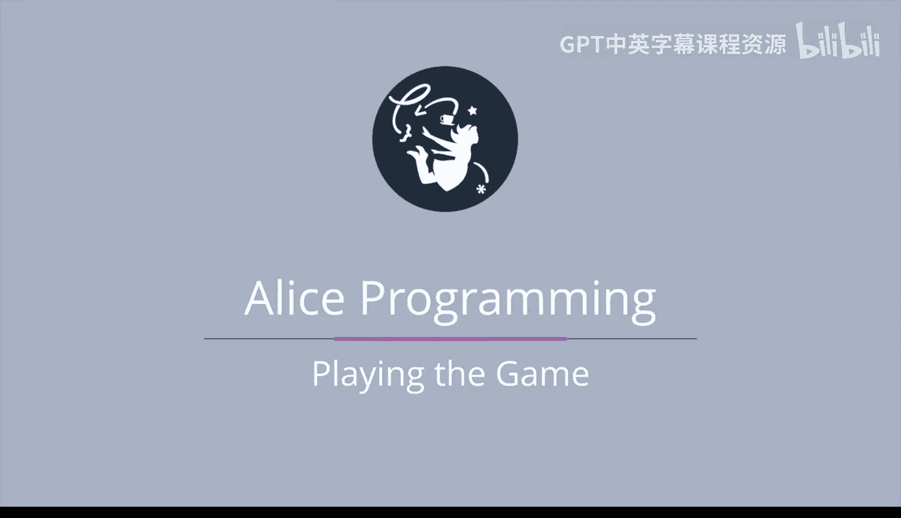

# 杜克大学《爱丽丝编程与动画入门｜Introduction to Programming and Animation with Alice》中英字幕 p139 139_08_06_游戏玩法演示.zh_en -BV1QrB6BcEWW_p139-

Let's play the game。He says，" get me a bone and a banana， let's go over here first。

Cost one we got to go back and get a ruby somewhere。Okay。Let's try over here。Okay。

 we'll go get a bone and a banana。Oh， the logic game， okay。Let's try here。Nope， no。Here。😔，Nope， here。

Here。Here。😔，what is it？It's going to be this one。Down up， down。 All right， let's go back。

 Now we can play that game。Over here。Oh， this is hard， all right。Send to。So， it's 7。2，2，2，2，2。2，5。3。

One， I need help， I think it was six， awesome four。No we did it。 that is so hard。 Okay。

 we got a banana， All right。

One more game in the middle one， okay。Yup。Okay， oh， we got a match。 Alright， let's see。

 We'll start here。Red。Yellow。Red， oh， we got onet that one that was easy。Blue。Oh my gosh。

 we got lucky。Pink， blue。 thats a different blue there。 I think blue。 Oh， we got the blues。

 We got the blues。AGi。😔，Great， oh my gosh， we're doing so good。 Yellow must be this one。 Oh， oh， oh。

 okay， yellow。😊，Yellow， no， okay， we'll get it。 Okay， pink， pink。 All right。

 now I think this is yellow。 This is gotta be yellow。 Okay， we got。 we have a bone and a banana。😊。

All right， let's try this now。 Let's crash into that tiger。 Oh yeah， awesome We won， awesome， Okay，5。

 great job。😊。