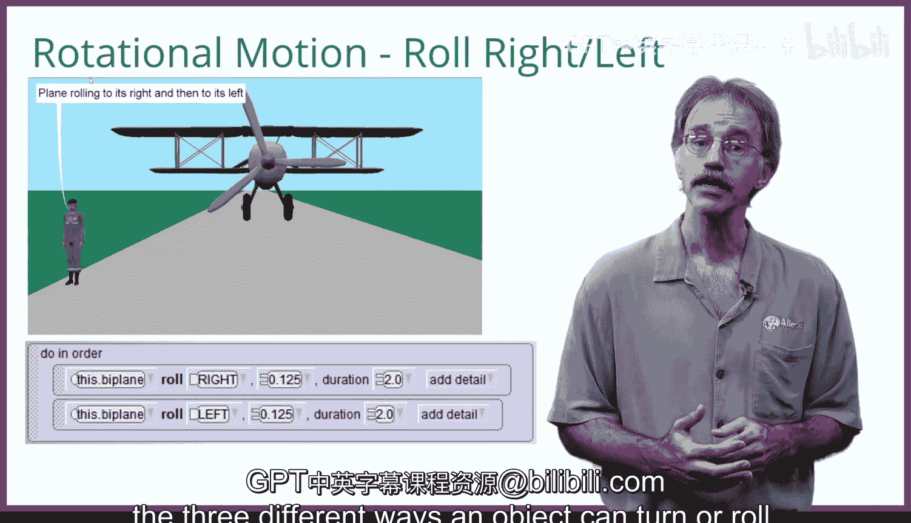

# 杜克大学《爱丽丝编程与动画入门｜Introduction to Programming and Animation with Alice》中英字幕 p14 014_02_04_移动与转向.zh_en -BV1QrB6BcEWW_p14-

In this session， we're going to look at the different types of motion。

 We're going to show some code and the effect of that code running in Alice。

Translational motion are those move instructions。The first possible direction of movement is in a forward。

 backward direction， as is illustrated by the biplane。Note that since a plane is facing the camera。

 its forward direction is towards the camera。The second possible direction of motion is in an up down direction。

As we watch this animation run， this motion is the most normal in that the up down direction is exactly what we'd expect it to be。

The third possible direction of motion is in a right left direction。 As we watch the animation run。

 this motion is somewhat surprising。 When the biplane moves to its right。

 since it's facing the camera， the biplane actually moves to the camera's left。

The same is true when the biplane moves to its left， which happens to be the camera's right。

To be funny， the biplan now tells us that real biplanes don't move that way except an Alice。

Truthfully， real bikeplanes aren't able to talk either， except in Alice。Now。

 it's time to explore rotational motion analysis Alice。 Like translational motion。

 there are three different ways for an object to rotate。

 The first direction of rotation is turning forward backward。 As the plane turns forward。

 its nose turns towards the ground below it。😊，The second rotational direction is a biplane turning to its right left。

 Note that the biplane turning to its right turns it in a clockwise fashion。

The last rotational direction is when the biplane rolls to its right left。

 because the plane is facing us， the plane's rolling to its right seems backwards to what it should be。

We encourage you to run this sample Alice project several times When we were first learning how to create animations in Alice。

 we built an Alice project quite similar to this one to help us get used to the three different ways an object can move and the three different ways an object can term or roll。

😊。

