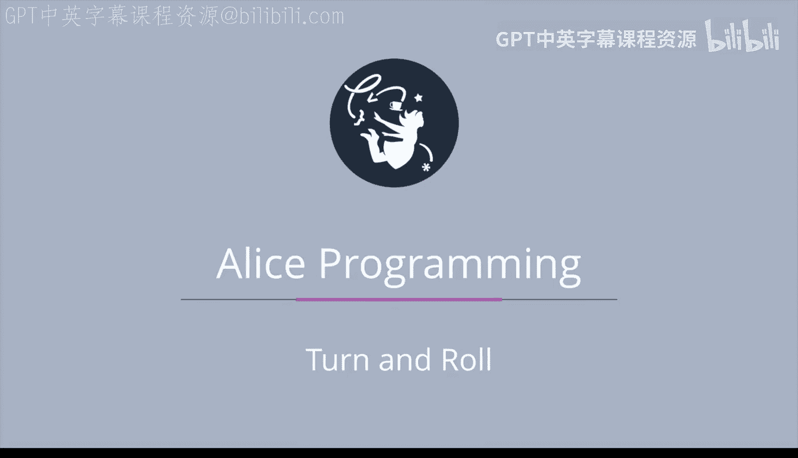

# 爱丽丝编程与动画入门：015：转向与翻滚 🎬

在本节课中，我们将进一步探索“转向”与“翻滚”这两个动作过程。许多学生能很快熟悉爱丽丝3中的移动方向，但我们发现，要习惯旋转操作通常需要更多的练习。

## 概述 📋

我们将通过一个预先构建的爱丽丝项目来学习。该项目包含三个对象：一个宝箱、一个微波炉和一个落地钟。我们将观察这些对象如何通过“转向”和“翻滚”来实现不同的动画效果。

## 宝箱盖的转向 🧰

上一节我们提到了旋转操作，本节中我们来看看宝箱盖是如何工作的。宝箱盖的开关是通过“转向”动作实现的。

*   **打开宝箱**：箱盖需要**向后转向**。
*   **关闭宝箱**：箱盖可以**向前转向**。

## 微波炉门的转向 🚪

了解了宝箱的转向后，我们来看看微波炉门的运作方式。它与宝箱盖不同，其铰链位于微波炉的右侧（或从摄像机视角看是左侧）。

以下是微波炉门的开关方式：
*   要打开门，门需要**向右转向**。
*   要关上门，门需要**向左转向**。

## 落地钟指针的翻滚 ⏰

现在，我们转向最后一个对象——落地钟。钟的指针需要的是“翻滚”动作，而非“转向”。

以下是控制分钟指针的方法：
*   要让时间前进，分钟指针需**向其左侧翻滚**。
*   要让时间倒退，分钟指针需**向其右侧翻滚**。

## 总结与练习 🎯

本节课中，我们一起学习了“转向”与“翻滚”在爱丽丝中的区别与应用。我们通过宝箱盖、微波炉门和钟表指针三个例子，具体观察了这些旋转动作如何产生不同的动画效果。

为了更熟悉爱丽丝中转向和翻滚的工作方式，建议你多次运行这个示例项目进行练习。