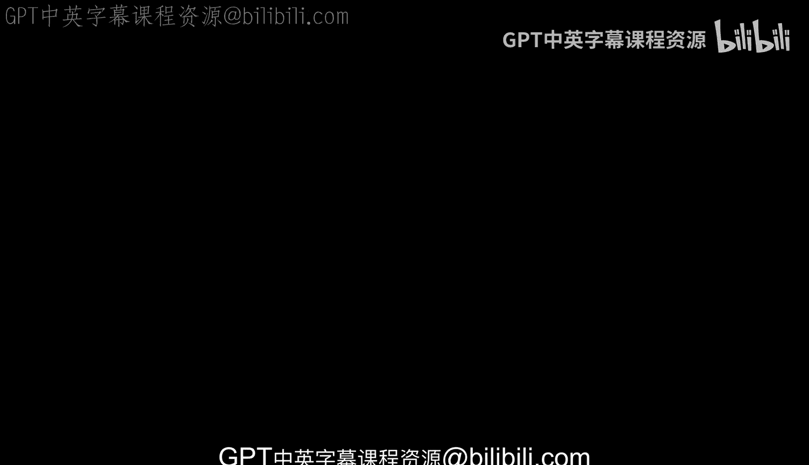
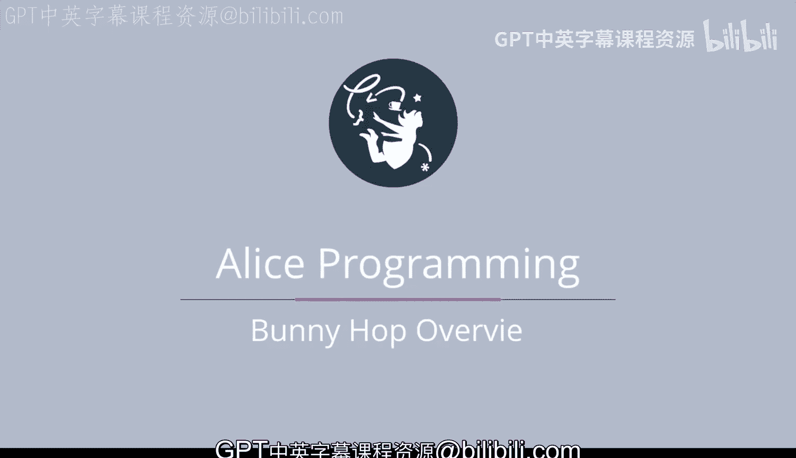
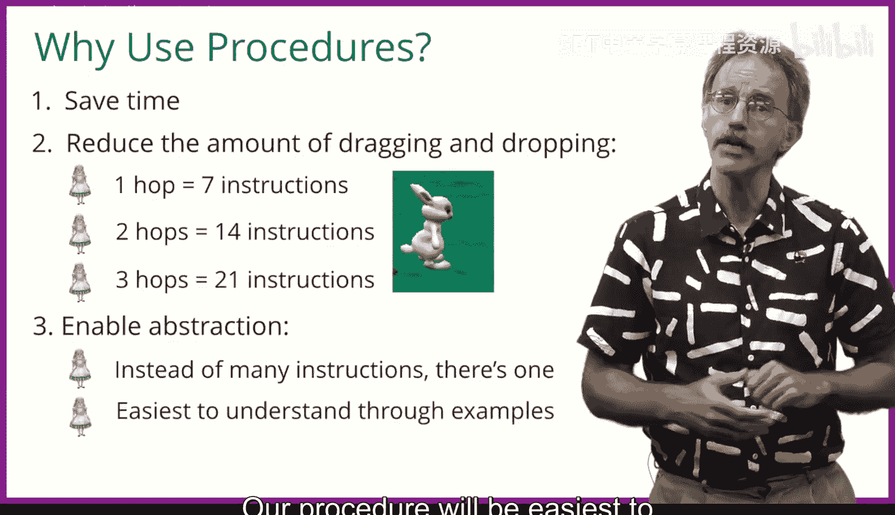

# 杜克大学《爱丽丝编程与动画入门｜Introduction to Programming and Animation with Alice》中英字幕 p23 023_03_03_Hop功能概述.zh_en -BV1QrB6BcEWW_p23-

This module will focus on procedures。 Procedures are one of the most important。

 if not the most important concept， you'll learn in this course。

 Procedures are what allow programmers to build large programs。

 and nearly every piece of software you use from your operating system be it Windows 10 or Mac O。

 Hi Siera to your browser， whether it's Chrome， Firefox。

 Safari Edge or Internet Explorer to your applications， Facebook's， F toify， etc cetera。

 are large programs。 So what exactly is a procedure。In Alice。

 our procedure is nothing more than an instruction。We've already seen many instructions。

 These include move， turn， roll， turn to face， and you'll see many more instructions over the next few weeks。

These instructions are built into Alice。 Every object in Alice can move or turn。

 These instructions are considered to be primitive。In other words。

 they are part of Alice and cannot be broken down into smaller instructions。

AlIS also allows you to create your own procedures or instructions。

The instructions you will create will be collections of Alice's instructions。

Before we discuss why instructions are so useful， we need to say a bit about terminology。

Computer science is full of words that are specific either to a particular programming language or to programming。

We need to be comfortable being able to converse with others and need to learn the language of programming。

 This is no different than the language of doctors or the language of plumbers or the language of bike repair shop owners。

If you are talking with another programmer about Alice。

 the term you'll use to describe creating your own instruction is procedure。

By using the word procedure， both you and the other Alice programmer you're talking to。

 will understand exactly what you're talking about。However。

If you are talking to someone who programs in Java or C++ or C sharpp or in most other languages。

 the term you'll wish to use for describing your own instruction is method。Technically。

 a procedure is a void method， but most programmers just use the term method。All three terms。

 instruction， procedure and method mean the same thing。

 We'll use all three interchangeably in this course。So。Why do you want to use procedures？

You will see that procedures will save you time since you will write less code。

 You'll write the code once and then call it whenever you need it。

Procedures also reduce the amount of dragging and dropping you do with your instructions。

Let's look at an example In this module， we're going to write the instructions for having a bunny hop。

 depending on how realistic we wish the hop to be， we'll discover that it requires， say。

7 instructions， move， turn， etc ceter to get the bunny to hop。 Well。

 what if we'd like the bunny to hop twice。Well， instead of needing seven instructions。😊。

We all need 14 instructions。Three hops will require 21 instruction。Yuck。

 that's a lot of dragging and dropping， just to have the bunny hop three times。Instead。

 Alice will allow us to create our own instruction， which will name Hop。

 creating this instruction will still require seven instructions。

But once we have created our own instruction H， asking the bununny to hop three times。

 we'll be doing nothing more than do in order， Bunny hop， Bunny hop， Bunny hop。

 that's a lot shorter than needing to drag in 21 instructions into my first method。

Computer scientists say the use of procedures or methods enables the use of abstraction。

What they mean is once we're happy with these seven instructions we'll need to use to make a bunny hop。

 we can forget all about the turns and moves that are needed to create the hop and just think about hop as one instruction the bunny can now do。

In addition to turning， rolling， moving， etc。Computer scientists will say that we're thinking and reasoning at a higher level of abstraction。

 that we're thinking about a bunny hopping rather than a bunny turning then moving， then moving。

A procedure will be easiest to understand by looking at some examples。

 Let's get started with teaching a bunny how to hop。

