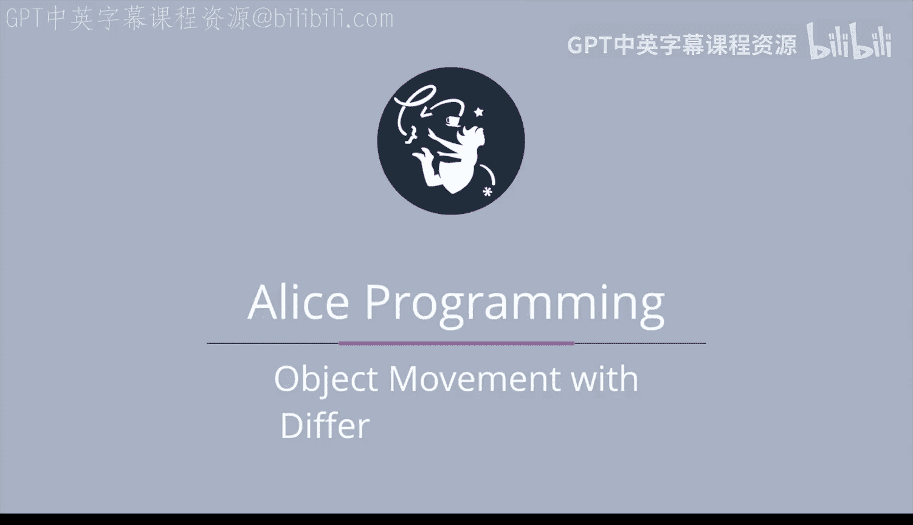
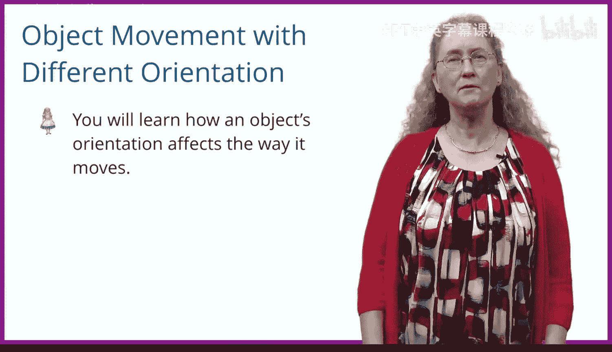
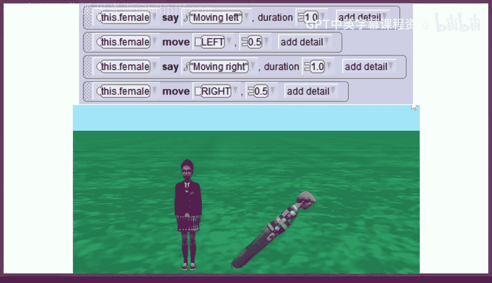

# 杜克大学《爱丽丝编程与动画入门｜Introduction to Programming and Animation with Alice》中英字幕 p26 026_03_03_不同方向的对象移动.zh_en -BV1QrB6BcEWW_p26-

In this demo， you'll learn how an object's orientation affects the way it moves。

 We have prewritten a complete Alice world that will run and discuss why it behaves a little strangely。

 at least strangely at first glance。 If you show this world to a real animator。

 they'll tell you it runs perfectly normally。😊。

There are two people in this world， A female and a male。 Initially， they're both facing you。

 The viewer。 We first asked the male to move to his left half a unit and then turn to his left a quarter revolution。

 We then really make things complicated by having him turn forward One8 of a revolution so that his orientation is quite different from the females。

😊，Now we ask the characters to move when the female moves left。

 she moves to her left or to the viewer's right as she's facing the camera。

Then she moves to her right， back to her starting position。

When the male moves to his left， he actually moves away from the viewer as he has been turned a quarter revolution to his left。

Next， the female moves up and then back down。 This movement is exactly what we expect。

When the male moves up， he appears to move both forward and up。

 The reason for this is he's turned  one，8 through a revolution forward。

 meaning his up direction is actually at a 45 degree angle。When the female moves forward。

 she moves towards the camera。 This motion is also what we expect。When the male moves forward。

 he actually moves into the ground。 This is because he's been turned forward One8th of a revolution or 45 degrees。

 If you prefer degrees of revolutions。 So his forward direction actually appears to the viewer as forward and downward。

😊，We encourage you to run this world several times to get used to this seemingly strange behavior objects exhibit when they're not standing up。

