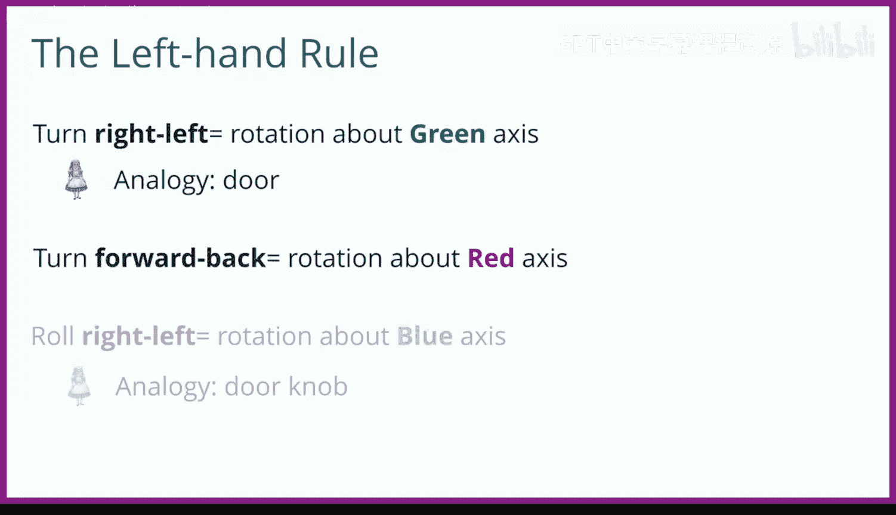

# 爱丽丝编程与动画入门：027：对象与部件转向翻滚演示 🧭

在本节课中，我们将学习如何在Alice中理解对象的旋转。旋转有时难以直观把握，因此我们将通过一个四手演示来清晰地展示对象整体及其部件的旋转原理。

## 概述 📋

我们将使用一个左手、一个坐标轴、一个方便的人体模型以及一只旋转模型及其关节的手来进行演示。在Alice中，坐标轴与人物模型的对应关系如下：绿色轴代表向上，红色轴代表向右，蓝色轴代表向后。模型前方通常没有白色箭头指示。

你可以在Alice中通过添加一个人物、添加一个坐标轴，并让坐标轴移动和对齐到该人物来验证这一点。

## 旋转规则：左手定则 ✋

Alice中的旋转遵循**左手定则**。我们将左手拇指指向要围绕旋转的轴的方向。

观察幻灯片：
*   **左右转向**等同于围绕**绿色轴**旋转。
*   **前后转向**等同于围绕**红色轴**旋转。
*   **左右翻滚**等同于围绕**蓝色轴**旋转。

## 围绕各轴旋转演示 🔄

上一节我们介绍了旋转的基本规则，本节中我们来看看具体的演示。

以下是围绕绿色轴（上下方向）的旋转演示：
*   使用左手演示。
*   使用人体模型演示。

现在，让我们看看围绕红色轴（左右方向）的旋转：
*   使用左手演示。
*   使用人体模型演示。

接下来，观察围绕蓝色轴（前后方向）的旋转：
*   使用左手演示。
*   使用人体模型演示。

## 部件旋转示例 🦵

理解了整体的旋转后，我们来看看模型部件的旋转，其方向可能与整体不同。

首先观察人体模型的右膝，其局部方向与整体不同。现在，我们让膝盖弯曲。遵循左手定则，我们需要让膝盖**向前**旋转四分之一周。

接着，观察人体模型的左肘，其方向也与整体不同。现在，我们让左臂做一个弯举动作。遵循左手定则，我们需要让肘部**向右**旋转四分之一周。

最后一张幻灯片展示了人物整体、他的膝盖以及他的肘部所具有的不同方向。

## 总结 🎯

本节课中我们一起学习了Alice中的旋转机制。我们通过左手定则明确了围绕不同坐标轴（绿、红、蓝）旋转对应的动作（转向、翻滚）。同时，我们也了解到模型部件的局部旋转方向可能独立于整体。旋转可能比较复杂，一个有用的技巧是在Alice中添加一个坐标轴参考，或者用实物组装一个坐标轴模型来辅助理解。