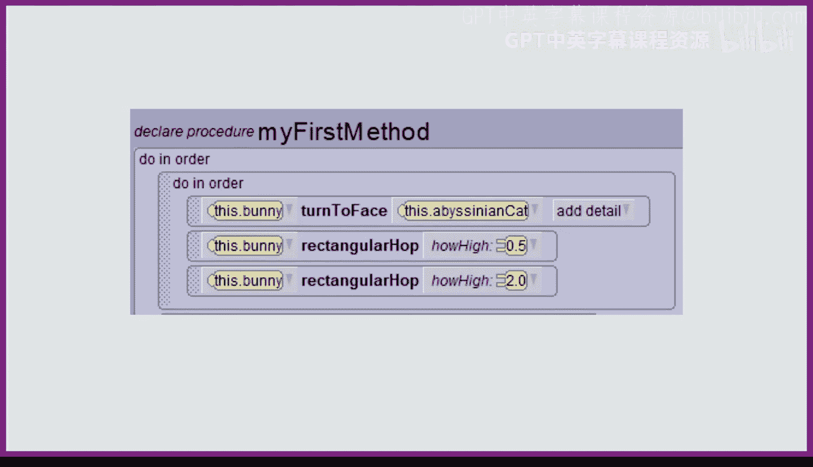

# 爱丽丝编程与动画入门：03：参数概述 🎯


在本节课中，我们将学习如何通过参数使指令变得更加灵活，从而避免编写大量重复的代码。

## 指令的局限性

上一节我们介绍了基本的矩形跳跃指令。现在，我们来看看这个指令的局限性。

矩形跳跃指令总是让兔子向上跳跃1个单位，同时向前跳跃1个单位。虽然这个指令本身没有问题，但它可能无法满足所有场景的需求。

想象一下，兔子需要跳过障碍物。由于它总是向上跳跃1个单位，如果障碍物只有0.5个单位高，兔子就会浪费能量。反之，如果障碍物有2个单位高，在现实中兔子会撞上障碍物，但在Alice动画中，兔子会直接穿过障碍物，这看起来会很奇怪。

## 解决方案：参数化

为了解决这个问题，一个方法是编写三个不同的矩形跳跃指令，分别对应0.5、1和2个单位的高度。但这很笨拙，会导致大量代码重复。

更好的方法是创建一个**单一的矩形跳跃指令**，并允许我们向它传递信息，告诉它我们希望兔子跳多高。这样，指令就能根据我们提供的值让兔子跳跃相应的高度。

## 参数与参数值

Alice已经为一些基本指令（如`move`和`turn`）提供了这种自定义功能。例如，在`move`指令中，我们需要指定**方向**和**距离**。在`turn`指令中，我们需要指定**旋转方向**和**圈数**。

我们可以将这种灵活性添加到我们自己创建的任何指令中。方法是通过**参数**和**参数值**。

*   **参数** 是你在指令中定义的一个**占位符**，用于接收输入。它必须有**名称**和**类型**（例如，数字或对象）。
*   **参数值** 是你在调用指令时**传递给参数的具体值**。每次调用指令时，你都可以传递不同的值。

## 实践：为矩形跳跃添加参数

让我们通过一个例子来理解。原始的`rectangularHop`指令如下：
```alice
bunny move up 1
bunny move forward 1
bunny move down 1
```
它的跳跃高度固定为1个单位。

现在，我们添加一个参数，使兔子能跳跃不同的高度。

1.  点击指令顶部的 **“添加参数”** 按钮。
2.  为参数命名，例如 `howHigh`，它代表兔子跳跃的高度。
3.  选择参数类型。由于跳跃高度是一个数字，我们将其定义为 **“十进制数”**。

添加参数后，其类型和名称会显示在指令名称旁边。但此时我们还没有使用它，兔子仍然固定移动1个单位。

我们需要修改指令体，将向上移动和向下移动的“1”替换为我们的参数 `howHigh`。修改后的指令如下：
```alice
bunny move up howHigh
bunny move forward 1
bunny move down howHigh
```
现在，我们可以为 `howHigh` 传递任何值，兔子将向上移动该值，然后向下移动相同的值。

## 调用带参数的指令

添加参数后，之前调用`rectangularHop`的地方会显示为红色，提醒我们需要提供参数值。

例如，要让兔子跳过一只高约0.5的猫，我们可以传递参数值 `0.5`。要让兔子跳过一只高约2.0的野兔，我们可以传递参数值 `2.0`。这样，兔子两次跳跃的高度都刚好能越过障碍物。

使用参数可以让你编写更灵活、更少的指令。在这个例子中，我们只需要一个`rectangularHop`指令，就能应对不同高度的障碍物，而无需编写多个指令。

## 总结



本节课中，我们一起学习了参数的概念和作用。我们了解到，通过为指令添加参数，我们可以向指令传递信息，使其行为根据我们的需求发生变化。这避免了代码重复，极大地提高了代码的灵活性和可重用性。现在，你可以尝试为你自己的指令添加参数，享受创造更智能动画的乐趣吧！