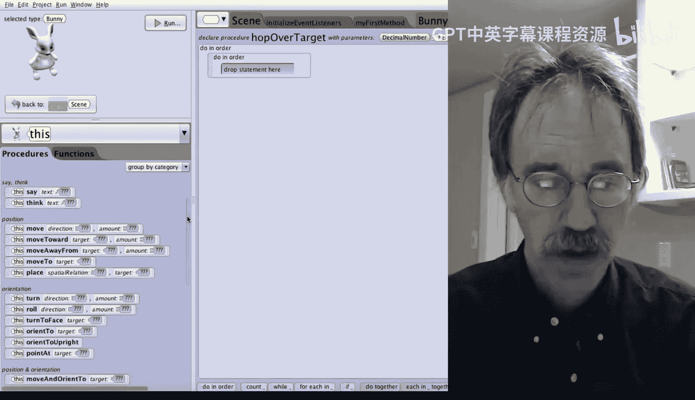

# 杜克大学《爱丽丝编程与动画入门｜Introduction to Programming and Animation with Alice》中英字幕 p33 033_03_04_跨越世界.zh_en -BV1QrB6BcEWW_p33-

In this lesson， you'll learn how to use parameters to make your instructions more useful。

This world has our bunny， along with a turtle， cat， and dog。The turtle is 0。25 units tall。

 the cat is 0。5 units tall， and the dog is one unit tall。They have been positioned in a line。

 more or less。The dog is one unit away from the cat， and the cat is one unit away from the turtle。

The bunny is positioned halfway between the cat and the turtle。In other words。

 it is half a unit from the cat and half a unit from the turtle。

The hot method from earlier has been included。 If you click on the triangle to the right of the word this on the left hand side of the screen and then select this dot bunny。

You can click on editit to see the Bunnynie's code for hopping。There we go。

There are two differences from the instruction we created before。

 The first is that we name this instruction hop high。There was no real reason to do this。

 except to emphasize that we are going to modify this instruction to use a parameter that will allow the bunny to do hops of different heights。

 The second difference is， we have changed the duration of each of the animation instructions to be half a second rather than the one second default。

 Main， so the animation will run a bit quicker。Let's run the world。

We see the bunny first turn to face the cat and then hop over the cat。The problem is， of course。

 that the bunny hops too high。The reason is that， and let's take a look at this one more time to watch the bunny watch too high to jump too high。

Okay。The reason is that in the high hop procedure， we have asked the bunny to move up and then later down one unit。

But the bunny really only needs to move up half a unit to safely get over the cat。

And if the money were trying to hop over the turtle， it would only need to move up one quarter unit。

Let's add a parameter which will allow the caller to specify the height the bunny has to move up and then later down。

To do so， we'll need to change the hop high procedure。

We click on the large Add parameter button at the top of the screen。Right here。In the name box。

 we type in the nameHowH。Which is what we will call the parameter。

Note that we are also using Caml case in how we name our parameters。

We also need to tell Alice one other very important piece of information。

We need to tell Alice what type of information the parameter will contain。For example。

 a direction or a number。In this case， we would like the height to be a decimal number。

So we click on the little red triangle to the right of the wordunset。

Which is to the right of the word value type。After clicking on the triangle。

 we're going to select decimal number。 because we had previously written this procedure with no parameters。

 We also need to click the check box that says， I understand that I need to update the invocations to this procedure。

Right there。What this means is that Alice is telling us that we were previously calling this procedure when it didn't have any parameters。

 now that we have added a parameter， we also need to change the calls， which we'll do in a minute。

Click on the checkbox and then click on the OK at the bottom right of the box。

Now we have the parameter how high available for us to use in the H high instruction。

Let's drag the parameter over top of both of the 1。0s。

 which refer to how far up and down the bunny is to move。 We can simply drag。Right over the 1。

0 in the up。And we can drag just over the 1。0 in the down。

That's all we need to do to change our procedure。Let's go back to my first method。

You can now see a red box appear next to how high that is because we need to pass a value to the hop high procedure telling the bunny how high it should hop。

By clicking on the triangle to the right of the word unset， we can select a value of 0。5。Right there。

Let's run our world。The bunny now hops over the cat。

 barely clearing it and not wasting any energy in the process。

Let's add a second call to the H High instruction tab have the bunny also hop over the dog。So again。

 we can click on this dot bununny。And we can drag in a second call to hop high。

And this time we'll specify a value of one for how high so that the bunny will hop the right height over the dog。

Let's run the world again。Cool， the bunny hops the right height to clear the cat and then a higher height to be able to clear the dog。

For the second part of this lesson， we're going to look at the case where you'd like to have more than one parameter。

In this specific case， we are going to write a new procedure。

 which we'll call hop over target for this procedure， we'll want to have two parameters。

1 will be the height the bunny is to move up and then down。

 And the second is which object the bunny is to hop over。 Let's go ahead and do it。 First。

 we need to simply close our running world。Next， we'll go ahead and click on the hexagon up here and go ahead and let's go ahead and add a new bununny procedure。

We'll name this one， hopop。Over。Target， again， using Caml case。Next。

 let's go ahead and add two parameters。So let's click on the first add parameter button。

The first parameter will name height of target。And this is exactly the same as what we did last time。

And like we did before， we'll go ahead and make this parameter a decimal number。Quick， okay。

The second parameter， so we'll need to click the Add parameter button one more time。

We'll call this one which？Animal。And this type will be S model。

 as all of the animals the bunny is top over are considered by Alice to be models。

It would also be fine for the type of which animal to be quadruppeed as all of the animals。

 the bunny all of the animals the bunny is going to jump over happen to have four legs to set the type after clicking on the little right yellow triangle to the right of the word unset。

We have to go and click on gallery class。And then within the gallery class。

 we can go ahead and click on S model and then specify， okay。And we'll specify， okay。

 one more time to add the second parameter， which animal that's of type S mod。

This hopover procedure only has to do two things。First。

 it has to have the money turned to face the target animal。

 so let's drag in a do in order instruction。Right。And then let's drag in a bunny turn to face instruction。

'll scrollcroll down。

And will' specify this bunny turn to face。And when the target pops up， we can specify our parameter。

 which animal。The second thing we need to do is to hop over that animal。

 We can simply call our handy dandy hop high procedure。Scroll up top and we can simply say。

 let's call hop high。And specify our parameter height， height of target。That's it。

Let's go back to my first method。Now， after changing this to this dot bunny。

We can call or invoke our new method。 Let's call hop over target three times the first time。

We can specify a height of one and specify we are to dump over the Dalmatian。

Then we'll call hop over targetrg a second time， and this time we'll specify we only have to go up 0。

5 units and we'll specify the cat。The third time we're going to call hopover target and we'll say we only need to go up one quarter unit and we're going to specify the tortoise。

And now when we run our world。We see the first two hops that we had specified before。

 and now we call our second method so that the bunny is going to turn to face the right object and hop exactly the right height。

And now we have a more useful bununny hop。