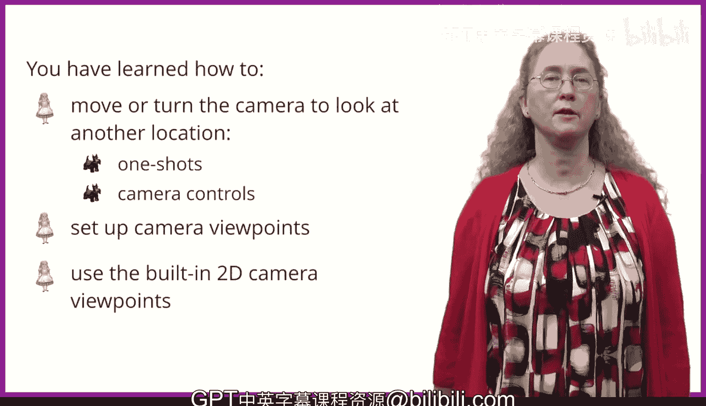

# 爱丽丝编程与动画入门：第35课：摄像机控制 📹


在本节课中，我们将学习如何在Alice动画中控制摄像机。你将了解如何设置不同的摄像机视点，如何移动和旋转摄像机，以及如何使用摄像机标记来保存和调用特定的摄像机位置。掌握这些技巧，你就能像电影导演一样，为你的动画故事创造动态的视角。

## 概述：摄像机视点

在电影中，你有时会看到这样的场景：两个人正在交谈，突然传来一声巨响。摄像机通常会转向声音的方向，甚至向前移动，以便你能看清声音的来源。接着，摄像机可能会切换到人物的特写镜头，让你看到他们对声音的反应。摄像机所观察的场景被称为**摄像机视点**。

本节中，我们将学习如何设置这样的摄像机视点，以便在动画中将摄像机移动到不同的位置。

## 使用Alice内置的二维视点

在设置场景时，Alice提供了特殊的二维内置视点，帮助你精确地放置世界中的物体。

以下是Alice提供的五个内置视点，你可以点击箭头在不同视点间切换：

*   **起始摄像机视点**：这是你开始场景设置时看到的视点，也是进入场景设置前的默认视点。
*   **布局场景视点**：这是一个从摄像机上方俯瞰的视点，可以看到世界的大部分区域。但请注意，在这个视点和起始视点中，我们都无法看到某些被遮挡的物体（例如之前提到的兔子）。
*   **二维俯视图**：这是一个二维视图，物体只能朝四个方向（前、后、左、右）移动，而不能上下移动。这个视图有助于你将物体在地面上移动到理想位置。
*   **二维侧视图**：这也是一个二维视图，物体只能朝四个方向（上、下、前、后）移动，不能左右移动。这个视图可以确保物体正好站在地面上，而不是略高于或低于地面。
*   **二维前视图**：这同样是一个二维视图，物体只能朝四个方向（左、右、上、下）移动，不能前后移动。

这些内置视点能帮助你在程序开始时，将物体精确地放置在你想要的位置。

## 移动摄像机的方法

现在，我们来看看如何移动摄像机以改变观察世界的角度。

### 方法一：使用摄像机控制箭头

从起始摄像机视点，你可以看到一组紫色的箭头控制工具。直线箭头用于**移动**摄像机，曲线箭头用于**旋转**摄像机。

*   **最左侧的箭头组**：全部是直线箭头，用于上下、左右移动摄像机。
*   **中间的箭头组**：包含两个直线箭头和两个曲线箭头。直线箭头用于前后移动摄像机，曲线箭头用于左右旋转摄像机。
*   **最右侧的箭头组**：全部是曲线箭头，用于前后倾斜（俯仰）摄像机。

你可以使用这些控制箭头，将摄像机移动和旋转到你希望在动画中使用的视点。

### 方法二：使用“单次指令”

你之前已经使用过“单次指令”在设置过程中移动物体。同样，你也可以用它来移动或旋转摄像机。以下是一些可用于摄像机的指令示例：

```alice
camera.move(forward, 1)
camera.turn(left, 0.25)
```

**一个小提示**：摄像机的起始位置总是略微向前倾斜。在移动或旋转摄像机之前，最好先使用 `orient to upright`（定向为直立）指令让它完全直立。这样，当你让摄像机向前移动时，它就不会钻到地下去。

你可以结合使用“单次指令”和摄像机控制箭头，将摄像机移动到世界中的另一个视点。

## 保存视点：摄像机标记

既然你已经知道如何在世界中移动摄像机，你可能会希望保存某个特定位置，以便在动画播放时将摄像机切换过去。

**摄像机标记**是一种特殊的对象，可以记住你世界中的一个摄像机位置。你可以通过将摄像机放置在你想要保存的位置，然后在该位置放置一个摄像机标记来创建它。

在场景设置中选中摄像机后，你会看到“摄像机标记”选项和一个“添加摄像机标记”的按钮。点击该按钮会创建一个看起来像摄像机（但颜色不同）的标记。你应该为摄像机标记起一个有意义的名称。

添加标记后，它们会出现在场景设置视图中（方便你查看位置），但在运行世界时不会显示。

摄像机标记有两个控制按钮：
*   **左侧按钮**（黑色摄像机指向彩色摄像机）：用于将**摄像机移动**到该标记的位置。这在设置物体或在动画中将摄像机切换到预设位置时非常有用。
*   **右侧按钮**（彩色摄像机指向黑色摄像机）：用于将**摄像机标记移动**到当前摄像机的位置。如果你决定将标记重置到另一个位置，这会很有用。

要使用这些按钮，你必须先点击摄像机标记的名称，然后再点击按钮。

你也可以使用“单次指令”将摄像机移动到标记处，使用的指令是 `move to` 和 `orient to`。这样摄像机会移动到标记位置，并转向与标记相同的方向。

```alice
camera.moveToAndOrientTo(cameraMarker)
```

## 使用摄像机标记的技巧

以下是一些有助于你使用摄像机标记的技巧：

1.  **始终先放置起始标记**：在移动摄像机之前，应该先放置一个摄像机标记，并将其命名为类似“camera start view”的名称。Alice世界中起始摄像机的位置很特殊，它代表了世界的中心，也是你点击添加物体时默认放置的位置，不要丢失这个位置。
2.  **善用撤销**：如果点击了错误的摄像机控制按钮，可以点击“编辑”->“撤销”。撤销功能是你的好帮手。
3.  **处理标记遮挡**：有时摄像机标记会遮挡住视图中的物体，使你难以点击和移动该物体。如果发生这种情况，你可以始终使用“单次指令”来移动物体。
4.  **先布置物体，后设置标记**：最好先设置好所有物体，然后再添加摄像机标记。

## 在动画中使用摄像机标记

一旦设置好摄像机标记，你就可以在动画过程中将摄像机移动到它们的位置。

你会使用 `move to and orient to` 指令，并选择你想要移动到的摄像机标记。通过更改**持续时间**，你可以控制摄像机移动到新位置的速度。例如，持续时间为5，意味着摄像机需要5秒钟移动到新位置。

```alice
// 示例：摄像机在2秒内移动到“侧视图”标记
camera.moveToAndOrientTo(sideViewMarker, duration=2)
```

## 总结



本节课中，我们一起学习了关于摄像机的许多知识：如何移动它，如何设置摄像机标记来保存视点，以及如何通过移动物体和选择Alice的二维视图来设置场景。现在，你可以享受使用不同的摄像机视点来创作更生动、更具电影感的动画了。