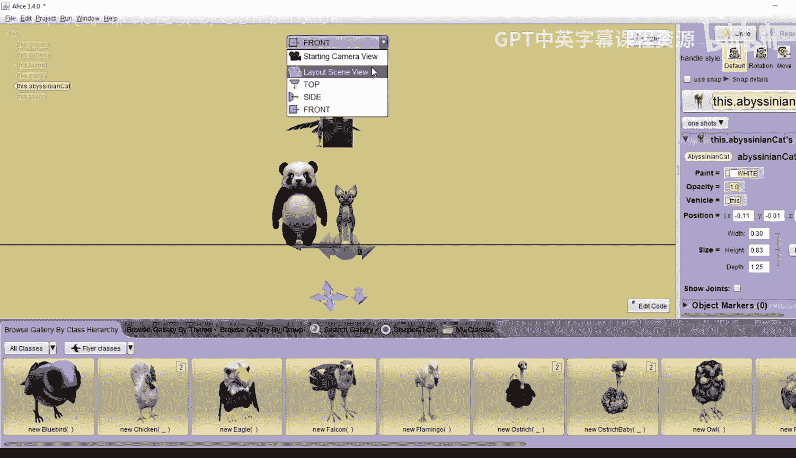

# 杜克大学《爱丽丝编程与动画入门｜Introduction to Programming and Animation with Alice》中英字幕 p36 036_03_04_摄像机控制演示第一部分.zh_en -BV1QrB6BcEWW_p36-

This demo shows how to use the built in camera views to set up a scene that includes camera markers。

Those camera markers are used as preset locations to move the camera to in the animation。

The story we are going to tell will make use of different camera views。

 We have several animals are standing around After moving the camera around to show different views of the scene。

 the Falcon will crash land， causing the other animals to scatter。

Here is the first scene in the storyboard for the story you will build。

Scene 1 shows the setup of the animals and the camera markers。 You will be adding a panda。

 an obsceidian cat， and a Falcon to the Alice world。😊。

You also add in a bunny and hide the bunny behind the panda， facing the same direction as the panda。

You will set up three camera markers。 One is the starting camera position。

 One is on the side looking at the right side of the animals。

 and one is a close up looking at the falcon。Now， notice that you do not have to be an artist to draw a storyboard。

 You probably can't even tell what the animals are that I drew without looking at the object list。

The important thing is to show where you want the objects in the world。

Sne 2 shows that the camera has been moved to the side view。

 You can see that the bunny is directly behind the panda。

The absentbsceian cat will be partially obscured。 so I just made a note of it instead of trying to draw it。

Scene 3 shows that the camera has been moved to the close up view of the falcon。

 You cannot see any of the other animals in this view。

Scene 4 has the animals in the same position as scene 1。

 We have moved the camera back to the starting camera position。Scene 5 has action in it。

 The falcon will drop to the ground， and the three animals will move out of the way at the same time。

Let's build the world。Open a new Alice world with a grassy desert ground cover。

You may have to scroll down to see it。Click， Ok。Click on set up scene。

We will add animals to the world， first。Go to the Bped classes folder。 Just click on that。

These are 3D models， animals， people and other creatures that all stand on two legs。

We're going to drag in a bunny。Have to scroll over to see it。 There it is。Draggging a bunny。And then。

 drag a panda。Now， in the wild， you would not think of a panda bear as a biped， but instead。

 probably as a quadruped。But in Alice， any 3D model is determined by the artist that creates it。

And the artist that created the panda decided it would stand on two legs and be a bipet。Next。

 go to the Quadruped folder， you'll need to click on the arrow by all classes and select Quadruped classes。

We're going to add in a new Esceinian cat。Now the quadruppeg classes are models that the artist determine stand on four legss。

Next， we want a Falcon again， click on the arrow by all classes。And select the Fer classes。

And since the falcon is going to be above the animals， we're going to do a one shot here。

And spread the falcon's wings just select spread wings。Oh， nice。

 Let's go ahead and move the Falcon up in the air with a one shot。

We're going to move it up exactly 1。3， so select moveve。U。

And then custom decimal number and type in 1。3。That should put it exactly above all the animals。

Let's light up the animals as shown in this storyboard scene 1。Put the bunny in the middle。

 but a little bit to the left。Of the middle。Put the panda in front of the bunny。

So you can't see the bunny。The obsidian cat goes right beside the panda， so that's fine。

And then put the falcon above all the animals。Now， do we know if the cat is really standing beside the panda？

And do we know if the bunny is directly behind the panda。

Do we know if the falcon is directly above the animals， it looks like all of these are true。

 but we don't really know。So we're going to look at Alice's built in 2D views to make sure our animals are exactly where we want them。

Es comes with several built in viewpoints you can use during scene setup。At the top of the page。

 the current camera view is called the starting camera view。If you click on the button beside it。

 you'll see there's four other choices。Select side view。

Now you're seeing all the animals from the left side。

 you can click anywhere on the background and you can pull the animals to the center of the window。

You can also see where the camera is now don't click on it， it's right where we want it。

 we don't want to move it。The animals can move in two dimensions， click on the bununny。

You can see that the bunny can move up and down。And it can move forward and backward。

But it can't move to its left and right。You could actually move the bunny over the panda。

 and he could also jump back over。Now we want the bunny directly behind the panda。

 and we also want the bunny on the ground。Now， the ground is the line that you see there。

 So make sure he's standing right on top of the line and right behind the panda。 Now， remember。

 the falcon is exactly 1。3 units above the ground。But you can see it's not over the animals。

 So click on the falcon and just move it backwards about the same height until it's directly above the panda and the bunny。

If you want to move the cat， you can， you can see just click on any part of it and you can move it。

 and when you're done， just make sure it's standing beside the panda and right on the line。

Check the starting camera view again。I see。 I have my animals lined up exactly the way I want them。

 You cannot see the bunny。Now， change the view to the top view。

You'll be able to see the camera and if you click and drag on the ground。

 you can pull the animals to the center of the window。

Now with the camera controls on the bottom in the top right arrow。

 if you click and drag here and move in， you can get a zoom in and get a close up of the animals。

In this 2D view， you can only move the animals in two dimensions， click on the cat。

 and you can see that the cat moves forward and backward and to its left and right。

But it can't move up and down。Now make sure you put it back right beside the panda。

Change the view to the front view。Here you may also see the camera， but don't move it。Now。

 in this 2D view， you can only move animals again in two dimensions， click on the cat。

 and you can see that the cat can move up and down。And it can move to its。Left， And it's right。Again。

 put the animal， the cat right back on the ground and right beside the panda。

Change the view now to the layout scene view。

This gives you another perspective from the front but higher above。

Change the view back to the starting camera view。You have seen all five of the built in camera viewpoints and saw that three of them are 2D views that limit the movement of the animals。

All five can help you set up the objects for your world。

