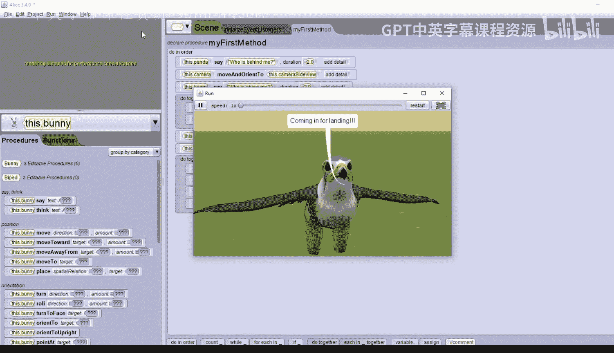

# 杜克大学《爱丽丝编程与动画入门｜Introduction to Programming and Animation with Alice》中英字幕 p37 037_03_05_摄像机控制演示第二部分.zh_en -BV1QrB6BcEWW_p37-

Now you're going to set up several camera locations。

 adding a camera marker for each location so you can move the camera between them during setup and also when you want to write code。

Camera markers are kinda like tripods。They are a location。 You can move the camera to。

They actually look just like the camera and the camera moves directly into them。Very important。

The starting camera view is special。 It's facing the very center of the Alice world。

 When you're adding a 3D model and you click on it and add it。

 it will drop into the world at this central location。 So before you ever move the camera。

 you need to save this special location。 by dropping a camera marker right on the camera。

 Then later in the con， you can easily get back to this starting camera view。😊。

So before you move the camera， let's drop a camera marker on top of it。

To drop a camera marker exactly where the camera is on the right side， you need to select the camera。

As the current object， and then click on camera markers to expand it。Then click on add camera marker。

And then replace its name with a meaningful name。I'm going to call it camera。Start。😔，Few。And click O。

You will see the camera marker has been added。Now you can move the camera and still be able to get back to the starting camera view。

Now let's experiment with moving the camera with a camera control。

 those arrows at the bottom of the window。The leftmost controls move up and down。Up。down。😔。

And then you can also move left。And right， you should have seen a red flash go by。

 That is the red camera marker that we created。Don't ever click on the red camera marker and move it。

 It's saving the location of the starting camera view for us。The middle controls move forward。

And backward。And then the left and right arrows you can see， are curved a little bit。

 so therefore're turning。You can turn to the left。Or you can turn to the right。

The rightmost controls are also curved and also for turning。They turned forward。Or turn backward。

Let's set up another camera view。 We want to get a side view of the animals。

 looking at their right side。We'll use a combination of one shots and moving the camera with the camera controls to do this。

First， do a one shot to move the camera to the falcon。So， we'll select。Move to。😔，Falcon。

And the camera moved right to it。 Next， let's do a one shot。To make the camera orient to upright。

And what that does is it makes the cameras stand up straight。Next， move the camera left ten0。

So move left。1en units， this is just moving it to the left of the animals。

And now we'll use the camera controls。 We'll look at the middle right arrow。

 which is turning and we'll turn to the right if you move， itll go faster and then slower and now。

We can see the side view of the animals。 Let's drop a camera marker， and call it。Camera。Side view。

Now that we've created two camera views， we can move between them using the camera marker controls。

 we're just going to use the left button for now。 don't click on the right button yet。

Click on the camera start view。And then click on the left button。

 which is a picture of a black camera pointing to a red camera。

This means that the camera will move to the camera marker for the camera start view。Next。

 click on the camera side view。And then click on the left button again。

 and the camera moves to the camera side view。My side view is really far away。

 I'd like to reset the camera marker to be a little bit closer。

 We can adjust the camera and then move the camera marker to the camera with the right button。

 So let's do that now。😊，First， I'll use the camera controls to get closer。

Maybe even move this a little bitop。Okay， I like that better。So now I will click on the right button。

It doesn't look like anything happen， but the camera marker should have moved to the camera。

 Let's test that out by moving to the camera start view。With the clicking on the left button。

And then click on the camera side view and again click on the left button。

And it looks like it worked。Let's adjust the camera start view a little bit the same way。

 move the camera to the camera start view。Adjust it just slightly， until you like it。Okay。

 I like that a better， so now I'm going to click on the right button to move the camera start view marker to where the camera is。

Remember， the starting view is special as it is looking at the center of the Alice world。

 so you should only adjust it a little bit and such that you can still see the center of the Alice world。

You'll now set up one more view， a close up of the Falcon。

Use the camera controls to get a close up of the Falcon。 If you have any trouble。

 you can always use a one shot。So I'm just trying the controls。 There we go。

I'm going to do a one shot to move the camera。Down just a little hair。downown。😔，1。Oh， I like that。

Drop a camera marker when you have a view you like， so add camera marker。

 I'm going to call this the camera Falcon view。Now， let's see all three views。

Remember to click the left button， not the right button。Click on camera side view。

Then click the left button。Looks good。Click on cameramer Start view。And then click the left button。

Now， click on camera Falcon view。And click the right button。Oops。

Did you see the camera marker move to the camera？ That's not what we wanted。

 but we can fix that with undo。Undo is our friend。 Click on edit and then undo。

 and you'll see the camera marker move back to where it is。

 It's supposed to be looking at the falcon。There's one more way to move the camera you can use a one shot and use the command。

 move and Orient to。Try that now。Use a one shot to move the camera。To the camera side view。

By selecting the move and Orient to。And then， the camera side view。

Then use a one shot to move the camera back to the camera start view。Move in orient to。The camera。

 start view。Make sure you have the camera in the camera start view， you're now ready to add code。

 so click on editit code to move to the coding window。Let's have the panda say， who is behind me。

Find the panda。Dragon a say。Who。😔，Is behind me。Let's make that duration， Two seconds。

Then we'll need to move the camera to the camera side view using the moveve and Orient2 command。

 so select camera。Drag in， move and orient 2。And select the camera side view。Now play your world。

Says who's behind me？And we can see。Now let's have the bunny say， who is above me。Select the bununny。

Sai。😔，Who is above me。Let's make that duration too。We need to move the camera to the side view。

 but this time， let us see how move and orient to work by having the camera move to the camera Falcon view first and then have it orient to that view。

So select the camera。And we'll do move 2。The camera Falcon view。And then， we'll do Orient to。

The camera， Falcon view。So play your world。Who's behind me？

Whos above me now the camera is going to move to the camera marker and then it's going to orient to the camera marker。

The movement orient to command does both of these at the same time。 In fact。

 we could also do that by adding in a do together。And putting both of these commands in the due together。

That's essentially the same as a move orient to。 Let's see it work。Who's behind me。

Who's above me and now in one move， we'll move to the camera marker。Now we'll finish the story。

Have the Falcon。Sai。Coming in for landing。We'll make that duration， too。

That just makes it easier for the person who's playing it to read it。Next。

 we'll have the camera move back to the camera start view。So we'll select camera。Move and orient to。

The camera start view。Then we'll add in a do together。

 and we're going to have all the animals move at the same time。Will'll have the falcon。Move down。😔。

Remember the falcon was exactly 1。3 units up， so we'll have it moved down 1。3。At the same time。

 we'll have the panda。Move。😔，To its right。How about two units？And then we'll have the obsceian cat。

Move to its left。Two units。That should be in the do together。And then we'll have the bunny。

The bunny will move backwards。Two units。Let's play the world and see what happens。Who's behind me。

Who's above me。Coming in for landing。

And that's it。That's all for camera controls。