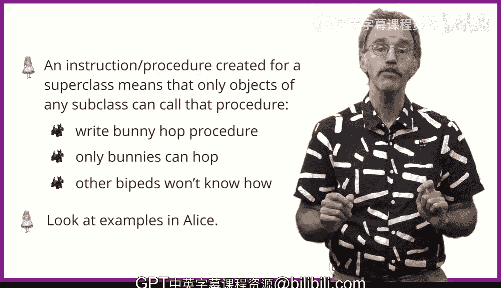

# 杜克大学《爱丽丝编程与动画入门｜Introduction to Programming and Animation with Alice》中英字幕 p39 039_03_03_继承概述.zh_en -BV1QrB6BcEWW_p39-

In this lesson， you are going to learn a bit about inheritance and what are the implications of inheritance for creating methods or procedures。

Object oriented programming is quite fashionable today。Computer programming languages such as Alice。

 C++， Java and Python are said to be object oriented。

What this means is that each of these languages allows a particular style of programming。

Object oriented programming can be quite complicated。Heck。

 most of the world's programmers didn't understand what object oriented programming enabled you to do for the first 20 or 30 years after object oriented programming was discovered。

😡，Throughout this course， we are going to introduce many of the different aspects of object oriented programming。

Today， we are starting with the implications object oriented programming has for procedures and procedure creation。

We need to start with some terminology。Let's start with classes and objects。

 A class is a template that describes the behavior of instantiated objects of that class。

And an object is an instance of a class。嗯。I think this can be better understood by means of an analogy。

A couple of years ago， my wife and I needed to get a family car。

 We live in an area of the United States which is rather rotten weather in the winter。

 so we wanted to get a car with antilock bricks in All wheelhe drive。

We considered several classes of cars。I thought the BMW X3 would be a great class of car。

 but my wife noted that they are too expensive and with our kids getting older。

 it would be too much car for them to handle as they learn to drive。

I then suggested the portion of a can， which my wife said。

 was far too expensive and would be far too much car for our kids to handle。

I then suggested the Subaru Outback， which seemed to be a practical class of car for our family。

 to which my wife agreed。

Finally， it was time to test drive an outback。 We had a nice brochure about outbacks。

 which described the feature of outbacks。 It was necessary to go to test drive a specific Subaru Outback。

 an instance of the outback class。😊，And when we bought one， my daughter named it ugly。

 as she didn't like its green color and didn't want to be seen by her friends in such an ugly car。

Alice is quite similar。 Let's look at an example of a bunny class and a bunny object。

All of the 3D models are classes。 the bunny class is a description of a bunny and not an actual bunny。

The Bunny class can be found in the Alice galleryllery。Once you wish to add a bunny to your world。

 you actually add an instance of the bununny class to your world。

The bunny added to the world is also called an object。Fortunately in Alice。

 you don't have to pay for the objects you add。The car dealership wasn't so obliging for the Subaru outback we acquired。

Part of the power of objects and classes in programming is that the classes aren't flat。

 but rather in a hierarchy。What this means is that the subclass inherit all of the functionality of the superclass。

 Again， this will be easier to understand by means of an analogy。The cars。

Subaru is an example superclass。 All Subarus have all wheel drive and antilock brakes。

The outback class inherits from Subaru。 What this means is that all outbacks have all wheel drive and antilock brakes。

 but there are extra things that outbacks have that not all other Subarus have。 For example。

 all outbacks have roof racks and power rear gates。Alice is similar。 Bipeds are a super class。

 and the class bununny is a subclass。 The creators of Alice decided that bununny should walk on two legs。

 So are bipeds， rather than running on all four legs as quadrieds。

What this means is that bunnies can naturally do anything a biped can do。

But we can give the bunny additional capabilities， such as to twitch its nu ears or to hop。

So what does all that mean if you have a superclass like BpedD and you write an instruction for it。

 every BpedD will be able to use that instruction。That is， BPd is a superclass。

Bunny is a subclass of BpedD。 If you write Hp as a Bped instruction。

Then a bunny will know how to hop， but also a panda and a golden monkey and any other biped will also know how to hop。

On the other hand， if instead。You decide to write the hop instruction as an instruction for the subclass。

 say you write the hop instruction as a bunny instruction。 Then only the bunny will know how to hop。

When we have been creating procedures so far， we have been creating bunny procedures。

What this means is that anybody we have in our world can invoke the hot procedures。啊。😮。

But there was only one bunny in our world。This is true， had we added a second bunny。

 that bunny could automatically be able to hop as well。Other bipeds will not know how to hop。That is。

 they cannot use the hot procedure we wrote for the bunny。

This will all make sense if we look at some examples in Alice， we'll first see a bunny hot procedure。

 and then we will see a biped leap procedure。And see that all bipeds will be able to leap。

 but only bunnies will be able to hop。

