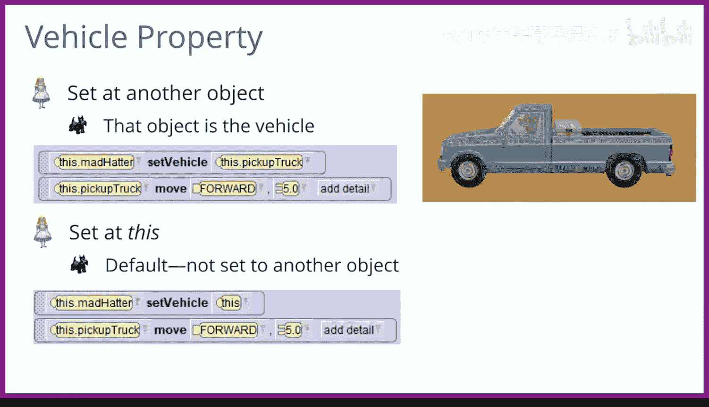

# 杜克大学《爱丽丝编程与动画入门｜Introduction to Programming and Animation with Alice》中英字幕 p43 043_04_03_内置函数：数学、环绕与属性.zh_en -BV1QrB6BcEWW_p43-

We'll introduce several calculation and animation topics in this lesson and then explore them in more detail and separate videos。

 You will learn about Alice's built in functions， functions calculatedc value for you。 For example。

 you may need to have a character walk around a table。

 You would need to know the table's measurements。 its width and its length or depth。

 Alice provides functions that can calculate those values for you。

 Then Alice gives you the result a number in this case。😊，You will learn about using math and Alice。

 If you want to walk by two tables that are touching。

 you would need to know the width of both of those tables and add those widths together in order to know the total distance to walk。

You will learn about an animation technique for having one object circle all the way around another object in a nice。

 clean circle motion。Finally， you will learn about properties。

 Each object can distinguish itself with its own values for its properties。

Objects and Alice are initially painted The color of the artist intended for that object。

 It is possible to change the paint color of an existing object。 Technically。

 all objects in Alice have their paint property initially set to white， but it's not really white。

 Instead， white means that no additional color has been added to that object beyond how the object was originally painted。

You can change a particular bunny to be painted another color。

 such as red by changing its paint property to red。 Then the bunny will have a red tent to it。

Objects have an opacity property， which refers to the degree of see throughness。 The default is set。

 so the object is completely visible。 You can set an object to look ghostlike。

 So it's partially see through。 You can also set an object's opacity。 So the object is invisible。

 being completely see through。Objects can also glue themselves to another object by using the vehicle property。

 This makes sense if you put a person in the car and then the car dries off。

 you would want the person to move with the car。We will discuss all of these topics here and then learn more about them with additional videos。

😊，The first topic is Alice built in functions。 A function computes a value and returns that value to be used in some way。

 For example， supposeuppose you want to have a bunny who wants to jump over a cow。

 It would help the bunny to know exactly how tall the cow is。

 so the bunny knows how high it needs to jump。 Alice can calculate the height of a cow and return that number so the bunny can jump the height of the cow。

 Or rather so you can write code to tell the bunny how high to jump to jump over the cow。😊。

Alice can also calculate the width of a cow and the depth or length of a cow。 Those are also numbers。

Associated with each object in Alice is a function tab that has lots of functions or values that Alice can calculate about that object。

 Functions can return whether two objects are colliding or the paint of an object。

Many functions calculate numbers， such as how far one object is from another object or the height of an object for functions that calculate numbers。

 you can use those functions wherever you have a number and an instruction。

Suppose we have the instruction， Bunny， move up one。We can drag in the function cowgate height。

 which is a number representing the cow's height and place it over the number one。

Now the instruction reads，Bunny move up this cow's gi height。

 and now the bunny will move up the exact height of the cow。

Suppose we want the bunny to move over to the Cheshire cat。

 the exact distance between the bununny and the Cheshire cat。

The bunny is facing the right side of the Cheshire cat。

 So it would move over and stop right in front of the Cheshire cat's right arm。

 We don't know how far the bunny should move forward。 So we pick any number。 I picked1。

 We need a function to calculate the exact distance between the bunny and the Cheshire cat。

Here are some other functions at return numbers。 Any of these can be used in place of a number in an instruction。

 We can call the bunny function， get distance to the right of to get the exact distance between the bunny and the right side of the Cheshire cat。

We can replace the one in the move forward to have the bunny move the exact distance between the bunny and the right side of the Cheshire cat。

You will learn more about Alice's built in functions and other videos。

Suppose a black cat is sitting on top of a dining table to jump over both of them。

 the bunny will need to jump up the height of the table plus the height of the black cat。

 How do we do that？ We will need math。Math and Alice allows us to add numbers together and then use the sum of the numbers in an instruction。

 Let's see the code to get the bunny to jump over the table and the cat。

Start with a bunny move up instruction for now， pick any number。 I chose one。

 Since the bunny is supposed to move up the dining table's height， replace the one with the function。

 dining table get height。Then we will use math to add any number to。 I chose one。Finally。

 we can replace the second number with the function that gives us the black cat's height。Now。

 the bunny will move up the distance equal to the sum of the dining table's height plus the black cat's height。

You will learn more about using math in Alice in our other videos。Now。

 suppose we have an ostrich and a flamingo， and the ostrich would like to circle around the flamingo。

 How do we do that？We will discuss two ways you can do that in Alice。 If you think about it。

 circling around an object is doing two Alice instructions。

 You're moving forward and turning at the same time。 So the move forward curves around。😊。

But how far should the ostrich go forward if it wants to make one complete circle around the flamingo。

The distance the ostrich must travel is called the circumference of a circle。

 The formula to calculate the circumference for the distance around the circle is two times pi times the radius of the circle。

And the radius of the circle is the ostrich's distance to the flamingo。There's also an easier way。

There's an option with the turn command called as seen by that lets an object turn around another specified object。

We will explore both of these for circling objects and other videos。

The last topic we will introduce is properties。In Alice。

 each object has properties that distinguish it from other objects。 Consider a bunny object。

 I have put two bunnies into Alice， and you can see that they are quite different。

The one that is white is named Bunny， and the one that is red is named Bunny， too。

 You may also notice that Bunny， too， is taller than Bunny。In the set up scene view。

 you can examine the properties of an object。 Here are the properties of Bunny。

You can see that Bunny， which is the white bunny， has its paint property set to white。

 You can also see its height property is 0。59。For the object named Bunny， too。

 which is the red bununny， you can see that its paint property is set to red and its height is taller。

 said at 0。83。Properties can be set during scene setup。

 and they can be changed with code during an animation。

Here you can see some other properties that we will talk about， opacity and vehicle。

The opacity property is the degree of C throughness that is how much of the object is visible。

The default opacity value is one， which means you cannot see through the object。 technicalically。

 it is completely opaque。If you set the opacity to 0。5。

 the object is partially see through or ghost like。If you set the opacity to0。

 then the object is completely see through or invisible。

This property can be used during setup scene to hide objects in your world that you want to become visible during your animation。

Next， we will talk about the vehicle property。 The vehicle property is a bit different than the other properties。

 as it is impossible to tell what its value is unless we run some animations to check it。

In other words， the vehicle property is not statically visible the way the color。

 opacity and height properties are。The vehicle property lets you to find a particular vehicle for an object。

Let's see how we can use an object's vehicle property to have the object right in a vehicle。

 That means when the vehicle moves the object， riding in it will automatically move with it as if it was riding in the vehicle。

Suppose the mad Hatter is in the driver's seat in the pickup truck。

 It would make sense to set the mad Hatter's vehicle property to the pickup up truck。😰。

Then when the pickup track moves， the mad Hater moves with the pickup track。At some point。

 you may no longer want the pickup up truck to be the madhatter's vehicle。

 Maybe the madhater has gotten out of the truck。You can reset the mad Hatter's vehicle property to this。

 which means it is set to itself。Then when the pick truck moves。

 the mad Hater will no longer move with it。You will learn more detail about all these new topics in several videos。

Thank you。