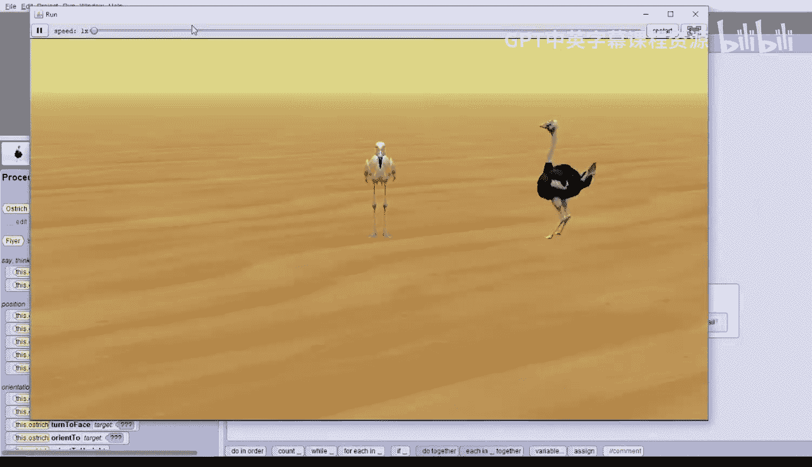

# 爱丽丝编程与动画入门：045：环绕对象运动

在本节课中，我们将探索如何让一个对象围绕另一个对象做圆周运动。

我们将从一个包含火烈鸟和其左侧鸵鸟的世界开始。两只鸟都面向摄像机。我们的目标是让鸵鸟围绕火烈鸟转圈。

我们将探索如何使用**转向**指令来实现这一效果。

## 初始场景与转向指令

世界场景中已有一些指令。火烈鸟说：“让我们探索转向。”接着，鸵鸟会执行向右转一整圈，然后向左转一整圈。

让我们运行这个世界。我们会看到，**转向**指令使鸵鸟在原地旋转，无论是向右还是向左。这是我们已知的。

那么，如何让鸵鸟围绕火烈鸟转圈呢？

## 实现圆周运动的思路

一种方法是让鸵鸟向前移动一点，然后转向一点，并重复多次。但这会形成一个非常不规则的圆形，并且实现起来很麻烦。

更好的方法是让鸵鸟围绕火烈鸟平滑地移动成一个圆形。

我们可以尝试让鸵鸟**同时**转向和向前移动。当鸵鸟向前移动时，同时进行的转向会使它持续地轻微改变方向，从而使其沿圆形路径移动。

以下是实现这一想法的步骤。

## 方法一：使用“同时执行”指令

首先，我们添加一个注释：“使用‘同时执行’指令实现转向”。

然后，我们添加一个 **`do together`**（同时执行）指令块。在其中放入鸵鸟的指令：选择鸵鸟，让它**向右**转**1**圈。选择向右转的原因是，当鸵鸟围绕火烈鸟移动时，火烈鸟将始终位于鸵鸟的右侧。

接着，在 **`do together`** 指令块中添加鸵鸟**向前移动5**米的指令。这里的“5”是鸵鸟需要移动的总距离。

我们将这两个指令的持续时间都设为2秒，以便鸵鸟有更充足的时间完成圆周运动。

运行世界。在鸵鸟完成原地旋转后，它会完成一个完整的圆圈。因为我们让它转了一整圈（360度），并且恰好移动了5米，这意味着鸵鸟所画圆的**周长**是5米。周长就是沿圆形轨迹移动的总距离。

然而，这个圆非常小，鸵鸟并没有真正围绕火烈鸟。我们需要鸵鸟移动得更远一些。

## 调整圆周大小

我们复制刚才的 **`do together`** 指令块，并添加注释：“绘制一个更大的圆”。

在新复制的指令块中，我们只需将向前移动的距离从 **`5`** 改为 **`12`**。

再次运行世界。鸵鸟会先原地旋转，然后画一个小圆，接着画一个更大的圆。现在鸵鸟移动的周长是12米，我们很幸运地让它刚好绕过了火烈鸟。

但这仍然不是我们想要的精确效果。我们希望鸵鸟以它和火烈鸟之间的**距离**为**半径**来画圆。为此，我们需要使用 **`distance to`** 函数，并计算相应的周长。

## 方法二：结合数学公式计算周长

圆的周长公式是：
**`周长 = 2 × π × 半径`**

其中，π 是一个常数，约等于3.14。

这个公式计算出的周长，就是鸵鸟需要移动的确切距离。

我们添加注释：“使用数学计算实现转向”。

再次复制上一个 **`do together`** 指令块。这次，我们需要修改向前移动指令中的距离。

将其改为：**`2 × 3.14 × (鸵鸟到火烈鸟的距离)`**。

在Alice中的操作步骤是：
1.  将距离值改为 **`2`**。
2.  点击 **`2`** 旁边的下拉箭头，选择 **`数学运算`** -> **`×`**（乘号）。
3.  接着输入 **`3.14`**。
4.  点击 **`3.14`** 旁边的下拉箭头，再次选择 **`数学运算`** -> **`×`**。
5.  此时需要一个占位数字（例如 **`1`**），然后我们用函数替换它。
6.  点击 **`函数`**，找到并选择 **`鸵鸟 获取到 [其他对象] 的距离`**，将其拖拽覆盖掉占位数字 **`1`**。
7.  在弹出的对象选择框中，选择 **`火烈鸟`**。

现在，向前移动的距离就变成了 **`2 * 3.14 * ostrich get distance to flamingo`**。

运行世界。现在，鸵鸟会依次画出周长为5米、12米以及精确计算出的圆周长的圆。效果看起来很棒。

## 方法三：使用“以…为参照”选项

Alice提供了一个更简单的方法来实现这个效果，那就是在转向指令中使用 **`as seen by`**（以…为参照）选项。

我们添加一个新注释：“使用‘以…为参照’选项实现转向”。

然后，为鸵鸟添加一个**转向**指令：选择**向右**转**1**圈，持续时间为2秒。

接着，点击 **`添加细节`**，这次选择 **`as seen by`**（以…为参照），并选择**火烈鸟**。

运行世界。鸵鸟会依次执行前几种方法画出的圆，最后使用 **`as seen by`** 方法画出的圆，效果与使用数学公式计算出的完全一样，但指令却简单得多。

请注意，我们让鸵鸟**以火烈鸟为参照**向右转。这是正确的，因为当鸵鸟围绕火烈鸟转圈时，火烈鸟始终在鸵鸟的右侧。

让我们看看如果改为向左转会怎样。复制刚才的指令，将**向右**改为**向左**。

再次运行世界。鸵鸟会先向右转画圆，然后向左转画圆。使用向左转时，鸵鸟会沿相反方向（逆时针）绕圈。

## 总结

本节课中，我们一起学习了在Alice中实现对象环绕运动的三种方法：
1.  使用 **`do together`** 指令组合转向和移动。
2.  结合数学公式 **`周长 = 2 × π × 半径`** 精确计算移动距离。
3.  利用转向指令中的 **`as seen by`** 选项，这是最简单直接的方法。

通过探索这些方法，你掌握了如何让对象平滑地围绕另一个对象做圆周运动。