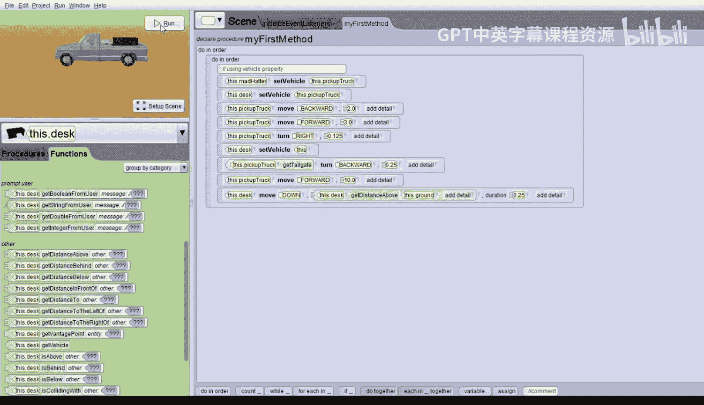

# 杜克大学《爱丽丝编程与动画入门｜Introduction to Programming and Animation with Alice》中英字幕 p46 046_04_06_载具属性.zh_en -BV1QrB6BcEWW_p46-

In this demo， we will explore how to use the vehicle property。

 We'll start with a world that has a pickup up truck， the mad Hater， and a desk。

The mad hatter is sitting in the driver's seat。If we go into Se scene。And we look at the side view。

You can pull it over。You can see。That the madhater sitting in the driver's seat。

On the right side of the vehicle。If we go back to the。Top view。😔。

We can't see it unless we pulled it over， you can see the desk is in the back of the pickup truck。

Let's add an ado and order for all the code。And we'll add a comment that says。Using vehicle property。

Let's add instructions to move the pickup truck around， we'll have it move backward too。

So let's pick the pickup track。Move。Backwards。Qiu。😔，And then let's let it move forward three。

We'll have to type the three。And then let's have it turn right a little bit。So， turn。😔，Right。

 maybe just a little 0。125。And then let's have it move forward a lot。Say，10 units。So， move forward。

Cen。Now let's play the world and see what happens。The truck moves around a lot。

But the man had it in the desk。 They never move。So one way to fix this would be to add in a do together for each instruction and have the mad Haer and the desk always move the same way the truck does。

 but that would be a lot of extra instructions。So instead。

We can have the mad Hater set its vehicle property to be the pickup truck。

That means that whenever the pickup truck moves， the manhater will move in the same direction the pickup truck moves。

Similarly， we can have the desk set its vehicle property also to be the pickup truck。

So let's do that now。First， we'll do the mad Hater。If you scroll down in the procedures。Youuxi。😔。

A set vehicle instruction。We'll drag that in and have the mad Hater set its vehicle to be the pickup truck。

And then， we'll change it。To the desk。And again， we'll have to scroll down in the procedures until the bottom。

And there you'll see a set vehicle for the desk。Will set the desk's vehicle to be the pickup truck also。

Now we should actually do this before the pickup truck moves。

 so I'm going to pull both of these up and add them。To before the pickup truck moves。Allright。

 let's play the world。Now， when the pickup truck moves， the mad Hater in the desk， go with it。

And also， did you notice that when the world started， the truck started moving right away？

The set vehicle instruction happens instantly in zero seconds。

Whereas an animation instruction such as moveve or turn， they have a default time of one second。

So the set vehicle is zero because there's nothing to see when the set vehicle instruction is set。

Nothing， you don't see anything until the vehicle moves。Now that you have set the vehicle property。

You may only want it set for a part of an animation and not for the whole animation。For example。

 suppose you want the tailgate of the truck to open at a particular point in the animation and the desk to fall out of the pickup truck。

Let's do this。 right after the truck turns。We can turn off the desk vehicle property by setting it back to itself。

The default vehicle property for every object is to have it set to this。

 which means it's set to itself。So after the pickup up truck turns。

 set the desk vehicle property to this。So we'll drag this in right after the turn。

 which is right before the last move。And will set it to this。Let's play the world。

The desk is moving with the truck， but once it turns。

 then the desk is no longer moving with the pickup truck。

Let's make the desk falling out of the truck look a little better。It went right through the tailgate。

 so let's have the tailgate open first。What we have to do is find the truck。

Pick up truck and then look for the part。Which is the tailgate。 Here it is， right here。

Let's have the tailgate turn。Backward。A quarter。0。25。 and I've put this right after the set vehicle。

For the desk has been set back to itself。Then after the truck moves。

We want the desk to move down to the ground。So let's add in for the desk。We'll have the desk move。

downown。We don't know how far。 So we'll just put one。

We can use another function to calculate that distance if we click on functions。

We can see there's a function that says get distance above。So we can have the desk。

Get the distance above the ground。And the desk will move down to the ground。

We'd like that to happen quickly， so let's set the duration。To0。25。Let's play the world。

Now the tailgri opens， the desk falls out and goes to the ground。

Now it looked like the desk was a little bit floating in the air。

 so I think we need to put it down further in the truck。We can fix that， also。

If we go into set up scene。And go back to。The starting camera view。

We can move the desk down a little bit。And then we'll see if that looks better。Let's run that。Okay。

 that looks better。 it's still floating a little bit， so I'm going to move it down a little bit more。

 just a tiny bit。 there we go。Okay。Let's go back to the code。Now。

 the mad Hater has its vehicle property set to the pickup truck。

So the mad hatter moves whenever the pickup truck moves。

But the pickup up truck does not have its vehicle property sent to the madhater。

 So what happens if the mad Hater moves。The pickup truck should not move。Let's try that。

So right after the pickup truck moves backward， let's have the mad Hater move up and down quickly。

Let's pick the mad hatter。And procedures。And we'll have the mad hatter。Move up。😔。

Right after the pickup truck most backwards。Move up。😔，Say1 me。And we'll do it fast。

 So we'll say duration 0。25。And then， we'll copy。The mad Hater， moving up。And drag it over。

And we'll have the mad Hater moved down。And that should be right after the mad header moves up。

So the pickup truck moves backward， the mad Hater moves up and down quickly。

 and then the pickup truck moves again。Let's see what happens。

So you saw the truck did not move when the mad hatter was moving。

That's it for exploring the vehicle property， hopefully you'll find the vehicle property useful when one object should act like a vehicle for another object。

Thank you。