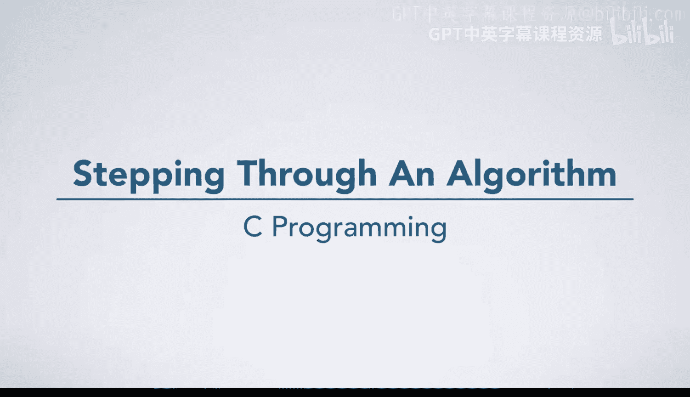

# 002：逐步执行算法 🧮

在本节课中，我们将学习如何手动逐步执行一个简单的算法。我们将通过一个具体的例子，一步步跟踪算法的执行过程，理解其逻辑和输出结果。即使没有任何编程经验，你也能通过基本的数学运算和仔细的记录来完成这个过程。

---

## 算法概述

这个算法接受一个非负整数 **n** 作为输入。它并不完成一个特别有用的任务，但为我们提供了一个简单的起点来理解算法的执行流程。算法的核心是进行一系列计算，并在过程中记录输出值。

为了执行算法，我们需要一个具体的 **n** 值。这里我们选择 **n = 2**。

我们还需要一个“输出框”来记录算法要求我们写下的所有内容。同时，我们将使用一个绿色箭头来跟踪当前正在执行的步骤，确保我们不会在流程中迷失。

---

## 逐步执行过程

现在，让我们开始一步步执行这个算法。我们将从第一步开始，并严格按照指示操作。

### 初始化变量

首先，算法要求我们创建一个名为 **x** 的变量，并将其值设置为 **n + 2**。

*   **计算**：由于 n = 2，所以 x = 2 + 2 = 4。
*   **记录**：我们记下，变量 x 的初始值是 4。

### 开始循环计数

接下来，算法要求我们从 0 计数到 n（包括 n 本身）。我们需要为计数的数字起一个名字，以便在后续步骤中使用，这里我们称它为 **i**。

在计数过程中，我们将重复执行一组步骤。这些步骤通过缩进表示，并且算法明确说明了在计数完成后需要执行的步骤。

以下是循环中需要重复执行的步骤列表：

1.  **写入输出**：写下 **x * i** 的值。
2.  **更新变量**：将 x 的值更新为 **x + i * n**。

现在，我们开始第一次循环，此时 **i = 0**。

*   **执行步骤 1**：计算 x * i = 4 * 0 = 0。我们将 **0** 写入输出框。
*   **执行步骤 2**：计算 x + i * n = 4 + 0 * 2 = 4。因此，x 的新值仍然是 **4**。

我们已经完成了第一轮循环的步骤。现在，我们需要回到循环开始处，计数下一个数字。

### 第二次循环

我们将 i 的值更新为下一个要计数的数字，即 **i = 1**，然后再次执行循环内的步骤。

*   **执行步骤 1**：计算 x * i = 4 * 1 = 4。我们将 **4** 写入输出框。
*   **执行步骤 2**：计算 x + i * n = 4 + 1 * 2 = 6。因此，我们将 x 的值更新为 **6**。

第二轮循环结束。我们再次回到循环开始处，准备进行最后一次循环。

### 第三次循环

我们将 i 的值更新为 **i = 2**（因为 n=2，我们需要计数到 2）。然后执行循环内的步骤。

*   **执行步骤 1**：计算 x * i = 6 * 2 = 12。我们将 **12** 写入输出框。
*   **执行步骤 2**：计算 x + i * n = 6 + 2 * 2 = 10。因此，我们将 x 的值更新为 **10**。

现在，我们已经计数了 0, 1, 2 这三个数字，循环结束。

### 循环后的步骤

循环结束后，算法还有最后一步需要执行：写下变量 **x** 的当前值。

*   **执行最终步骤**：x 的当前值是 10。我们将 **10** 写入输出框。

至此，所有步骤执行完毕。我们的输出框中记录了序列：**0, 4, 12, 10**。

---

## 总结

本节课中，我们一起手动逐步执行了一个简单的算法。我们学习了如何：

1.  **初始化参数**：为算法设定输入值（n=2）并初始化变量（x=4）。
2.  **跟踪循环**：理解并执行一个从 0 到 n 的计数循环，在每次循环中重复执行特定的计算和更新步骤。
3.  **记录输出**：在指定的步骤中将计算结果记录到输出中。
4.  **完成算法**：执行循环结束后的最终步骤，并得到完整的输出序列。

通过这个练习，我们掌握了逐步跟踪算法执行的基本方法，这是理解更复杂编程逻辑的重要基础。最终，对于输入 n=2，该算法生成的数字序列是 **0, 4, 12, 10**。