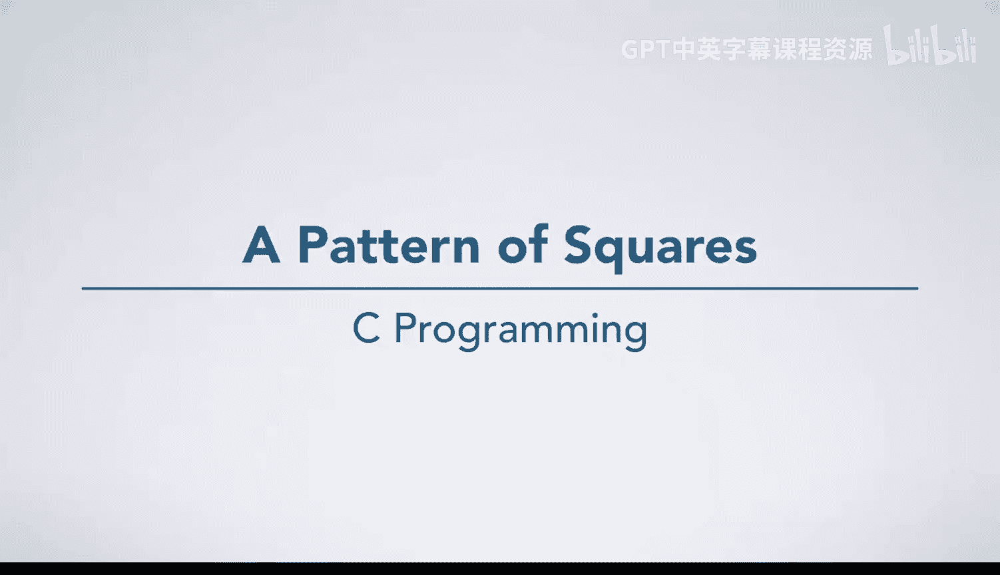
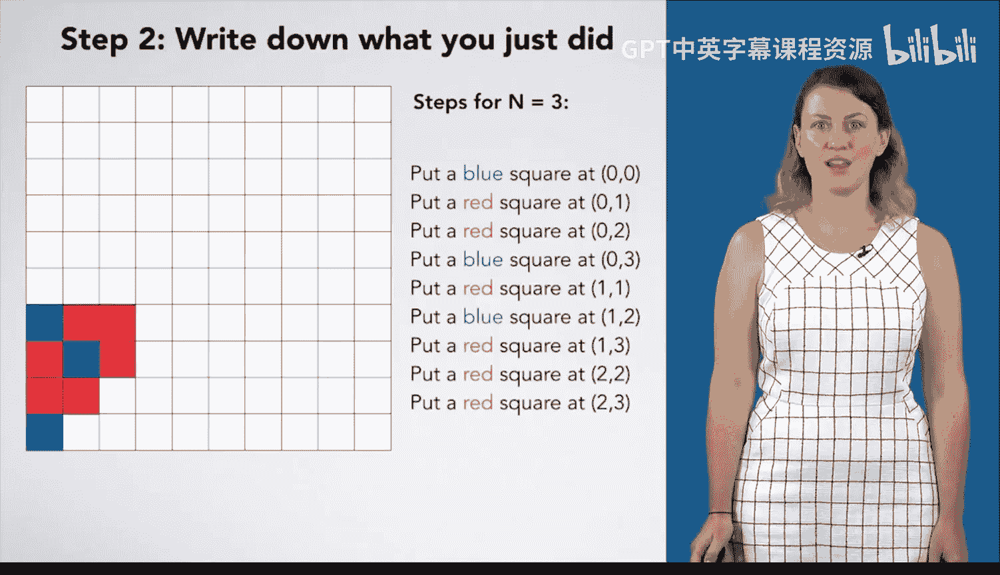
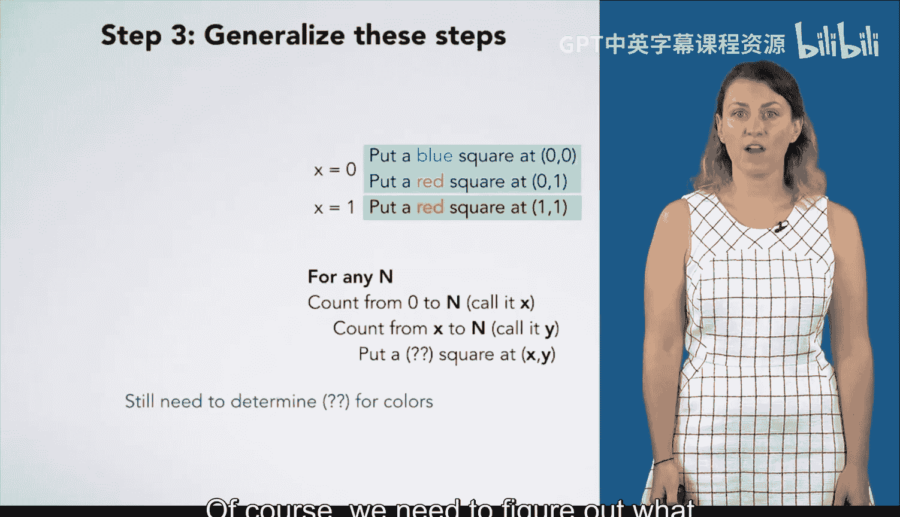
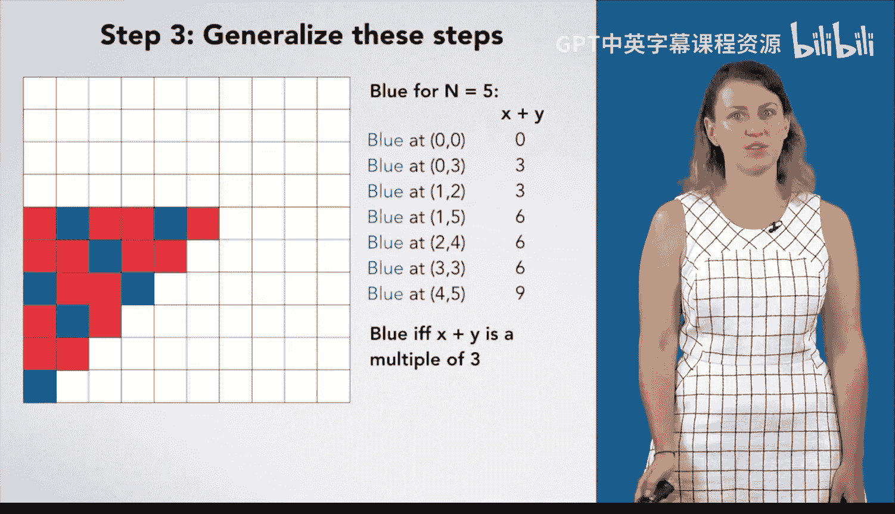
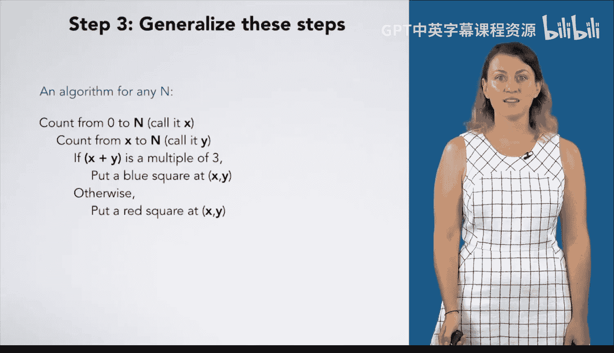
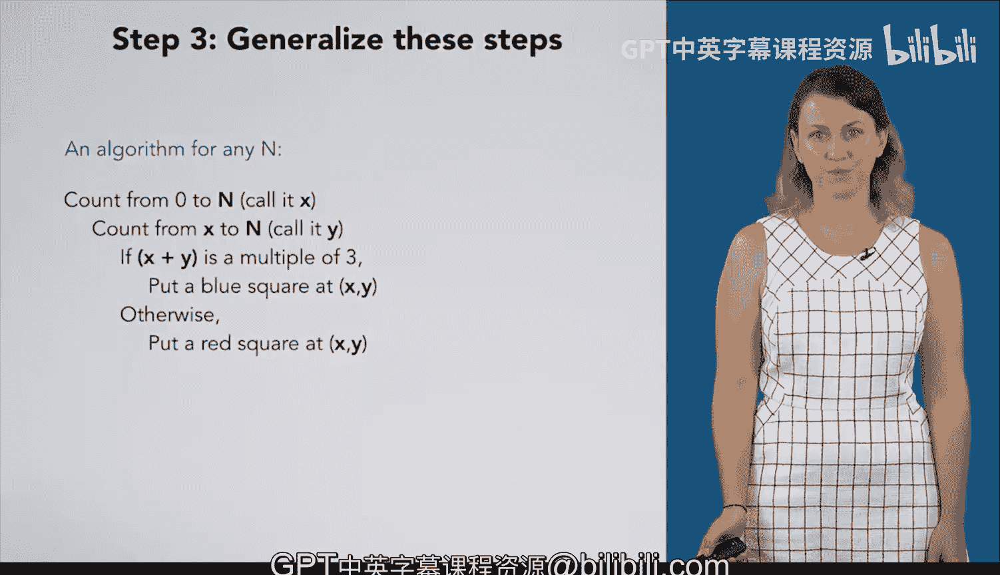

# 004：正方形模式算法推导 🧩



在本节课中，我们将学习如何为一个特定的网格红蓝方块图案开发算法。我们将通过一个具体的例子，逐步推导出通用算法，并最终确定方块颜色的判断规则。

## 概述

我们将遵循一个四步编程过程来解决问题：
1.  手动完成一个具体实例。
2.  精确记录每一步操作。
3.  从具体步骤中归纳出通用算法。
4.  测试算法。



下面，我们以 `n = 3` 为例开始第一步。

## 第一步：手动完成实例

首先，我们不考虑背后的逻辑，直接在网格上手动放置方块。对于 `n = 3` 的情况，我们依次放置了以下方块：
*   在坐标 (0,0) 放置蓝色方块。
*   在坐标 (0,1) 放置红色方块。
*   在坐标 (0,2) 放置红色方块。
*   在坐标 (0,3) 放置蓝色方块。
*   在坐标 (1,1) 放置红色方块。
*   在坐标 (1,2) 放置蓝色方块。
*   在坐标 (1,3) 放置红色方块。
*   在坐标 (2,2) 放置红色方块。
*   在坐标 (2,3) 放置红色方块。
*   在坐标 (3,3) 放置蓝色方块。

## 第二步：记录步骤

现在，我们将第一步中的操作精确地、一步一步地记录下来。以下是完整的步骤列表：
1.  在 (0,0) 放置蓝色方块。
2.  在 (0,1) 放置红色方块。
3.  在 (0,2) 放置红色方块。
4.  在 (0,3) 放置蓝色方块。
5.  在 (1,1) 放置红色方块。
6.  在 (1,2) 放置蓝色方块。
7.  在 (1,3) 放置红色方块。
8.  在 (2,2) 放置红色方块。
9.  在 (2,3) 放置红色方块。
10. 在 (3,3) 放置蓝色方块。

## 第三步：归纳通用算法

上一步我们记录了具体步骤，本节中我们来看看如何从中发现规律并归纳出算法。

观察记录下的步骤，我们可以发现一些重复的计数行为。前4步对应 `x = 0`，接着3步对应 `x = 1`，然后2步对应 `x = 2`，最后1步对应 `x = 3`。这表明随着 `x` 从0计数到3，我们在重复类似的操作，但具体细节（如颜色和 `y` 坐标的范围）有所不同。

我们先分析 `y` 坐标的规律。以下是每个 `x` 值对应的 `y` 坐标范围：
*   当 `x = 0` 时，`y` 从 0 到 3。
*   当 `x = 1` 时，`y` 从 1 到 3。
*   当 `x = 2` 时，`y` 从 2 到 3。
*   当 `x = 3` 时，`y` 从 3 到 3。

由此可以归纳出：对于每个 `x`，`y` 的计数范围是从 `x` 到 `n`（本例中 `n=3`）。

暂时忽略颜色，我们可以将算法初步描述为：
```
对于 x 从 0 到 n：
    对于 y 从 x 到 n：
        在坐标 (x, y) 放置一个（待定颜色的）方块
```

然而，这个算法仍然依赖于具体的 `n=3`。为了使其通用，我们需要让算法适用于任何 `n`。如果我们对 `n=1` 重复第一步和第二步，会得到类似的步骤模式，只是计数的上限变成了1。这证实了我们的归纳方向是正确的。

因此，更通用的算法框架是：
```
对于 x 从 0 到 n：
    对于 y 从 x 到 n：
        在坐标 (x, y) 放置一个（颜色？）方块
```

接下来，我们需要确定颜色规则。

## 确定颜色规则



上一节我们得到了算法的骨架，本节中我们来看看如何确定方块的填充颜色。

回顾 `n=3` 的例子，蓝色方块出现在坐标 (0,0), (0,3), (1,2), (3,3)。为了找出规律，我们计算这些坐标的 `x` 与 `y` 之和：
*   (0,0): 0 + 0 = 0
*   (0,3): 0 + 3 = 3
*   (1,2): 1 + 2 = 3
*   (3,3): 3 + 3 = 6

观察这些和：0, 3, 3, 6。它们都是3的倍数。为了验证这个规律，我们可以查看 `n=5` 时蓝色方块的位置（其坐标和分别为 0, 3, 6, 9等），同样符合“坐标和为3的倍数”这一规律。

因此，我们可以完善颜色判断规则：**当且仅当 `x + y` 是3的倍数时，放置蓝色方块，否则放置红色方块**。

现在，我们可以写出完整的算法：
```
对于 x 从 0 到 n：
    对于 y 从 x 到 n：
        如果 (x + y) % 3 == 0：
            在坐标 (x, y) 放置蓝色方块
        否则：
            在坐标 (x, y) 放置红色方块
```

## 总结







本节课中我们一起学习了算法开发的完整过程。我们从手动解决一个具体实例（`n=3`）开始，然后精确记录步骤。接着，我们通过观察步骤中的模式，归纳出了绘制方格的通用循环结构。最后，我们通过分析蓝色方块的位置，发现了颜色判断的关键规则：**`(x + y) % 3 == 0`**。这样就得到了一个可以适用于不同 `n` 值的完整算法。下一步将是测试这个算法，我们将在后续课程中进行。