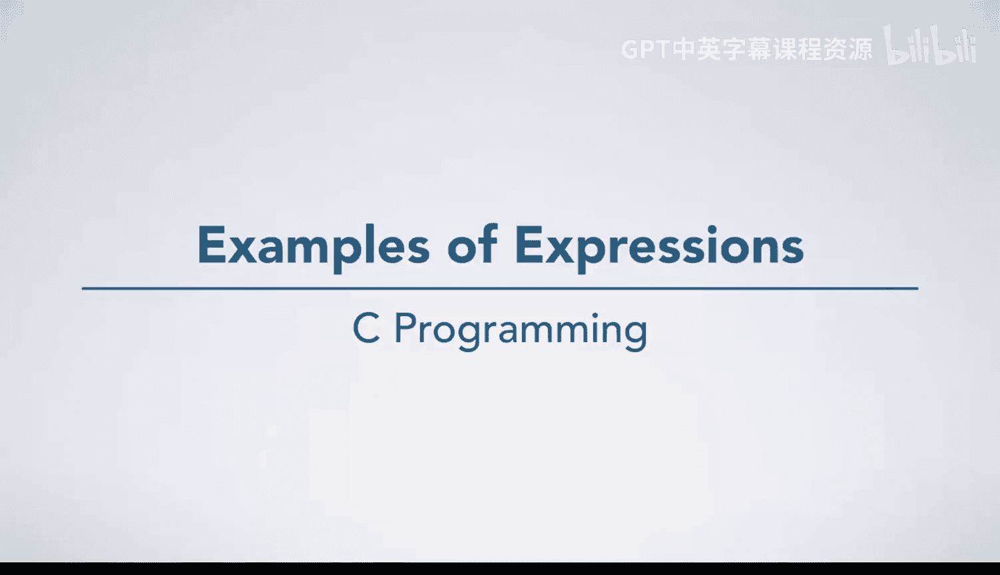
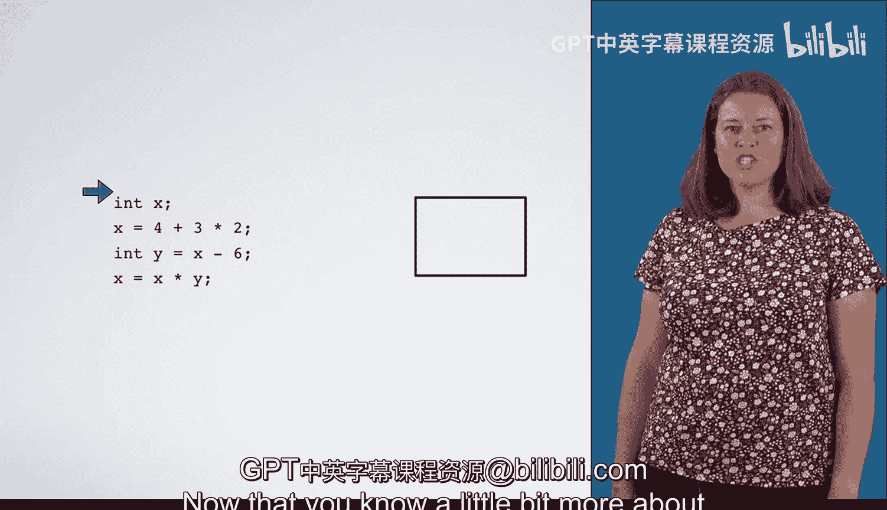
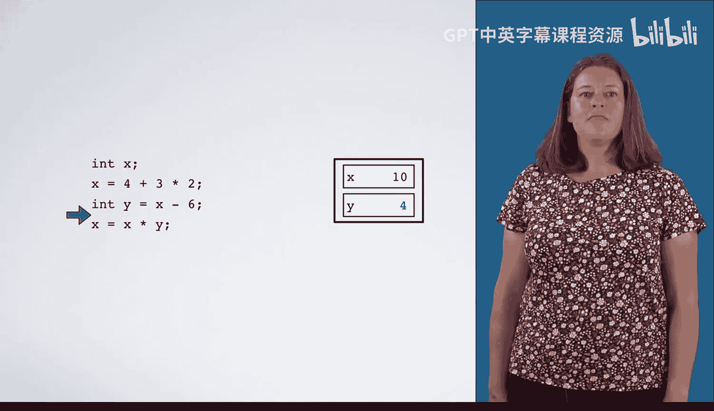
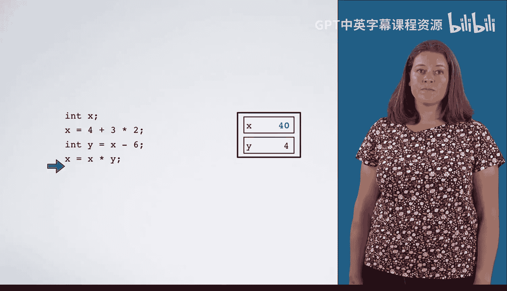
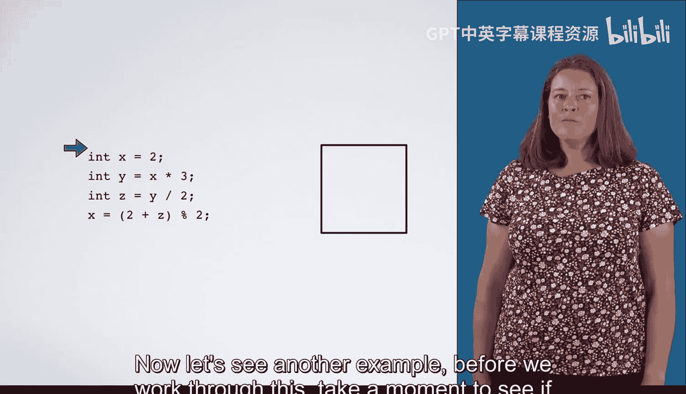
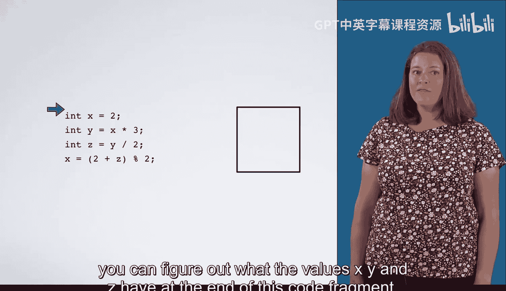
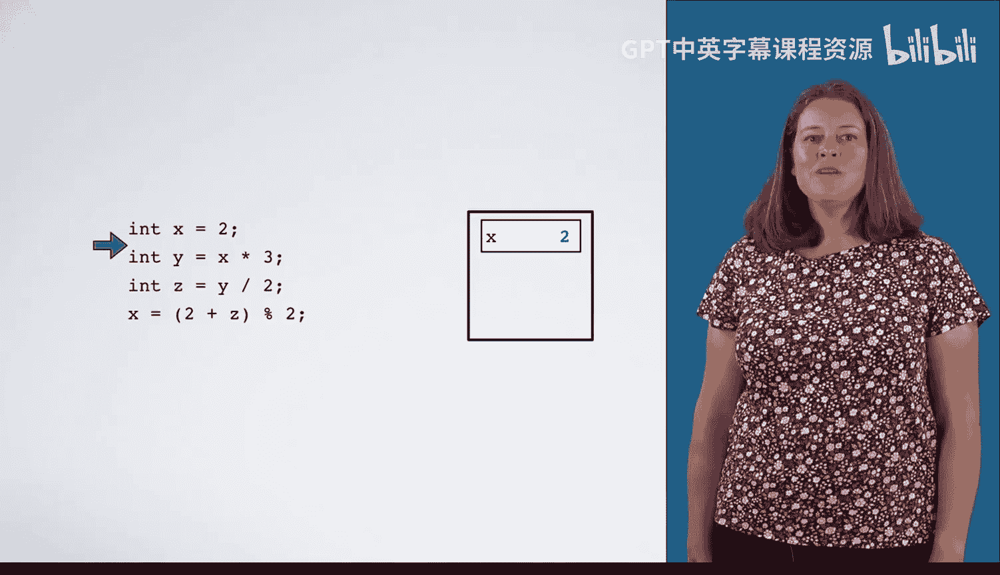
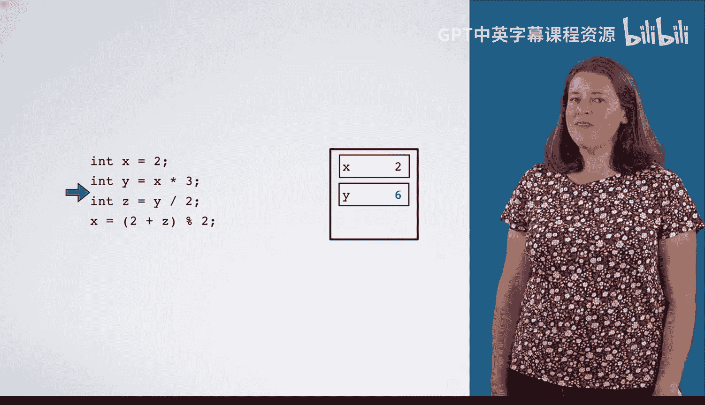
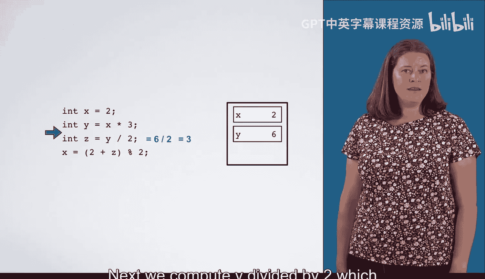
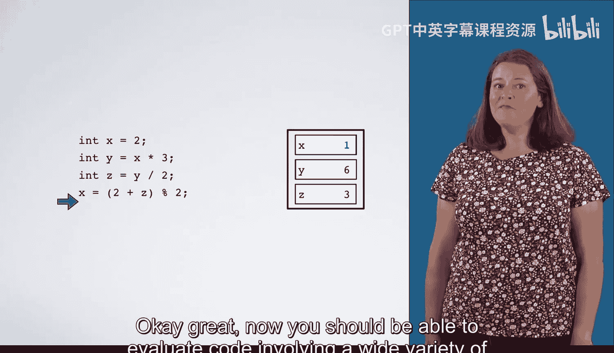

# 011：表达式示例



在本节课中，我们将通过具体的代码示例，学习如何分析和计算C语言中的表达式。我们将逐步解析代码片段，理解变量声明、初始化以及表达式求值的过程。

## 概述



我们已经了解了表达式的基本概念。本节将通过两个具体的代码示例，演示如何根据运算符优先级和结合性规则，一步步计算表达式的值，并更新变量的内容。

## 示例一：基础运算

首先，我们来看第一个代码示例。它演示了变量声明、初始化和赋值语句中表达式的计算过程。

以下是代码片段的逐步分析：

1.  **声明变量 `x`**：代码首先声明了一个名为 `x` 的整型变量。
    ```c
    int x;
    ```

2.  **初始化变量 `x`**：将 `x` 初始化为表达式 `4 + 3 * 2` 的结果。
    *   根据数学规则，乘法 (`*`) 的优先级高于加法 (`+`)。
    *   因此，先计算 `3 * 2`，得到 `6`。
    *   再计算 `4 + 6`，得到 `10`。
    *   最终，将 `10` 存入变量 `x` 对应的“盒子”中。
    ```c
    x = 4 + 3 * 2; // x 的值为 10
    ```

3.  **声明并初始化变量 `y`**：声明另一个整型变量 `y`，并将其初始化为 `x - 6`。
    *   此时 `x` 的值为 `10`。
    *   计算 `10 - 6`，得到 `4`。
    *   将 `4` 存入变量 `y` 的“盒子”中。
    ```c
    int y = x - 6; // y 的值为 4
    ```

4.  **执行赋值语句 `x = x * y`**：这条语句可能让初学者困惑，但它并非代数方程。
    *   首先，计算右侧表达式 `x * y` 的值。此时 `x` 为 `10`，`y` 为 `4`，乘积为 `40`。
    *   然后，将这个结果 `40` 存入左侧变量 `x` 的“盒子”中，覆盖原来的值 `10`。
    ```c
    x = x * y; // x 的新值为 40
    ```



执行完以上代码后，变量 `x` 的最终值是 `40`，变量 `y` 的值是 `4`。



## 示例二：包含括号和取模运算

在理解了第一个例子后，我们来看一个稍复杂的例子。这个例子引入了括号和取模运算符 (`%`)。



在逐步分析之前，请先尝试自己推断代码执行后变量 `x`, `y`, `z` 的最终值。



以下是代码的详细执行步骤：

1.  **声明并初始化变量 `x`**：将整型变量 `x` 初始化为 `2`。
    ```c
    int x = 2;
    ```





2.  **声明并初始化变量 `y`**：将整型变量 `y` 初始化为 `x * 3`。
    *   此时 `x` 为 `2`，计算 `2 * 3` 得到 `6`。
    *   将 `6` 存入变量 `y`。
    ```c
    int y = x * 3; // y 的值为 6
    ```

3.  **声明并初始化变量 `z`**：将整型变量 `z` 初始化为 `y / 2`。
    *   此时 `y` 为 `6`，计算 `6 / 2` 得到 `3`。
    *   将 `3` 存入变量 `z`。注意，这里是整数除法。
    ```c
    int z = y / 2; // z 的值为 3
    ```



4.  **执行赋值语句 `x = (2 + z) % 2`**：这是最关键的一步。
    *   **括号优先**：首先计算括号内的表达式 `(2 + z)`。`z` 的值为 `3`，所以 `2 + 3` 等于 `5`。
    *   **计算取模**：接着计算 `5 % 2`。取模运算 (`%`) 是求余数，即 `5` 除以 `2`，商为 `2`，余数为 `1`。
    *   **更新变量**：将计算结果 `1` 赋值给变量 `x`，覆盖其原有的值 `2`。
    ```c
    x = (2 + z) % 2; // x 的新值为 1
    ```

执行完以上代码后，变量的最终值为：`x = 1`，`y = 6`，`z = 3`。

## 总结

本节课中，我们一起学习了如何分析C语言中的表达式。

*   我们回顾了运算符的优先级规则，例如乘法优先于加法。
*   我们通过示例看到，赋值语句 `x = x * y` 是计算右侧表达式并更新左侧变量，而非求解方程。
*   我们练习了包含括号和取模运算符 (`%`) 的复杂表达式求值，理解了括号可以改变运算顺序，以及取模运算是求除法后的余数。



通过这两个循序渐进的例子，你现在应该能够分析和计算涉及各种数学表达式的C语言代码片段了。掌握表达式求值是理解程序逻辑流的基础。