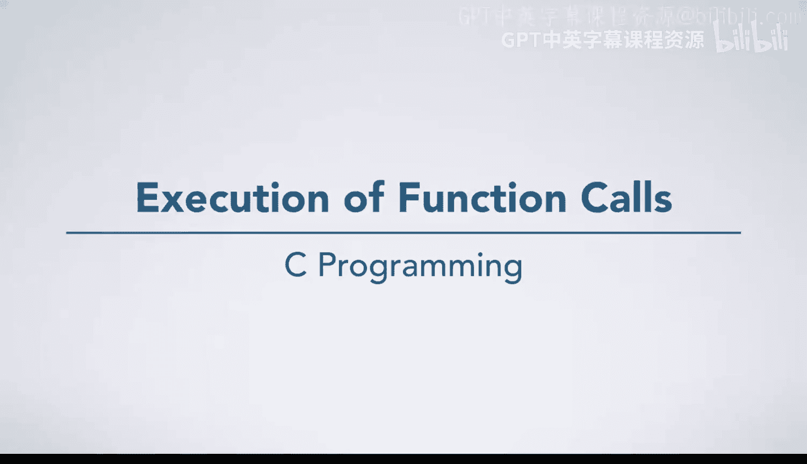
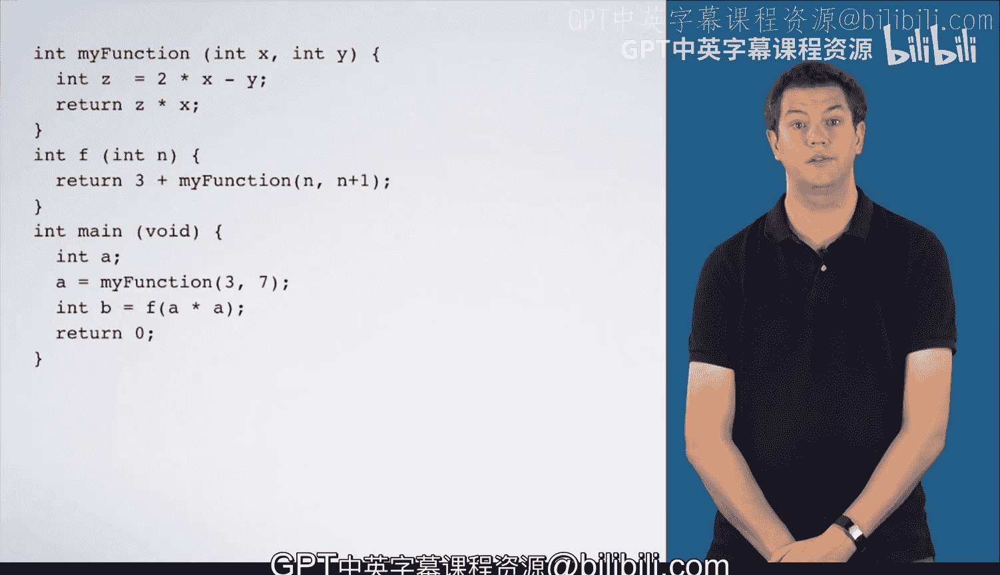

# 013：函数调用执行过程详解 🧠



在本节课中，我们将深入探讨C语言中函数调用的执行过程。我们将通过一个具体的代码示例，一步步跟踪程序的执行流程，理解函数调用时内存（栈帧）如何创建、参数如何传递、返回值如何计算以及控制流如何转移。这对于理解程序运行机制至关重要。

---

## 概述

我们将分析一个包含三个函数（`main`、`my_function`、`f`）的程序。通过跟踪其执行，我们将清晰地看到：
1.  程序从 `main` 函数开始执行。
2.  函数调用时，会为其创建独立的栈帧（frame），用于存储参数和局部变量。
3.  参数通过值传递（复制）的方式初始化。
4.  执行流程通过“调用点”（call site）记录和返回。
5.  函数返回时，其栈帧被销毁，控制权交回调用者。

现在，让我们进入详细的步骤分析。

---

## 执行步骤分解

### 第一步：进入 `main` 函数并声明变量

程序从 `main` 函数开始执行。首先，我们为 `main` 函数创建一个栈帧。执行第一条语句，声明变量 `a`。我们在 `main` 的栈帧中为 `a` 分配一个存储空间（“盒子”）。

```c
int a;
```

### 第二步：调用 `my_function` 函数

接下来，执行 `a = my_function(3, 7);`。为了计算这个表达式，我们需要调用 `my_function`。

以下是调用 `my_function` 的完整过程：
1.  **创建栈帧**：为 `my_function` 创建一个新的栈帧。
2.  **传递参数**：根据函数声明 `my_function(int x, int y)`，在栈帧中创建参数 `x` 和 `y` 的“盒子”。将调用时传入的值（`3` 和 `7`）复制到这两个盒子中。
    *   `x = 3`
    *   `y = 7`
3.  **记录返回地址**：在代码中标记出调用点（Call Site 1），并将这个标记（1）记录在 `my_function` 栈帧的角落。这指明了函数执行完毕后应返回的位置。
4.  **转移执行控制**：将“执行箭头”移动到 `my_function` 函数内部，开始执行其中的代码。

### 第三步：执行 `my_function` 函数

现在，我们在 `my_function` 的栈帧中执行代码。
1.  声明并初始化变量 `z`：计算表达式 `2 * x - y`。
    *   从栈帧中取得 `x=3`, `y=7`。
    *   计算：`2 * 3 - 7 = -1`。
    *   因此，`z = -1`。
2.  遇到 `return` 语句：`return z * x;`。这表示要结束当前函数并返回一个值。
    *   **计算返回值**：计算表达式 `z * x`，即 `-1 * 3 = -3`。
    *   **定位返回点**：查看栈帧中记录的调用点标记（1）。
    *   **传递返回值**：将计算得到的返回值 `-3` 复制回调用点（即 `main` 函数中 `a = my_function(...)` 这个位置）。
    *   **销毁栈帧并返回**：销毁 `my_function` 的栈帧，将执行箭头移回调用点（标记1处）。

### 第四步：回到 `main` 函数并赋值

此时，我们回到了 `main` 函数。函数调用 `my_function(3, 7)` 的值已经计算出来，是 `-3`。因此，这条语句等价于 `a = -3;`。我们将 `-3` 存入变量 `a` 的盒子中。

### 第五步：调用 `f` 函数

执行下一条语句 `int b = f(a * a);`。首先为 `b` 创建存储空间，然后计算 `f(9)`（因为 `a * a` 是 `(-3) * (-3) = 9`）。

调用 `f` 函数的过程与之前类似：
1.  为 `f` 创建栈帧。
2.  传递参数：根据 `f(int n)`，创建参数 `n` 并赋值为 `9`。
3.  记录返回地址（标记为 Call Site 2）。
4.  跳转到 `f` 函数内部执行。

### 第六步：执行 `f` 函数

在 `f` 函数中，我们遇到语句 `return 3 + my_function(n, n + 1);`。在返回之前，需要先计算 `my_function(n, n + 1)` 的值。

因此，我们**再次调用** `my_function`：
1.  为这次调用创建**一个新的** `my_function` 栈帧（与第一次调用互不影响）。
2.  传递参数：`x = n = 9`，`y = n + 1 = 10`。
3.  记录返回地址（标记为 Call Site 3，位于 `f` 函数内部）。
4.  跳转到 `my_function` 执行。

### 第七步：第二次执行 `my_function`

在新的栈帧中执行 `my_function(9, 10)`：
1.  计算 `z = 2 * x - y = 2*9 - 10 = 8`。
2.  遇到 `return z * x;`。
    *   计算返回值：`8 * 9 = 72`。
    *   根据栈帧中的标记（3）返回到 `f` 函数内的调用点。
    *   销毁本次 `my_function` 的栈帧。

### 第八步：完成 `f` 函数的执行

现在回到了 `f` 函数，我们得到了 `my_function(9, 10)` 的返回值 `72`。接着计算 `return 3 + 72;`，得到 `75`。这就是 `f` 函数的返回值。
1.  根据 `f` 栈帧中的标记（2）返回到 `main` 函数中的调用点。
2.  销毁 `f` 函数的栈帧。

### 第九步：完成 `main` 函数的执行

我们回到了 `main` 函数，`f(a*a)` 的调用结果为 `75`。因此，`b` 被初始化为 `75`。

最后，`main` 函数执行 `return 0;`。当从 `main` 函数返回时，整个程序结束。

---

## 核心概念总结

本节课我们一起学习了C语言函数调用的完整执行过程，其核心机制可以概括为以下公式和步骤：

**核心机制：栈帧管理**
每次函数调用都会在内存的**调用栈**上创建一个独立的栈帧，用于隔离该函数的执行环境。

**调用过程公式化描述：**
```
1. 调用者(caller)执行 `result = callee(arg1, arg2, ...);`
2. 系统为被调用者(callee)创建新栈帧
3. 参数值被复制到新栈帧的形参变量中
4. 记录下一条指令地址（返回地址）到栈帧
5. 跳转到被调用者函数体开始执行
6. 被调用者使用自己的栈帧进行计算
7. 遇到return语句，计算返回值R
8. 根据栈帧记录的地址跳回调用者
9. 销毁被调用者的栈帧
10. 返回值R被用于调用者的表达式（赋给result）
```

**关键规则：**
*   **值传递**：参数是原始值的副本，修改形参不影响实参。
*   **后进先出 (LIFO)**：函数调用和返回遵循栈的顺序，最后被调用的函数最先返回。
*   **局部性**：函数只能直接访问自己栈帧内的变量。



通过这种按步骤的跟踪分析，你应该对程序运行时函数如何交互、内存如何分配与清理有了直观的认识。这是理解更复杂编程概念（如递归、指针）的重要基础。