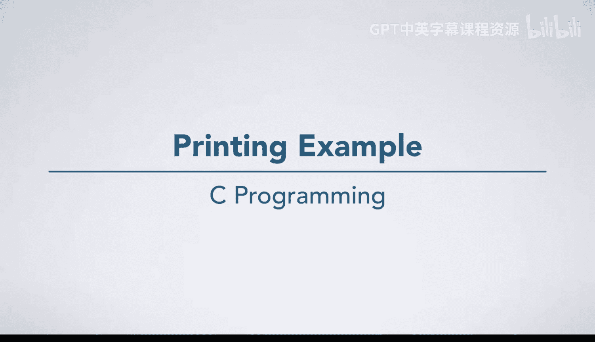
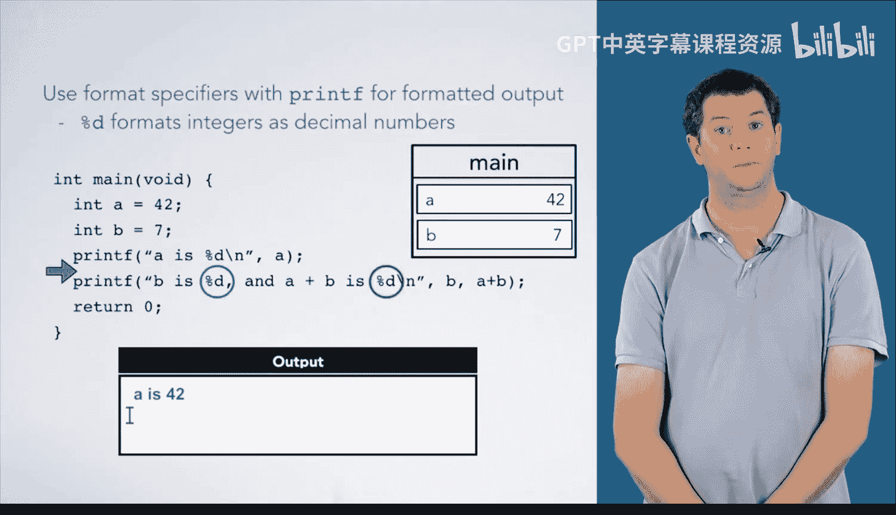
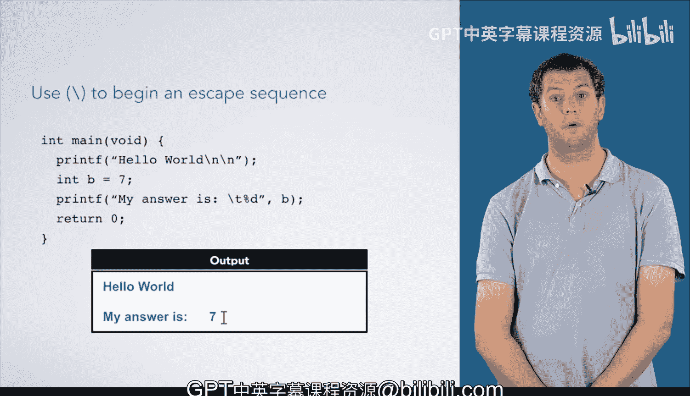

# 014：使用printf函数打印输出 📝



在本节课中，我们将学习如何使用C语言中的`printf`函数向终端打印输出。我们将通过几个具体的例子，了解如何打印字符串、变量值以及如何使用格式说明符和转义序列来控制输出格式。

---

## 打印字符串示例

上一节我们介绍了程序的基本框架，本节中我们来看看如何使用`printf`打印简单的字符串。

我们有一个标准的`main`函数框架和一个输出框。执行箭头位于`main`函数的开始处。

首先，我们声明并初始化一个整数变量`a`，其值为`42`。
```c
int a = 42;
```

然后，我们遇到第一个`printf`调用。
```c
printf("Hello world");
```
这个调用将直接打印字符串“Hello world”。字符串中没有任何格式说明符。因此，我们的输出是：
```
Hello world
```

接下来是第二个`printf`调用。
```c
printf("A");
```
请注意，这里打印的是字面意义上的字母“A”，因为它被引号包围，是一个字符串字面量。这与变量`a`无关。所以输出是：
```
A
```

最后，我们返回`0`并退出`main`函数。

---

## 使用格式说明符打印变量值

如果你想打印变量`a`的值，应该怎么做呢？`printf`中的“f”代表“格式化”（formatted），你可以使用多种格式说明符来格式化输出。

在这个例子中，我们首先声明并初始化两个整数。
```c
int a = 42;
int b = 7;
```

然后，我们遇到一个带有格式说明符的`printf`调用。
```c
printf("%d", a);
```
在这里，`%d`将整数格式化为十进制数字。`%d`意味着`printf`将查看对应的参数（这里是变量`a`），并将其作为十进制数字打印出来。因此，它会在字符串中`%d`的位置打印数字`42`的十进制表示。
输出为：
```
42
```

下一个`printf`调用包含两个`%d`。
```c
printf("b is %d and a+b is %d", b, a+b);
```
第一个`%d`对应字符串后的第一个参数`b`（值为`7`）。第二个`%d`对应表达式`a+b`。这个表达式会像其他表达式一样被求值，即`42 + 7 = 49`。
因此，输出是：
```
b is 7 and a+b is 49
```

最后，我们返回`0`并退出`main`函数。

---



## 使用转义序列控制格式

关于`printf`，另一个需要了解的重要概念是转义序列。转义序列以反斜杠`\`开头。

最常见的转义序列是`\n`，代表换行。
```c
printf("Hello world\n\n");
```
这个`printf`调用包含两个`\n`，因此它会在“Hello world”之后打印两个空行。

接下来，我们声明并初始化变量`b`。
```c
int b = 7;
```

这个`printf`调用中包含`\t`，代表制表符，对于对齐输出非常有用。
```c
printf("My answer is\t%d", b);
```
输出为：
```
My answer is    7
```

最后，我们返回并退出`main`函数。

---



本节课中我们一起学习了`printf`函数的基本用法。我们看到了如何打印简单的字符串，如何使用`%d`这样的格式说明符来打印整型变量的值，以及如何使用`\n`和`\t`这样的转义序列来控制输出的换行与对齐。这些是C语言中输出信息的基础，在后续课程中你还会看到更多`printf`的高级用法。