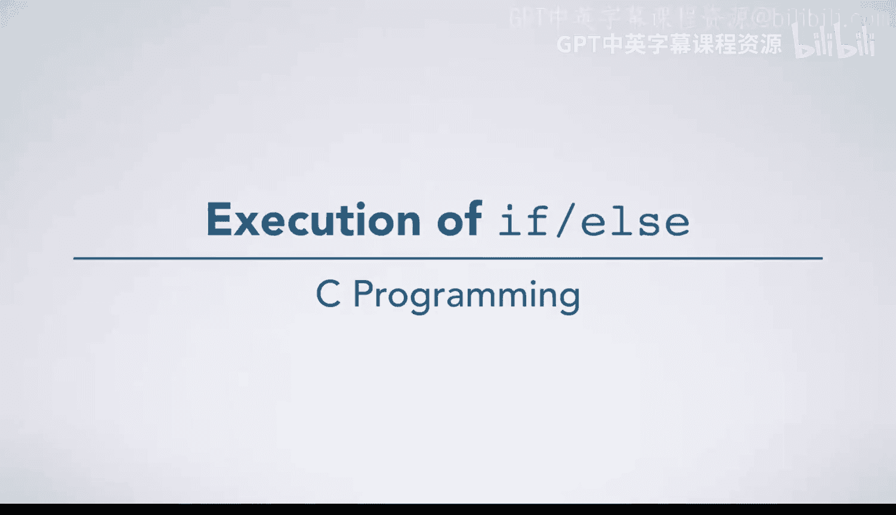
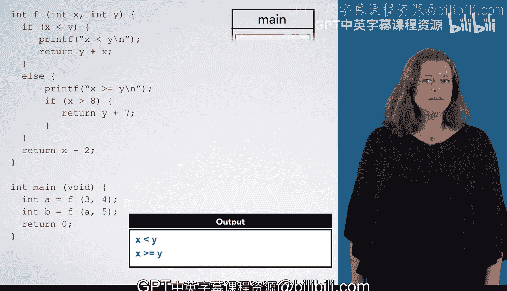

# 015：if-else语句执行过程详解 🧭

在本节课中，我们将学习C语言中`if-else`条件语句的具体执行过程。我们将通过一个具体的函数示例，一步步跟踪程序的执行流程，理解条件判断如何引导程序走向不同的代码分支。

## 概述

我们将分析一个包含`if`和`if-else`语句的函数`F`。通过模拟程序在内存中的执行步骤，包括变量声明、函数调用、条件判断和返回值处理，来直观地理解控制流的运作机制。

## 执行过程逐步解析

程序从`main`函数的起始处开始执行。

### 第一步：声明变量并调用函数

第一条语句声明了一个变量`A`，我们为其在内存中创建一个“盒子”。尽管这条语句会初始化`A`，但我们需要先计算`f(34)`的值，因此暂时将`A`的值标记为问号。

为了计算对函数`F`的调用，我们创建一个栈帧，并传入参数值。我们记录下返回位置，然后将执行箭头移动到函数`F`的第一行。

### 第二步：执行第一个if语句

下一行代码是一个`if`语句，其条件表达式为`x < y`。我们计算该表达式，发现`3 < 4`为真。

因此，我们将执行箭头移入该`if`语句的`then`子句中继续执行。

以下是`then`子句中的操作：
1.  执行`printf`语句，输出“x less than y”。
2.  执行`return y + x;`语句。我们计算表达式得到返回值`7`。这就是函数调用的结果。

现在，我们返回到调用者（`main`函数），并销毁`F`函数的栈帧。此时我们知道了`F(3,4)`的调用结果为`7`，因此完成变量`A`的初始化，`A`的值现在为`7`。

### 第三步：处理main函数中的第二个调用

我们准备好执行`main`函数中的下一行代码。为变量`B`创建一个盒子，并调用`F(7, 5)`。

我们再次计算条件`x < y`。此时`x`为`7`，`y`为`5`，因此`7 < 5`为假。

我们找到这个`if`语句的闭合花括号，并看到该语句有一个`else`子句。因此，我们将执行箭头移入`else`子句的开头，并从那里继续执行。

### 第四步：执行else子句及嵌套的if

首先，执行`else`子句中的`printf`语句。

然后，我们遇到另一个`if`语句。这个`if`语句嵌套在`else`内部，但这不影响我们评估它的规则。我们看到其条件表达式为假，因此我们寻找该`if`语句的闭合花括号。

由于没有`else`子句，我们立即将执行箭头移过闭合花括号，并继续执行。

`else`子句内部没有更多语句，因此我们将执行箭头移出`else`子句并继续。

### 第五步：函数返回并结束

现在我们遇到一个`return`语句。我们计算表达式`x - 2`，得到返回值`5`，该值将返回到我们记录的位置。

我们返回到`main`函数，并销毁`F`函数的栈帧。然后完成对变量`B`的赋值语句。

最后，我们到达`main`函数的`return`语句，执行它并退出程序。

## 总结

本节课中，我们一起学习了`if-else`语句在C语言中的执行过程。我们跟踪了一个具体示例，观察了程序如何根据条件表达式的真假值选择不同的执行路径，包括处理嵌套的条件语句。理解这个流程对于编写和调试依赖条件逻辑的程序至关重要。