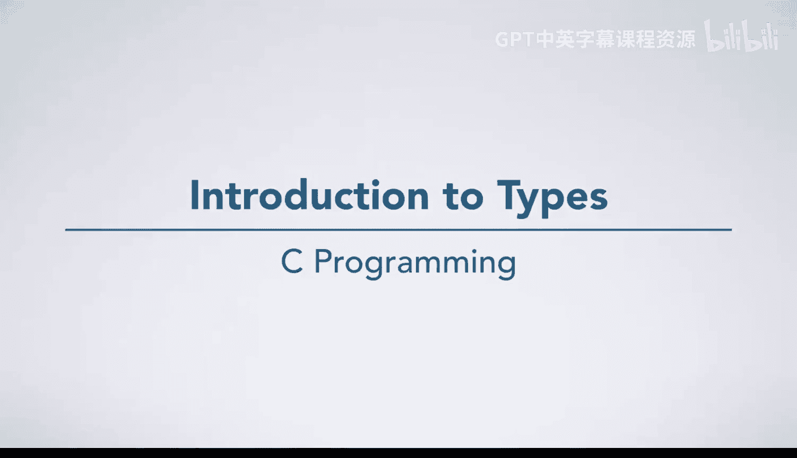
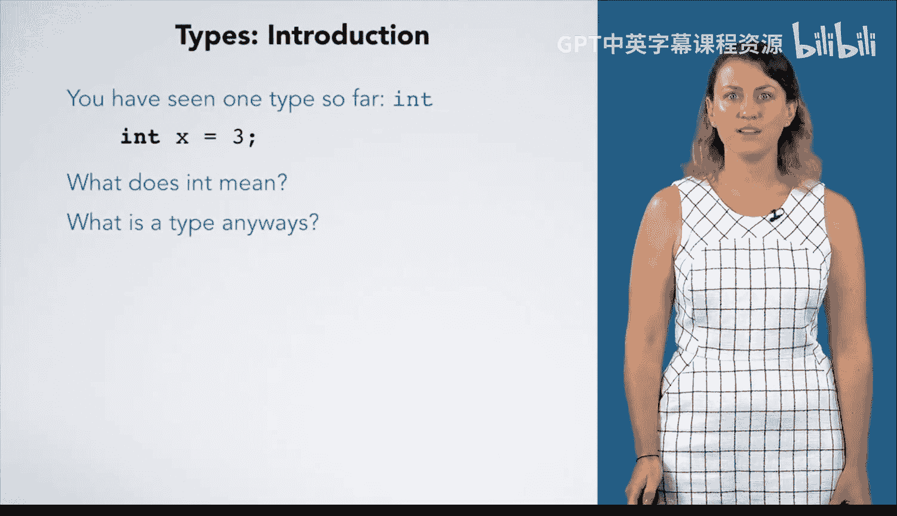

# 021：类型系统简介

在本节课中，我们将要学习C语言中一个核心概念——类型系统。到目前为止，我们只接触过 `int` 类型，但类型远不止于此。理解类型是理解计算机如何处理数据的关键。

## 概述：一切皆数字

上一节我们介绍了C语言的基本语法和手动执行语义。本节中我们来看看计算机科学的一个关键原则：**一切皆数字**。

计算机只能对数字进行操作。因此，所有数据都必须以数字形式表示。**类型**的作用就是告诉计算机如何解释和操作这些数字表示。

## 类型的作用

类型系统是编程语言的基石。它定义了数据的种类、可执行的操作以及数据在内存中的表示方式。

以下是类型系统的主要功能：

1.  **解释数据**：告诉计算机内存中的一串二进制数字代表什么（例如，是整数、字符还是浮点数）。
2.  **定义操作**：规定可以对某种类型的数据执行哪些运算（例如，整数可以加减，字符可以比较）。
3.  **管理内存**：决定为数据分配多少内存空间。

## 课程内容预告

随着本课程的深入，你将学习到以下关于类型的知识：

*   **其他内置类型**：除了 `int`，还将学习如 `char`、`float`、`double` 等其他基本类型。
*   **类型转换**：
    *   **隐式类型转换**：在某些运算中，编译器自动进行的类型转换。
    *   **显式类型转换**：通过**类型转换**操作符，由程序员明确指定的类型转换，例如 `(float) x`。
*   **自定义类型**：学习如何使用 `struct`、`union`、`typedef` 等工具创建自己的类型，以表示你需要处理的任何数据。

## 总结

本节课中我们一起学习了类型系统的基本概念。我们了解到，计算机将所有数据视为数字，而类型是解释和操作这些数字的规则。掌握类型系统对于编写正确、高效的C语言程序至关重要。在接下来的课程中，我们将逐一探索各种内置类型、类型转换的机制以及创建自定义类型的方法。