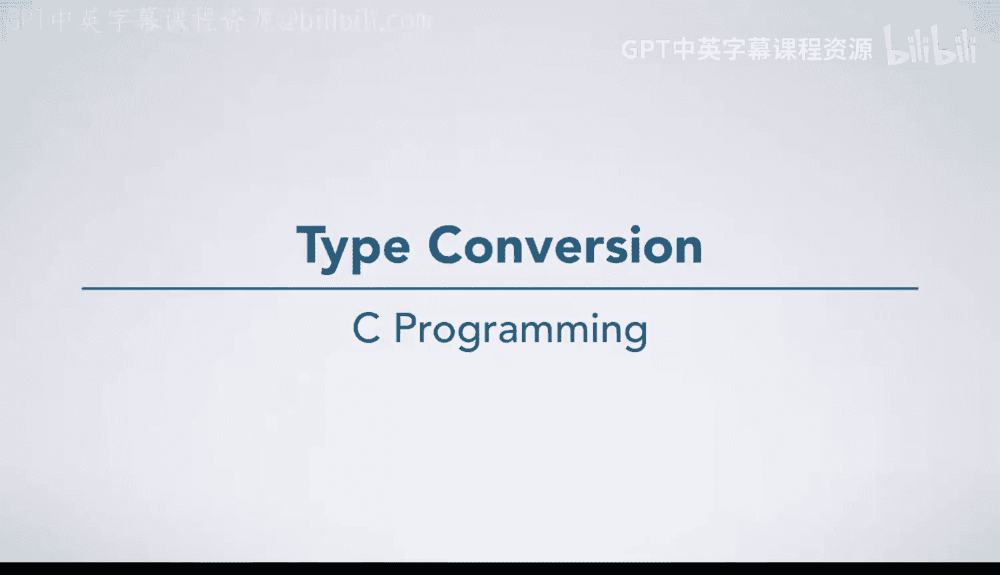
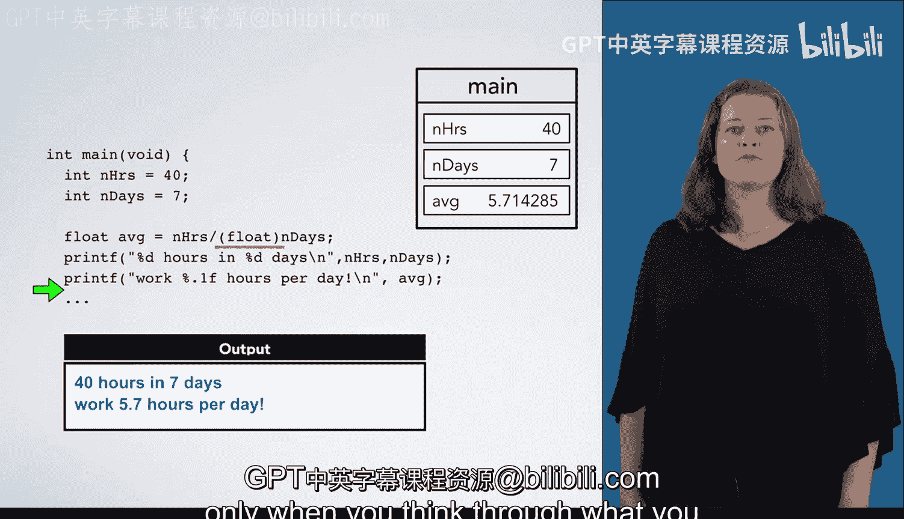

# 023：类型转换



在本节课中，我们将学习C语言中的类型转换，包括隐式转换和显式转换。我们将通过一个具体的代码示例来理解它们如何发生，以及为什么需要谨慎处理数据类型。

## 概述

类型转换是C语言中一个重要的概念，它允许我们将一种数据类型的值转换为另一种数据类型。理解类型转换有助于我们避免计算错误，并编写出更精确的代码。

## 隐式转换示例

让我们通过一段示例代码来看看隐式转换何时发生，以及为什么需要关注类型。

首先，我们创建一个名为 `n_hours` 的整型变量，并将其初始化为40。

```c
int n_hours = 40;
```

接下来，我们创建另一个整型变量 `n_days`，并将其初始化为7。

```c
int n_days = 7;
```

然后，我们创建一个浮点型变量 `average`，并将其初始化为 `n_hours` 除以 `n_days` 的结果。

```c
float average = n_hours / n_days;
```

由于 `n_hours` 和 `n_days` 都是整型，这里进行的是整数除法。40除以7在整数除法中的结果是5。

现在，由于我们将一个整型值赋值给一个浮点型变量，编译器会在除法运算之后，隐式地将整数结果转换为浮点数。因此，`average` 被初始化为5.0。

当我们打印结果时，会得到“40小时在7天中是每天5.0小时”的输出，这显然是不正确的。

## 显式转换（强制类型转换）

为了修正这个错误，我们需要对代码进行一个小小的改动：在进行除法运算之前，显式地将 `n_days` 转换为浮点型。

以下是修改后的代码：

```c
float average = n_hours / (float)n_days;
```

我们以同样的方式开始：创建并初始化 `n_hours` 为40，`n_days` 为7。

然而，现在情况有所不同。除法表达式中的除数现在是转换为浮点数的7。因此，我们需要计算整数40除以浮点数7.0。

计算机执行整数除以整数，或浮点数除以浮点数的运算。所以，编译器必须在进行除法之前，隐式地将40转换为浮点数。

现在，我们进行的是浮点数除法：40.0除以7.0等于约5.71。

我们用这个值初始化 `average`，这意味着当我们打印结果时，会得到正确的答案。

## 总结

在本节课中，我们一起学习了C语言中的类型转换。我们看到了隐式转换如何自动发生，以及如何使用显式转换（强制类型转换）来确保运算的正确性。



记住，虽然类型转换是一个有用的工具，但应该谨慎使用。只有在仔细思考了转换的原因和目的之后，才应该使用它。