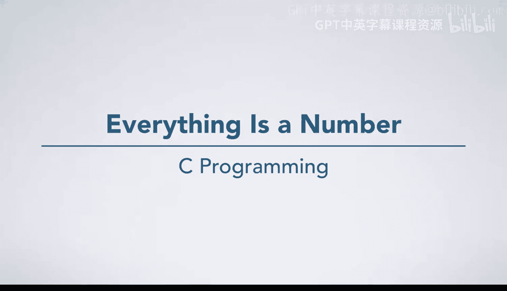
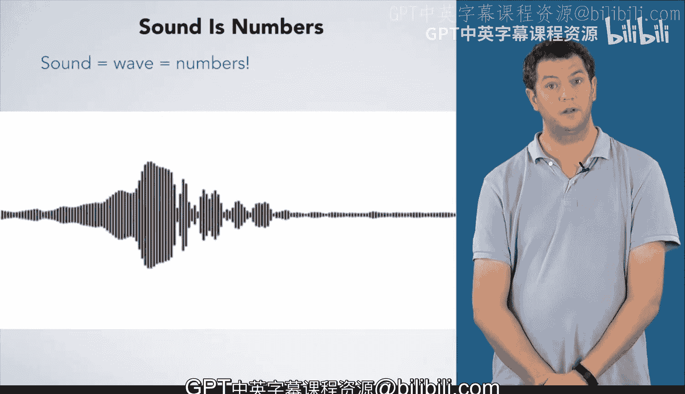

# 024：万物皆数字

在本节课中，我们将探讨计算机科学中的一个核心原则：万物皆数字。我们将看到，无论是文本、图像还是声音，在计算机内部最终都被表示为数字。理解这一点是学习编程和计算机如何工作的基础。

## 字符串是数字

上一节我们介绍了计算机处理数字的基本方式，本节中我们来看看这个原则如何应用于看似非数字的事物。

字符串就是数字。你之前见过字符的字面序列，例如 `"hello world"`。但你是否想过计算机如何将它们作为数字存储？每个字符都占据计算机内存的一部分。我们稍后会详细讨论具体占多少，现在你可以概念性地将每个字符想象成放在一个盒子里。

在硬件层面，计算机将每个字符存储为一个数字。你可以在ASCII表中查找不同字符对应的十进制或十六进制值。例如，字符 `'h'` 的十进制值是 **104**，字符 `'e'` 是 **101**。当然，计算机最终以二进制形式存储它们。

计算机将字母存储为数字的一个有趣结果是，我们可以对它们进行数学运算。这个原理构成了大多数现代加密方法的基础。

## 图像也是数字

另一个初看不像数字的东西是图像，比如这张花的图片。这张图像由大约一百万个像素组成，每个像素都用数字来代表图像中的颜色。

为了看清这些像素，让我们放大图像的这一小部分。在这里，你可以看到图像被放大了数倍。你可以看到图像看起来是块状的或像素化的。如果你能看得那么近，图像实际上就是这样的。

请注意，如果你自己尝试，可能会得到看起来平滑得多的结果。大多数图像软件在放大图像时会应用算法来平滑像素化效果。你必须关闭这个功能才能看到原始像素。

让我们回到放大的图像，它能更清晰地显示原始像素。如果我们只看图像的一个子集并进一步放大，就能更容易地看到和讨论单个像素。

以下是原始图像中的16个像素（原始图像有约一百万个像素，这让你了解我们放大了多少倍）。

以下是这些像素的RGB值示例：
*   这个深紫色像素的红色值为 **55**，绿色值为 **27**，蓝色值为 **75**。
*   同时，这个金色像素的RGB值则截然不同，分别为 **166**、**136** 和 **41**，这赋予了它完全不同的颜色。

## 声音同样是数字

声音是计算机处理的另一个重要事物。在我说话时，你可以看到我说的话的波形。计算机将这些波形编码为数字，并将它们发送到声音硬件。声音硬件利用这些数字来决定如何移动扬声器，从而产生所需的声音。

## 总结与展望

本节课中我们一起学习了“万物皆数字”这一核心概念。我们看到，文本（字符串）、图像（像素）和声音（波形）在计算机内部都被表示为数字序列。

除了这些，计算机中还有许多其他类型的数据需要表示。你将在课程3中学习由序列构成的数据（如数组和链表）。现在，你将开始学习 **`struct`** 和 **`typedef`**，它们是C语言中用来创建自定义复合数据类型的关键工具，能帮助你更有效地组织和表示复杂信息。