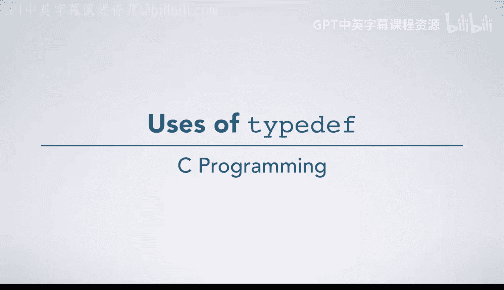
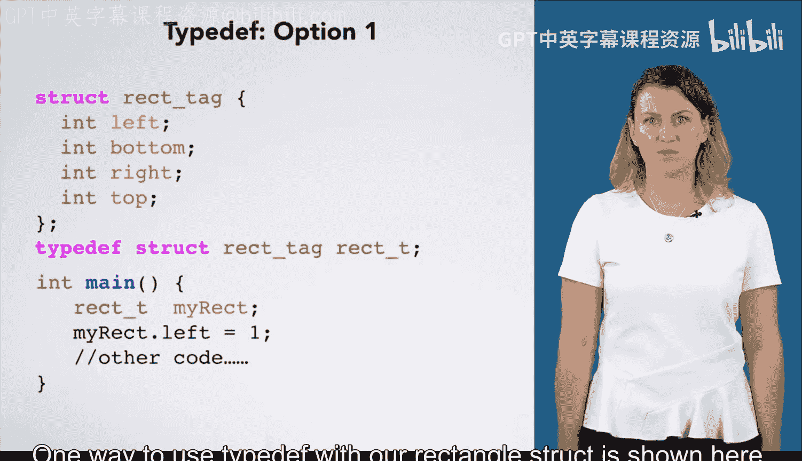

C语言入门：26：typedef的用途详解



在本节课中，我们将要学习C语言中`typedef`关键字的核心用途。`typedef`用于为已有的数据类型创建新的别名，这不仅能简化代码书写，还能提升代码的可读性和可维护性。我们将通过结构体和基本数据类型的例子来具体说明。

---

### 简化结构体类型声明

上一节我们介绍了结构体的基本概念，本节中我们来看看如何使用`typedef`来简化结构体类型的声明。



当我们声明一个结构体时，结构体标签本身并不是一个完整的类型名。例如，这里有一个矩形的结构体声明：
```c
struct rect_tag {
    int length;
    int width;
};
```
此时，`struct rect_tag`标识了结构体类型，但单独使用`rect_tag`并不是类型名。当你想要使用这个结构体类型时，必须在前面加上`struct`关键字，如下所示：
```c
struct rect_tag myRect;
```
许多程序员认为到处书写`struct`很繁琐。因此，他们使用`typedef`来为这个结构体类型定义一个新的类型名。

以下是使用`typedef`为我们的矩形结构体定义新类型名的一种方法：
```c
typedef struct rect_tag RectT;
```
`typedef`关键字表明我们将为一个已存在的类型创建一个新名字。在这个例子中，新名字`RectT`出现在声明的最后，而现有的类型名`struct rect_tag`位于它们之间。

现在，我们可以直接使用`RectT`作为一个类型名。它是`struct rect_tag`的一个别名。

---

### `typedef`与结构体声明的其他组合方式

为了确保你在阅读他人代码时不会感到困惑，我们还需要了解实现同一目标的另外两种常见方式。

**第一种方式：合并声明**
我们可以将结构体声明和`typedef`合并到一条语句中。
```c
typedef struct rect_tag {
    int length;
    int width;
} RectT;
```
这遵循我们刚才讨论的相同规则：新名字`RectT`位于`typedef`语句的末尾，而现有的类型（在这里被声明）位于新名字和`typedef`关键字之间。

**第二种方式：省略结构体标签**
第三种方式与上一种类似，只是省略了结构体标签。
```c
typedef struct {
    int length;
    int width;
} RectT;
```
这会创建一个没有标签的结构体，并立即将其别名定义为`RectT`。

---

### 提升代码可维护性与可读性

`typedef`的用途远不止于结构体。它还能显著提升代码的可维护性和可读性。

假设我们正在编写处理像素RGB值的代码。在最初的设想中，我们使用`unsigned int`来表示每个像素的红、绿、蓝分量。
```c
unsigned int red, green, blue;
```
但如果后来我们发现，由于RGB值只能在0到255之间，使用`unsigned char`会更节省内存，那该怎么办？

按照最初的写法，我们必须找到每一处使用`unsigned int`来表示RGB值的地方并进行修改。我们甚至不能简单地使用编辑器的搜索替换功能，因为程序中可能还有其他不表示RGB值的`unsigned int`变量，我们并不想改动它们。这样的修改既繁琐又容易出错。

事实上，编程的一个重要原则是：**编写代码时，应确保如果需要修改某处，你只需在一个地方进行改动**。

现在，假设我们最初是这样编写代码的：
```c
typedef unsigned int RGBT;
RGBT red, green, blue;
```
这里，我们使用`typedef`令`RGBT`成为`unsigned int`的别名，然后在所有需要表示RGB值的地方都使用`RGBT`作为类型名。

采用这种写法后，如果我们想改变用于RGB值的类型，只需修改`typedef`语句一处，所有相关代码都会自动正确地更新。此外，这还带来了一个额外的好处：它提高了代码的可读性。任何阅读代码的人都能通过类型`RGBT`立刻识别出某个变量、参数或返回值代表的是一个RGB值。

---

### 总结

本节课中我们一起学习了`typedef`关键字在C语言中的核心用途。我们了解到：
1.  `typedef`可以为复杂的数据类型（如结构体）创建简洁的别名，简化代码书写。
2.  它可以与结构体声明以多种方式结合使用。
3.  更重要的是，`typedef`通过将数据类型抽象化，将“是什么”与“如何实现”分离，极大地增强了代码的可维护性（只需修改一处定义）和可读性（类型名具有明确的语义）。

合理使用`typedef`是编写清晰、健壮且易于维护的C语言代码的重要技巧之一。