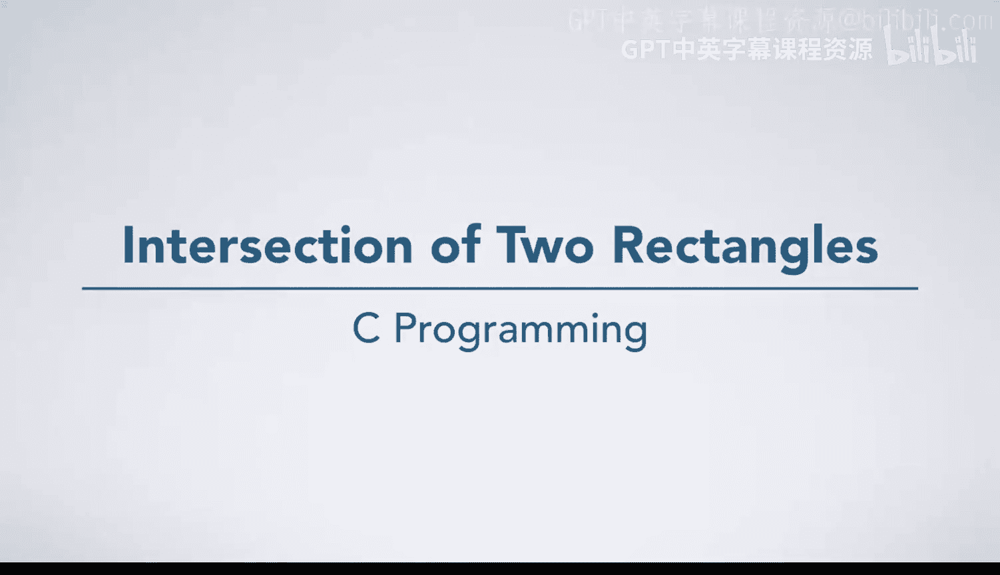
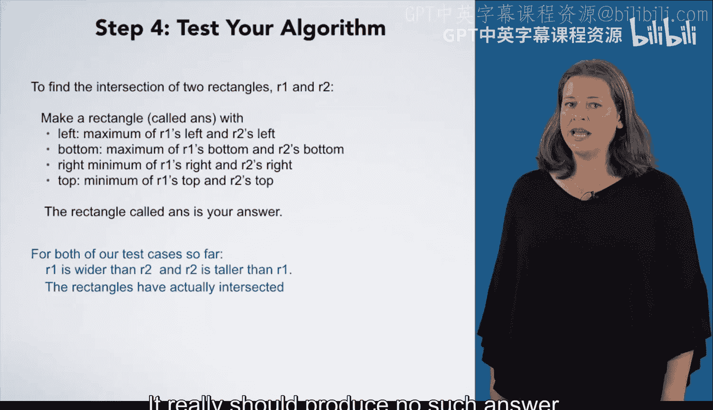

# 032：两个矩形的交集 📐

在本节课中，我们将学习如何运用“七步问题解决法”来解决一个具体问题：**计算两个矩形的交集**。我们将专注于处理边平行于坐标轴的矩形，这会使问题大大简化。

要解决这个问题，你需要一些预备知识，例如理解什么是矩形。你可能还记得，矩形是一个四边图形，其相邻边彼此成直角。同时，你需要理解“两个矩形的交集”意味着什么，即找出同时位于两个矩形内部的区域。

---

## 第一步：分析具体实例

第一步是分析一个具体的问题实例。我们从一张空白的笛卡尔坐标系开始，以便精确地绘制矩形。

首先，我选取了第一个矩形，其范围是从 (-4, 1) 到 (8, 6)。接着，我选取了第二个矩形，其范围是从 (1, -1) 到 (4, 7)。这两个矩形的交集区域已用绿色高亮标出。

我们可以看到，交集区域的范围是从 (1, 1) 到 (4, 6)。我们希望准确地写下我们是如何得出这个结果的。但我们的直觉可能只是说“我们看了图就知道了答案”。这种情况很常见：你只是知道自己做了什么，但很难一步步地思考清楚。

当这种情况发生时，一个好办法是**分析另一个实例**，并尝试思考你正在做什么。

---

## 第二步：分析第二个实例

这里我们移除了网格线，这样我们就不能直接从最终绘图中读取坐标了。

对于第一个矩形，我选择了 (-2, 1) 到 (6, 3)。对于第二个矩形，我选择了 (1, -1) 到 (4, 4)。交集区域同样用绿色标出，但它的角点坐标是多少呢？

这个矩形是从 (-1, 1) 到 (4, 3)。现在，让我们准确地写下我们刚才做了什么。

我们首先要回答的问题是：**如何用数字表示一个矩形？**

答案是：一个矩形由四个整数表示：**左边界 (left)、底边界 (bottom)、右边界 (right)、顶边界 (top)**。

接下来，我们需要思考我们采取了哪些步骤来得出这个答案。

1.  我首先确定交集矩形的左边界 x 坐标为 -1。
2.  接着，我确定底边界 y 坐标为 1。
3.  然后，我确定右边界 x 坐标为 4。
4.  最后，我确定顶边界 y 坐标为 3。

我的答案是矩形 (-1, 1, 4, 3)。

---

## 第三步：将步骤推广到一般情况

现在，我们准备将这些步骤推广到任意一对矩形。

*   **为什么我们选择 -1 作为答案的左边界？** 我们可能认为这是因为它是第二个矩形 (R2) 的左边界。但它总是 R2 的左边界吗？不，这次只是巧合，因为 R2 的左边界大于第一个矩形 (R1) 的左边界。更一般地说，答案的左边界应该是 **R1 左边界和 R2 左边界的最大值**。
*   **如果我们现在没有发现这个细微差别怎么办？** 我们应该在后续步骤中发现它，要么是在第四步手动测试算法时，要么是在第六步运行代码测试用例时。如果之后发现了，我们会回到第三步，修正算法，并重做后续步骤。
*   **那么底边界呢？为什么是 1？** 同样，我们可能认为是因为它是 R1 的底边界，但这会遇到我们刚才讨论过的相同陷阱。实际上，它是 **R1 底边界和 R2 底边界的最大值**。
*   接着，我们对右边界进行类似的思考，但这次是 **两个输入矩形右边界的较小值（最小值）**。
*   最后，顶边界是 **两个输入矩形顶边界的较小值（最小值）**。

让我们把这些步骤更明确地写成指令：

我们将创建一个矩形，称之为 `ans`（答案）。它的四条边由输入矩形对应边的最大值或最小值决定，正如我们刚才讨论的那样。然后，我们刚刚创建的矩形 `ans` 就是我们的答案。

---

## 第四步：测试算法

接下来，我们应该测试我们的算法。它看起来相当直接，那么可能会出什么问题呢？

首先，我们用来构建算法的唯一输入具有相同的总体形状：R1 比 R2 宽，而 R2 比 R1 高。如果我们在第三步中犯了任何之前讨论过的错误，我们可能还没有发现它们。

存在一个我们尚未考虑的、更微妙的情况：**矩形可能不相交**。

对于这种情况，算法会产生什么结果？它应该产生什么结果？实际上，它应该产生“无解”。因此，我们需要某种方式来表示这种情况。

---

## 总结

本节课中，我们一起学习了如何运用“七步法”解决“求两个矩形交集”的问题。我们首先通过具体实例理解问题，然后抽象出用四个整数（左、底、右、顶）表示矩形的方法。接着，我们推导出计算交集矩形的通用规则：**左边界和底边界取两个矩形的最大值，右边界和顶边界取两个矩形的最小值**。最后，我们意识到算法需要处理矩形不相交的特殊情况，这为后续的代码实现和测试指明了方向。