# 034：编程环境介绍 🖥️

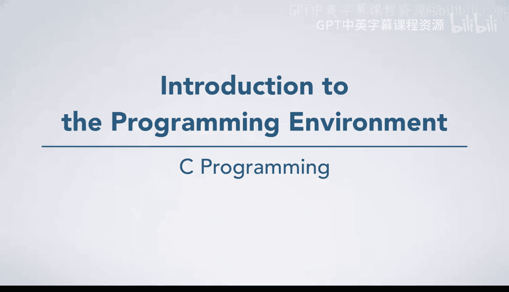

在本节课中，我们将学习如何在Unix环境中开始编写代码。我们将介绍编程环境的基本使用方法，包括如何编辑文件、使用Git以及其他编程工具。

---

## 概述

现在，你已经准备好在一个Unix环境中开始实际编写代码了。我们将花一些时间介绍如何使用这个环境，包括如何编辑文件、使用Git以及你在编程过程中会用到的其他各种工具。

---

## 进入编程环境

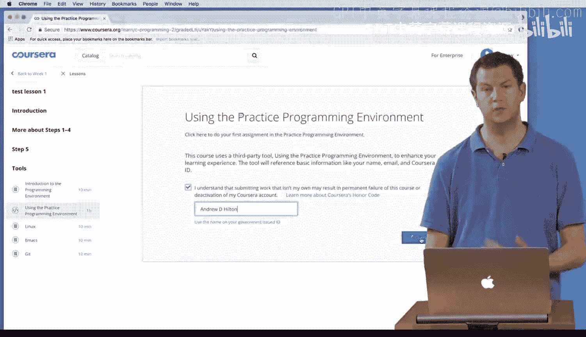

首先，我登录了Coursera平台，打开了第一项作业。这项作业实际上是一个环境使用指南，它会引导你熟悉整个操作流程。你可以跟着这个指南一起操作。

我确认遵守了Coursera的荣誉准则，并承诺独立完成作业。

点击“打开工具”后，会出现一个窗口，这本质上是一个Unix终端。这个工具叫做Xterm JS，它在你的网页浏览器中提供了一个标准的Unix终端。

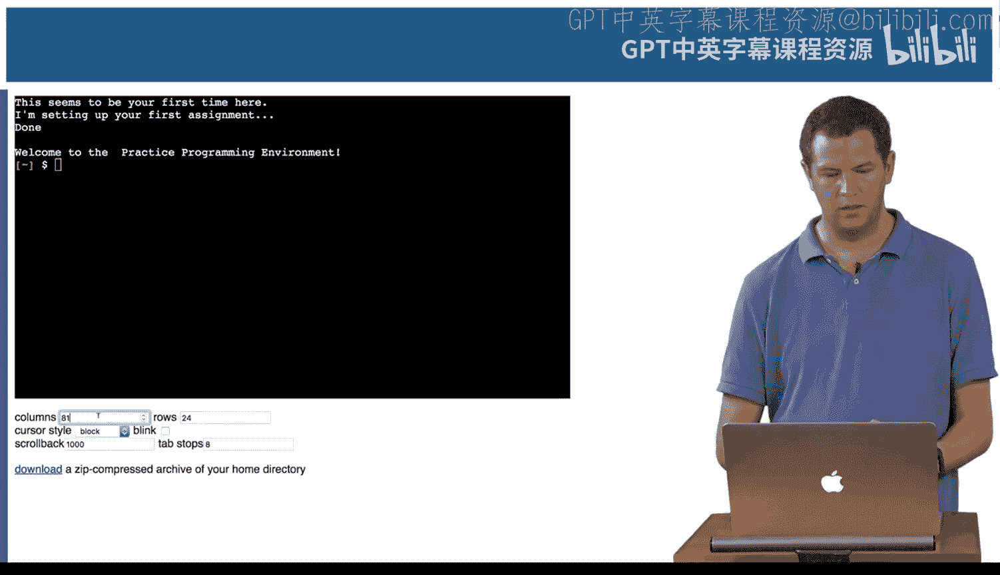

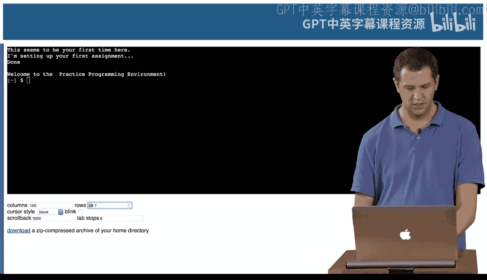

为了让操作空间更大，我将终端窗口调整为140列宽和36行高。这样就有更多空间来输入命令了。

终端会提示这是你第一次使用，并正在为你设置环境。接着，它会欢迎你进入实践编程环境。

---

## 熟悉Unix命令行

此时，你可能对Unix和命令行还不太熟悉。别担心，后续会有相关的阅读材料，并且你会有大量的练习机会。

首先，我输入了 `ls` 命令。这个命令的作用是列出当前目录下的所有内容。

```bash
ls
```

执行后，我们看到当前目录下有一个 `readme` 文件和一个名为 `learn-to-program` 的文件夹。这个 `learn-to-program` 文件夹将存放你所有的作业。

第一个作业是“00_hello”，也就是第0号作业。我们的第一个任务是创建一个名为 `hello.txt` 的文件。这虽然不是一个真正的编程活动，但能让你在开始写代码前，先熟悉这些基本操作。

---

## 使用Emacs编辑器

接下来，我使用 `emacs` 编辑器打开了 `readme` 文件。`emacs` 是你将要学习使用的编辑器。

```bash
emacs readme
```

文件打开需要一点时间。打开后，你可以看到里面有很多说明文字，可以滚动阅读。

正如说明中所说，我们的目标是创建一个名为 `hello.txt` 的文件，里面只包含一行文字“hello”。说明中也给出了具体的操作步骤。

我们需要用Emacs打开并创建一个名为 `hello.txt` 的新文件。说明中提到要输入 `C-x C-f`。在Emacs的术语中，这代表同时按下 `Ctrl` 键和 `X` 键，然后松开，再同时按下 `Ctrl` 键和 `F` 键。

我按下 `Ctrl+X`，然后松开，再按下 `Ctrl+F`。这时，在编辑器底部会看到提示“Find file:”，并等待我输入文件名。它显示了当前所在的目录路径，我只需输入 `hello.txt` 然后按回车即可。

编辑器底部会显示“New file”，并且文件名栏会变成 `hello.txt`。但这时，我暂时看不到操作说明了，因为它们还在另一个文件里。

Emacs有一个非常棒的功能，可以让你同时查看两个文件。我按下 `Ctrl+X` 然后按 `2`，窗口就会被分成上下两半。现在我有两个缓冲区，一个在上，一个在下，但此时它们显示的都是 `hello.txt` 文件的不同部分。

同时查看一个文件的两个不同位置很有用，但我现在想把顶部的缓冲区换成 `readme` 文件。我按下 `Ctrl+X` 然后按 `B`，它会询问我想切换到哪个缓冲区。默认就是 `readme`，所以我直接按回车。

现在，顶部是 `readme` 文件，底部是 `hello.txt` 文件。我可以看到操作说明就在 `readme` 文件里。如果想在两个缓冲区之间切换光标，可以按 `Ctrl+X` 然后按 `O`。你会看到光标随着按键在两个窗口间跳转。

---

## 编辑并保存文件

现在，我进入底部的 `hello.txt` 文件，输入单词“hello”，然后按回车键换行。通常，文件都以一个新行结束。

接着，我按下 `Ctrl+X` 然后按 `Ctrl+S` 来保存文件。编辑器底部会提示文件已写入并保存。

---

## 提交作业

现在，我想给这个作业评分。首先，我需要暂时挂起Emacs编辑器。我按下 `Ctrl+Z`，终端会显示“Stopped (emacs readme)”。Emacs并没有关闭，只是被暂时冻结在后台了。如果我因为忘记看接下来的说明而需要把它调回来，可以输入 `fg` 命令。

```bash
fg
```

说明中提示我要运行一些Git命令。Git是一个非常流行的版本控制系统，被许多专业开发者使用，你会在后续课程中深入学习它。

目前，我们需要做的是“添加”（add）、“提交”（commit）和“推送”（push）这个文件。这会将文件放入Git仓库，并将我们的作业提交给评分系统。

首先，我输入命令将 `hello.txt` 文件添加到Git的暂存区：

```bash
git add hello.txt
```

如果命令执行成功，通常不会有任何输出，这表示一切正常。

接着，我提交这个更改，并附上一条提交信息：

```bash
git commit -m "Did assignment 0."
```

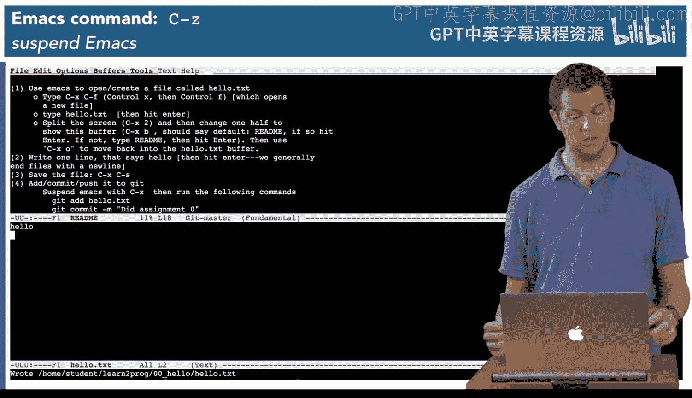

这里的 `-m` 选项表示直接在命令行上提供提交信息，这是一条关于当前操作的简短说明。终端会显示提交成功的信息。

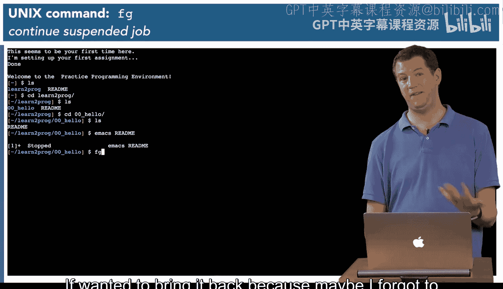

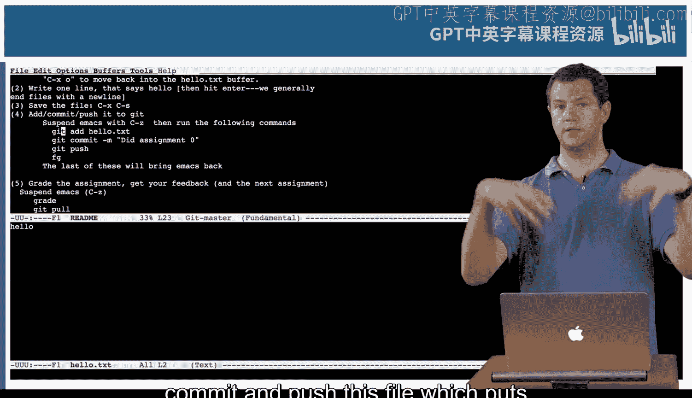

最后，我将本地的提交推送到远程仓库（通常是Coursera的服务器），以便评分系统能够获取：

```bash
git push
```

这个命令会将文件发送到与评分器共享的位置。

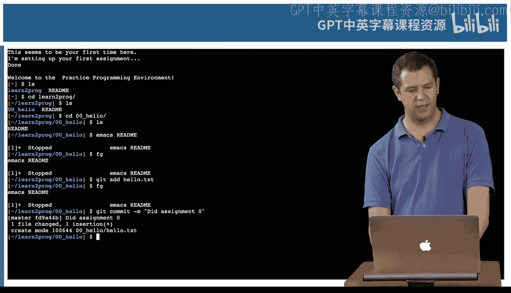

---

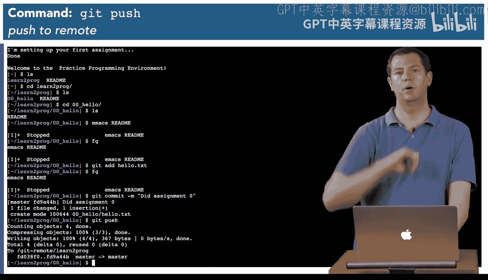

## 获取评分结果

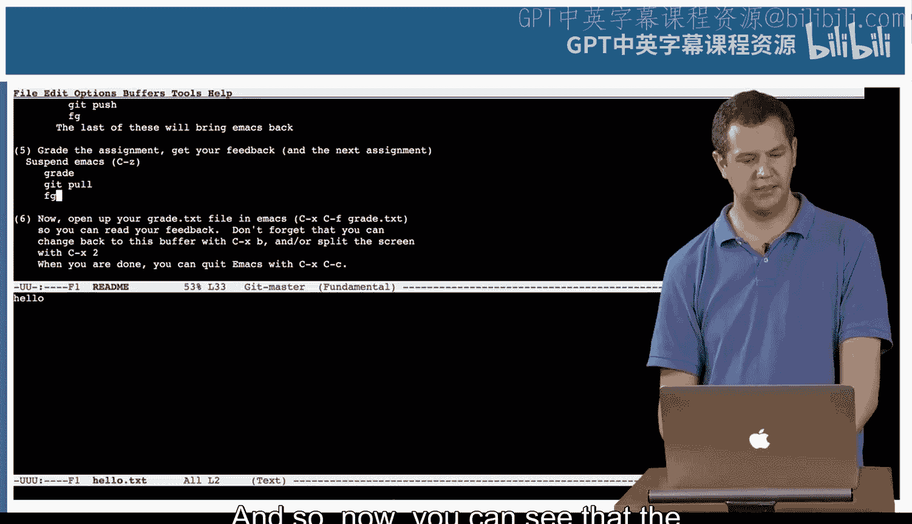

提交完成后，下一步就是给作业评分。我输入 `grade` 命令：

```bash
grade
```

这个命令会检查一些内容，确保我已经提交了所有必需的文件，然后运行评分器。结果显示我通过了这个作业。

评分器还会提示我，它已经发布了下一个作业，并且我应该继续观看视频，直到看完第一周关于评分的视频，那里包含了完成下个作业所需的材料。

同时，它还提示如果我运行 `git pull` 命令，就能获取我的评分报告和下一个作业。

```bash
git pull
```

`git pull` 与 `git push` 相反，它用于从远程仓库获取更新。在专业软件开发中，你会用它来获取合作者编写的代码。

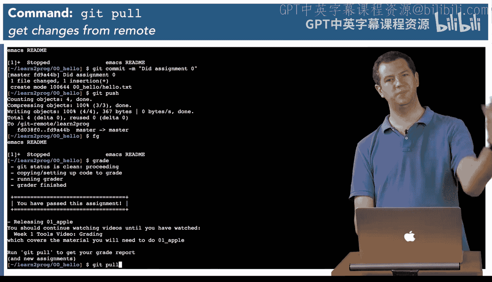

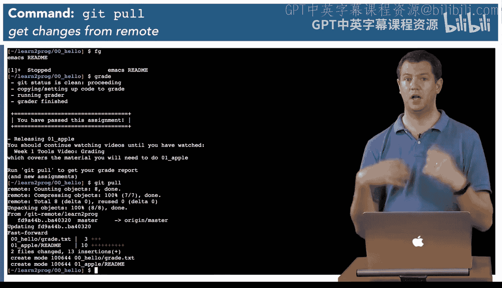

执行后，我看到多了一个名为 `grade.txt` 的文件。在这个简单的例子里，它只是说我的文件与预期输出匹配，因为这次作业没什么可评分的。但在一般情况下，这个文件会告诉你通过了哪些测试用例，失败了哪些，以及你的得分情况。

这样，我们就完成了当前作业，并且下一个作业也已经准备就绪，等你观看更多视频后就可以回来继续完成了。

---

## 总结

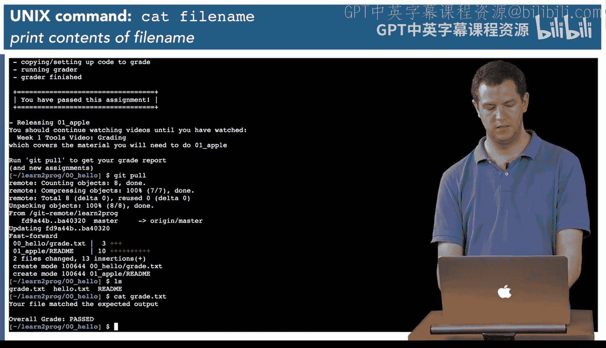

本节课中，我们一起学习了在Unix编程环境中的基本操作流程。我们了解了如何：
1.  使用 `ls` 命令查看目录内容。
2.  使用 `emacs` 编辑器创建和编辑文件。
3.  在Emacs中进行多窗口操作和文件切换。
4.  使用Git进行版本控制的基本操作：`add`、`commit` 和 `push`。
5.  使用 `grade` 命令提交作业并获取评分结果。
6.  使用 `git pull` 获取更新和新的作业。

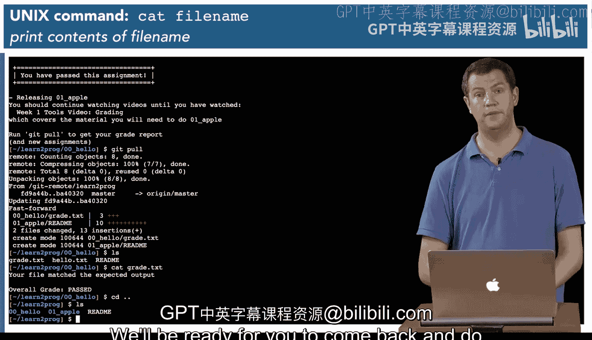

这些是后续编程学习的基础，熟练掌握它们将使你的学习过程更加顺畅。