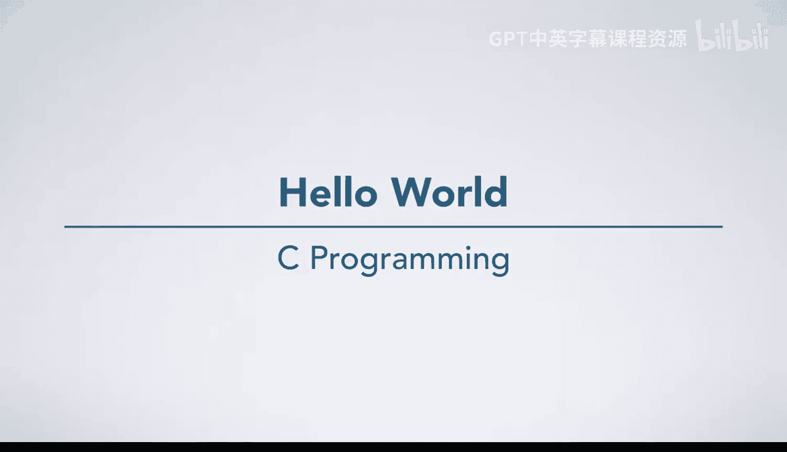
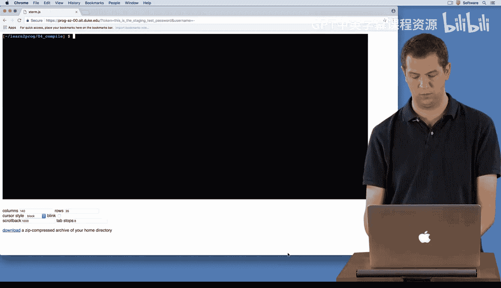
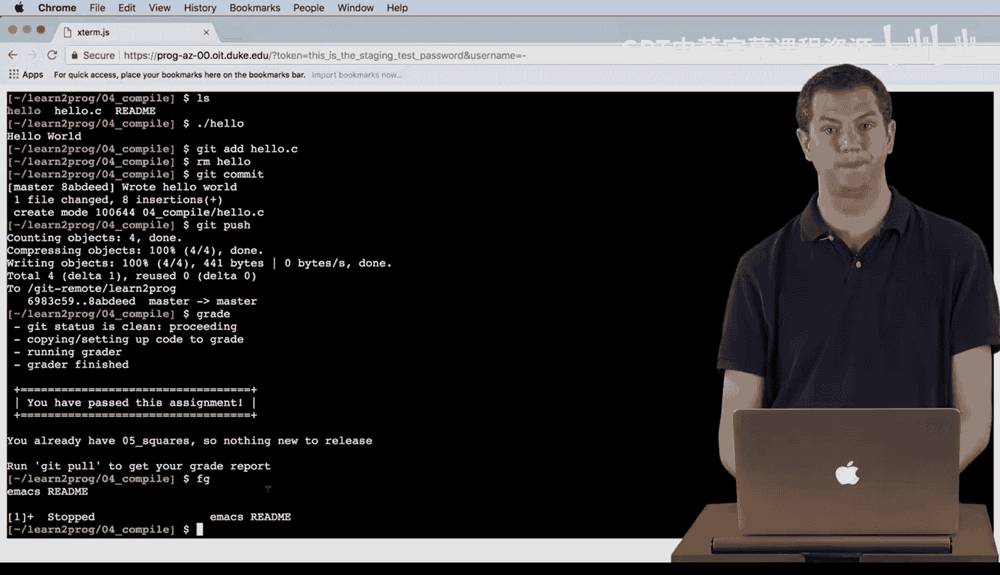

# 038：你好世界 👋



在本节课中，我们将学习如何在Emacs编辑器中编写、编译并运行一个简单的C语言程序。我们将以“打印Hello World”这个经典任务为例，完整地走一遍从创建代码文件到最终运行程序的流程。

---



## 在Emacs中编写代码

上一节我们介绍了课程目标，本节中我们来看看如何开始编写代码。

首先，在编程环境中，我们可以使用 `ls` 命令查看当前目录的内容。执行后，会看到一个名为 `readme` 的文件。


接下来，我们使用Emacs打开这个 `readme` 文件。文件内容说明了本练习的目标：编写一个能打印“Hello World”的程序。

为了完成这个任务，我们需要创建一个新的C语言源文件。以下是具体步骤：

1.  在Emacs中，按下 `Ctrl+X` 然后 `Ctrl+F` 组合键，这会提示你输入文件名。
2.  输入文件名 `hello.c` 并确认。
3.  在文件顶部，我们需要包含必要的头文件。对于打印功能，需要 `stdio.h`；为了使用 `EXIT_SUCCESS`，需要 `stdlib.h`。
    ```c
    #include <stdio.h>
    #include <stdlib.h>
    ```
4.  然后，我们编写 `main` 函数。它返回一个整数（`int`），目前不接收任何参数（后续课程会学习如何处理命令行参数）。
    ```c
    int main(void) {
        // 函数体将写在这里
    }
    ```
5.  在 `main` 函数体内，我们使用 `printf` 函数来打印“Hello World”，并在末尾添加换行符 `\n`。
    ```c
    printf("Hello world\n");
    ```
6.  最后，函数返回 `EXIT_SUCCESS` 表示程序成功结束。
    ```c
    return EXIT_SUCCESS;
    ```
7.  完成代码编写后，使用 `Ctrl+X` 然后 `Ctrl+S` 保存文件。

---

## 编译与运行程序

代码编写完成后，我们需要将其编译成可执行文件。为此，我们需要暂时回到命令行终端。

在Emacs中，按下 `Ctrl+Z` 可以挂起（暂停）Emacs，回到终端shell。此时，我们可以在命令行中操作。

以下是编译和运行的步骤：

1.  使用GCC编译器编译 `hello.c` 文件。`-o hello` 选项指定生成的可执行文件名为 `hello`。我们还会使用课程要求的所有严格编译标志，以确保代码质量。
    ```bash
    gcc -o hello hello.c
    ```
2.  如果编译成功，GCC不会输出任何信息。此时，使用 `ls` 命令查看目录，会发现多了一个绿色的 `hello` 文件，绿色表示它是可执行的。
3.  运行程序。在Unix-like系统中，运行当前目录下的可执行文件需要在文件名前加上 `./`。
    ```bash
    ./hello
    ```
4.  执行后，终端将打印出 **Hello world**。

---

## 版本控制与后续步骤

程序运行成功后，我们通常需要将源代码纳入版本控制（如Git），并清理生成的可执行文件。

以下是相关操作：

1.  使用 `git add` 命令将 `hello.c` 文件添加到暂存区。
    ```bash
    git add hello.c
    ```
2.  通常，我们不将编译生成的二进制文件（如 `hello`）提交到版本库。可以使用 `rm` 命令删除它。
    ```bash
    rm hello
    ```
3.  提交代码更改，并附上提交信息。
    ```bash
    git commit -m "Wrote hello world program"
    ```
4.  最后，将本地提交推送到远程仓库并完成评分。
    ```bash
    git push
    grade
    ```

完成这些后，请注意我们之前只是挂起了Emacs，并未退出。在终端输入 `fg` 命令可以让我们回到刚才的Emacs编辑会话中，继续修改代码。请避免同时开启多个Emacs实例。



本节课中，我们一起学习了第一个C语言程序的完整开发流程：从在Emacs中编写代码、保存文件，到挂起编辑器、使用GCC编译、运行可执行文件，最后进行版本控制的基本操作。你已经成功迈出了C语言编程的第一步。接下来，我们将进入下一个任务，编写打印平方数的程序。