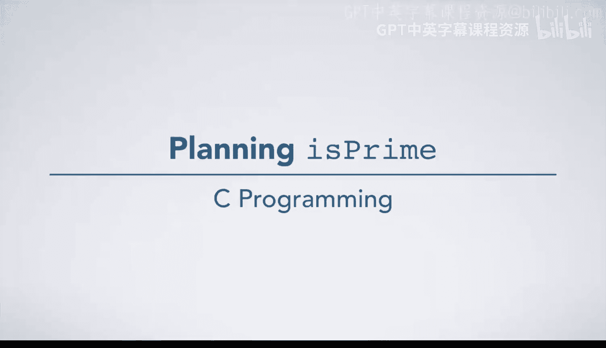
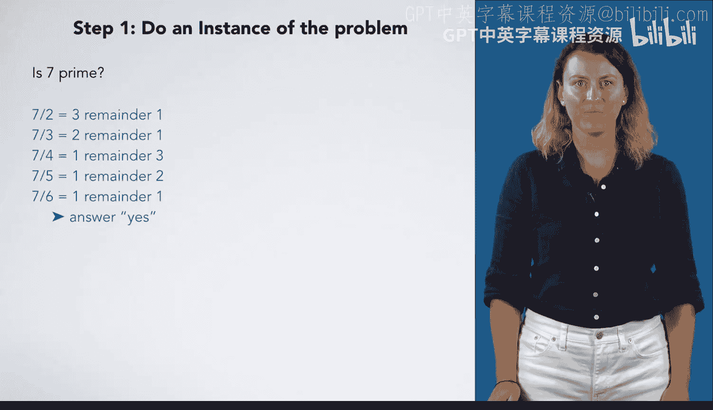

# 039：规划isprime函数 📝



在本节课中，我们将学习如何规划和编写一个函数，该函数接收一个整数作为输入，并判断它是否为质数。

---

## 步骤一：手动计算至少一个实例

我们首先需要手动解决至少一个具体实例，以理解判断质数的过程。

以下是判断质数的步骤：

*   **检查数字7是否为质数**：我们可能会直接回答“是”，但这无助于我们建立通用的解题步骤。
*   **克服思维定式**：当我们已知答案时，很难看清背后的计算过程。有两种方法可以解决：
    *   **方法一**：思考如何向一个不相信的人逐步证明7是质数。
    *   **方法二**：思考一个更复杂、答案未知的问题，以观察自己采取的步骤。如果问题太大，可以先用这个步骤思路处理一个更简单的例子。

---

## 步骤二：分析一个更复杂的实例

为了看清步骤，我们分析一个更复杂的例子：判断29393是否为质数。

以下是判断29393是否为质数的计算过程：

*   29393除以2，得14696余1。
*   29393除以3，得9797余2。
*   29393除以4，得7348余1。
*   29393除以5，得5878余3。
*   29393除以6，得4898余5。
*   29393除以7，得4199余0。

因为29393能被7整除，所以答案是：**否**，29393不是质数。

现在，我们将上述操作精确地写下来：

1.  检查 `29393 % 2 == 0` 是否成立（即是否能被2整除）。不成立。
2.  检查 `29393 % 3 == 0` 是否成立。不成立。
3.  检查是否能被4整除。
4.  检查是否能被5整除。
5.  检查是否能被6整除。
6.  检查 `29393 % 7 == 0` 是否成立。**成立**。
7.  当发现它能被7整除时，得出“不是质数”的结论。

---

## 步骤三：回到简单实例并记录步骤

上一节我们通过复杂实例理清了判断步骤，现在我们可以回到数字7，并记录下判断过程。

以下是判断7是否为质数的计算过程：

*   7除以2，得3余1。
*   7除以3，得2余1。
*   7除以4，得1余3。
*   7除以5，得1余2。
*   7除以6，得1余1。

此时，我得出结论：**是**，7是质数。因为我尝试了从2到6的所有数字，发现7不能被其中任何一个整除。

现在，为这个实例写下精确步骤：

1.  检查 `7 % 2 == 0`。不成立。
2.  检查 `7 % 3 == 0`。不成立。
3.  检查 `7 % 4 == 0`。
4.  检查 `7 % 5 == 0`。
5.  检查 `7 % 6 == 0`。
6.  在检查了所有上述情况并确认结果均为“否”之后，得出“是质数”的结论。

---



## 总结

本节课中，我们一起学习了规划 `isprime` 函数的前期步骤。我们通过手动计算具体实例（包括质数7和非质数29393），分解并记录了判断一个数是否为质数的逐步过程。核心思路是：**用从2到n-1的所有整数依次尝试整除目标数，如果发现任何一个能整除，则该数不是质数；如果全部都不能整除，则该数是质数**。这个过程可以用以下代码逻辑概括：

```c
for (int i = 2; i < n; i++) {
    if (n % i == 0) {
        return 0; // 不是质数
    }
}
return 1; // 是质数
```

这为下一步将思路转化为正式的C语言函数代码打下了坚实的基础。