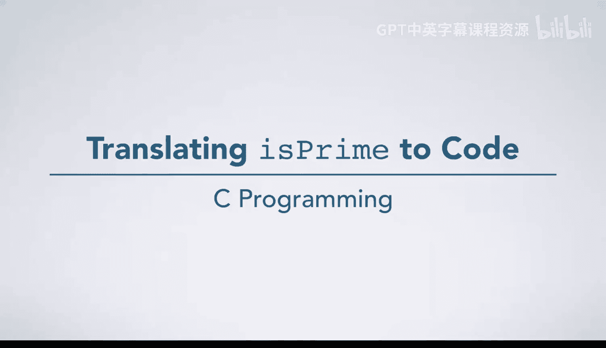
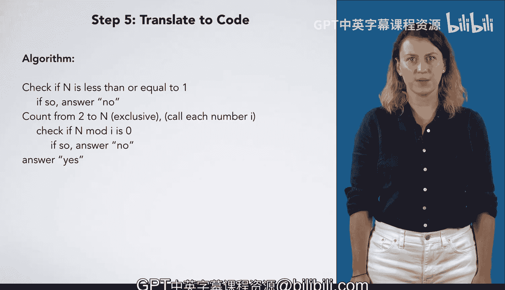
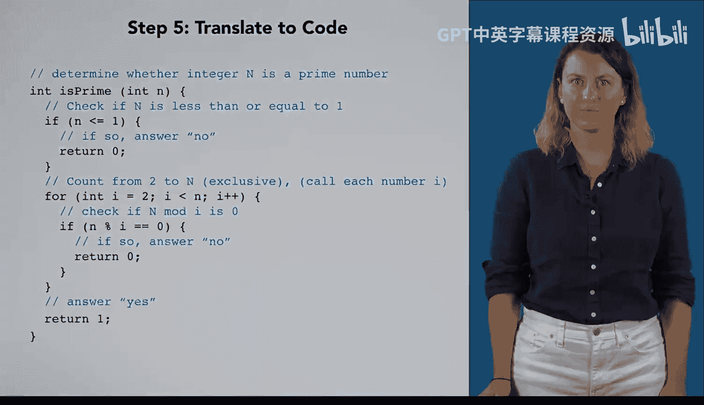

# 041：将isprime算法转化为代码 🧮



在本节课中，我们将学习如何将判断一个数是否为质数的算法步骤，逐行转化为可运行的C语言代码。我们将从函数声明开始，逐步实现条件判断、循环和返回逻辑。

---

上一节我们讨论了判断质数的算法逻辑。本节中，我们来看看如何将这些逻辑步骤转化为具体的C语言代码。

首先，我们将算法步骤作为注释写入代码中，以便逐行进行翻译和实现。



```c
// 函数声明开始
int isPrime(int n) {
    // 步骤1: 检查 n 是否小于等于 1
    // 步骤2: 从 2 到 n-1 进行循环计数
    // 步骤3: 检查 n 是否能被当前计数值整除
    // 步骤4: 根据检查结果返回是或否
}
```

---

接下来，我们实现第一个步骤：检查输入的数字 `n` 是否小于或等于1。这是一个条件判断，我们使用 `if` 语句来实现。

如果条件为真（即 `n <= 1`），我们知道这个数不是质数，需要立即返回 `0`（在C语言中通常用 `0` 表示“假”或“否”）。我们使用 `return` 语句来结束函数。

```c
int isPrime(int n) {
    // 步骤1: 检查 n 是否小于等于 1
    if (n <= 1) {
        return 0; // 不是质数
    }
    // ... 后续代码
}
```

---

上一节我们介绍了初始条件检查。现在，我们来实现算法的核心循环部分。

我们需要从 `2` 开始，一直计数到 `n-1`，并将每个计数值称为 `i`。这对应一个 `for` 循环结构。

以下是 `for` 循环的组成部分：
*   **初始化**：`int i = 2`
*   **条件**：`i < n` （计数到 n 之前停止）
*   **递增**：`i++` （每次计数加1）

循环体内部将包含我们对每个 `i` 要执行的操作。

```c
int isPrime(int n) {
    if (n <= 1) {
        return 0;
    }
    // 步骤2: 从 2 到 n-1 进行循环计数
    for (int i = 2; i < n; i++) {
        // 循环体：对每个 i 执行的操作
    }
}
```

---

循环已经建立。在循环体内，我们需要检查当前的 `n` 是否能被当前的 `i` 整除。

这又是一个条件判断，我们使用 `if` 语句。条件表达式是 `n % i == 0`，其中 `%` 是取模运算符，用于计算余数。如果余数为 `0`，说明 `n` 能被 `i` 整除。

如果这个条件为真，那么 `n` 不是质数，我们同样立即返回 `0`。

```c
int isPrime(int n) {
    if (n <= 1) {
        return 0;
    }
    for (int i = 2; i < n; i++) {
        // 步骤3: 检查 n 是否能被当前计数值 i 整除
        if (n % i == 0) {
            return 0; // 发现能整除的数，不是质数
        }
    }
    // ... 后续代码
}
```

---

最后，我们需要处理循环结束后的情况。如果函数执行到这里，意味着：
1.  `n` 大于1。
2.  循环从 `2` 到 `n-1` 检查了所有可能的除数。
3.  没有发现任何一个 `i` 能整除 `n`。

因此，我们可以确定 `n` 是质数，并返回 `1`（表示“真”或“是”）。

```c
int isPrime(int n) {
    if (n <= 1) {
        return 0;
    }
    for (int i = 2; i < n; i++) {
        if (n % i == 0) {
            return 0;
        }
    }
    // 步骤4: 循环结束未提前返回，说明是质数
    return 1;
}
```

此外，我们遵循一个常见的编程惯例：变量名通常使用小写字母。全大写名称通常预留给常量使用。因此，我们将函数参数命名为小写的 `n`。

---

本节课中我们一起学习了如何将质数判断算法转化为C语言函数。我们逐步实现了：
1.  使用 `if` 语句处理边界条件（`n <= 1`）。
2.  使用 `for` 循环遍历从 `2` 到 `n-1` 的所有整数。
3.  在循环内使用 `if` 语句和取模运算符 `%` 检查整除性。
4.  根据检查结果，使用 `return` 语句提前返回 `0`（非质数）或最终返回 `1`（质数）。



最终，我们得到了一个完整可用的 `isPrime` 函数。