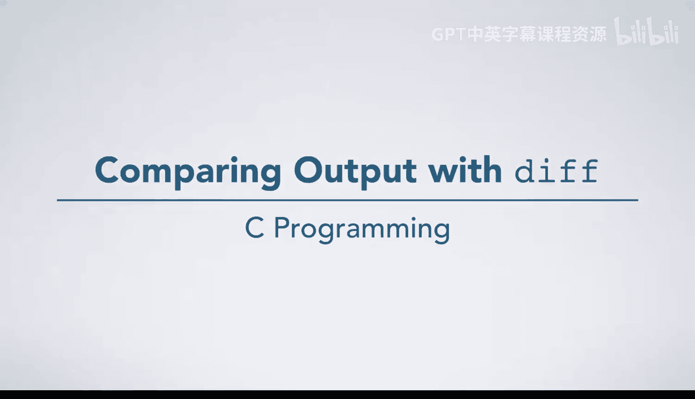
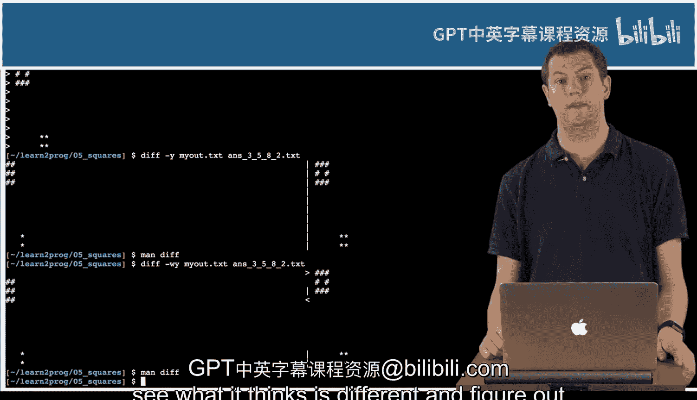

# 042：使用diff比较输出



## 概述
在本节课中，我们将学习一个非常实用的Unix工具——`diff`。这个工具用于比较两个文件的内容，并指出它们之间的差异。在编程作业中，你可以用它来比较你的程序输出与标准答案是否一致。

## 使用diff比较文件
上一节我们介绍了Unix环境下的基本操作，本节中我们来看看如何使用`diff`命令来比较文件内容。

假设我们有一个编程作业，需要编写一个程序来打印特定模式的方块。我们已经有一个标准输出文件 `ants_3582.txt`，以及自己程序编译后生成的 `squares` 可执行文件。

运行自己的程序并将输出重定向到一个文件，而不是直接打印到屏幕，这是一种常见的做法。命令如下：
```bash
./squares 3582 > my_output.txt
```
现在，我们有了自己的输出文件 `my_output.txt`。

## 比较输出文件
以下是使用`diff`命令比较两个文件的步骤。

首先，使用`cat`命令查看文件内容，进行初步的人工检查。
```bash
cat my_output.txt
cat ants_3582.txt
```
对于简单输出，人工检查可能足够。但对于复杂或大量的输出，人工检查会变得繁琐且容易出错。

此时，使用`diff`命令进行精确比较：
```bash
diff my_output.txt ants_3582.txt
```
如果两个文件内容完全相同，`diff`命令将不会有任何输出，这表示你的程序输出是正确的。

## 理解diff的输出格式
如果文件内容不同，`diff`会显示差异。其默认输出格式可能看起来有些奇怪。

*   以 `<` 开头的行表示该行存在于第一个文件（即`diff`命令的第一个参数）中，但不存在于第二个文件中。
*   以 `>` 开头的行表示该行存在于第二个文件中，但不存在于第一个文件中。

为了获得更直观的对比，可以使用 `-y` 选项进行并排显示：
```bash
diff -y my_output.txt ants_3582.txt
```
在并排视图中，中间会有一条竖线分隔两列，竖线两侧不同的行会被高亮显示，帮助你快速定位差异。

## 处理空白字符差异
有时，两个文件的差异可能仅仅在于空格、制表符或空行的数量。`diff`默认会将这些空白字符的差异也标记出来。

如果你希望`diff`在比较时忽略所有空白字符的差异，可以使用 `-w` 选项：
```bash
diff -w my_output.txt ants_3582.txt
```
使用 `-w` 选项需要谨慎，因为它可能会掩盖一些真正的逻辑错误。例如，一个本应有空格分隔的单词，如果漏掉了空格，`-w`选项会认为两者相同。

`diff`命令还有其他处理空白字符的选项。你可以通过查阅手册页来了解更多：
```bash
man diff
```
在手册页中搜索“white space”或“blank”，可以找到例如忽略行尾空格等更精细的控制选项。



## 总结
本节课中我们一起学习了`diff`工具的使用。我们了解了如何用它来比较程序输出文件与标准答案文件，如何解读其输出结果，以及如何使用 `-y` 选项进行并排对比和 `-w` 选项来忽略空白差异。掌握`diff`是验证程序输出正确性的高效方法，在后续的编程作业中你会经常用到它。