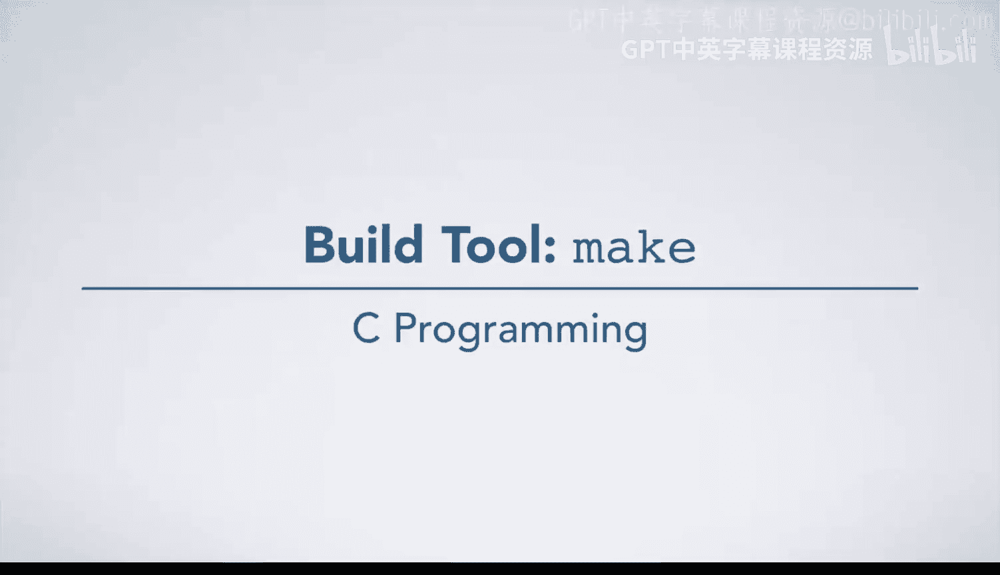
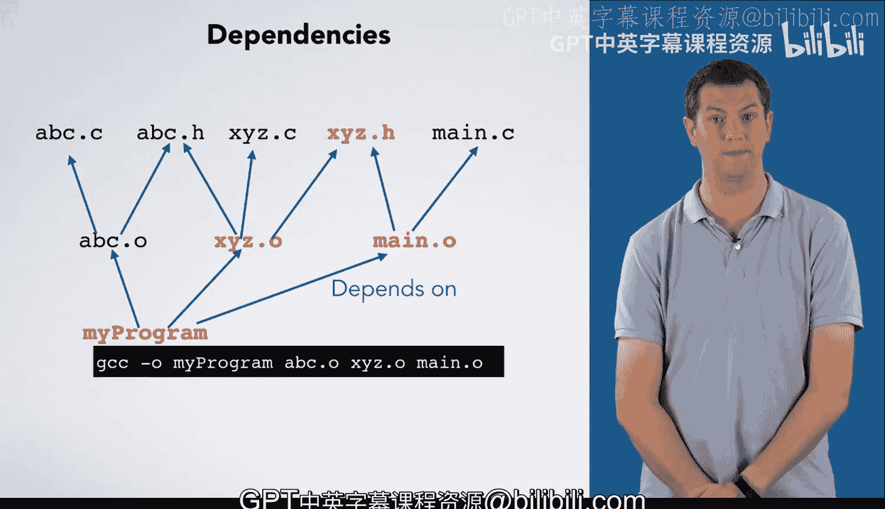

# 043：构建工具Make

## 概述
在本节课中，我们将要学习如何使用构建工具`make`来管理大型C语言项目的编译过程。我们将了解`make`如何通过分析文件之间的依赖关系，只重新编译那些发生变化的文件，从而显著提升开发效率。

## 从GCC到Make
上一节我们介绍了使用GCC编译器的基础知识。当然，你可以给GCC添加一些编译选项，以便它能更努力地识别代码中的潜在问题。

但是，如果你有一个非常庞大的程序，比如包含数百个源文件和成千上万行代码，该怎么办？

你可以直接告诉GCC编译当前目录下的所有`.c`文件，例如使用`gcc *.c`。但这意味着即使你只对代码做了一处微小的修改，也需要重新编译每一个文件。这将耗费大量时间，严重影响你的开发效率。

你也可以尝试手动挑选出需要重新编译的文件。但这个过程既繁琐又容易出错。如果你遗漏了某个文件，最终可能会导致程序出现奇怪的错误。

那么，你应该怎么做？你应该使用一个专门用于构建大型程序的工具，例如`make`。`make`不仅适用于构建大型程序，实际上几乎可以用于构建任何东西。例如，本课程所基于的教科书就是使用`make`构建的。

## Makefile：构建的蓝图
`make`工具的输入是一个名为`Makefile`的文件。这个文件指定了构建的目标，即`make`应该为你构建哪些东西。

它同时还指定了依赖关系，你可以将其理解为构建一个目标所需的输入文件。如果某个依赖文件发生了变化，那么对应的目标就需要被重新构建。一个目标也可能是另一个目标的依赖项，在这种情况下，重建第一个目标就意味着你必须重建第二个目标。

`Makefile`还指定了从依赖文件构建目标的配方。这些就是运行`make`时，为了从依赖文件生成目标文件所需要执行的命令。

## 深入理解依赖关系
为了更好地理解依赖关系，让我们假设你想要构建一个名为`myprogram`的程序。

为了构建`myprogram`，你需要链接三个目标文件，如下图所示。这意味着`myprogram`依赖于这三个文件。如果其中任何一个文件被重新编译，我们就需要重新链接`myprogram`。

如果`abc.o`是从`abc.c`编译而来的，那么这两个文件之间也存在依赖关系。同样地，如果`abc.c`包含了`abc.h`头文件，那么每当我们更改这个头文件时，我们就希望重新编译`abc.o`目标文件。

同理，`xyz.o`可能依赖于一个`.c`文件和一些头文件。在开发大型项目时，我们可能会在多个`.c`文件中包含同一个头文件。

最后，`main.o`依赖于`main.c`和我们的一个头文件。

现在，如果我们更改了`xyz.c`，由于`xyz.o`依赖于`xyz.c`，我们需要重新编译`xyz.o`。我们不需要重新编译其他任何目标文件。但是，由于`myprogram`依赖于`xyz.o`，我们需要重新链接我们的程序。

如果我们更改了`xyz.h`头文件，我们将需要重新编译两个目标文件，然后重新链接程序。

幸运的是，一旦我们告诉`make`这些依赖关系以及构建目标所需的命令，它就会自动计算出哪些目标需要被重新构建，并为我们运行相应的命令。

## 总结
本节课中，我们一起学习了构建工具`make`的核心概念。我们了解到，对于大型项目，手动管理编译既低效又易错。`make`通过读取`Makefile`文件，智能地分析目标、依赖和构建命令，只重新编译发生变化的文件及其依赖项，从而极大地提升了构建效率。理解并正确设置文件间的依赖关系，是高效使用`make`的关键。