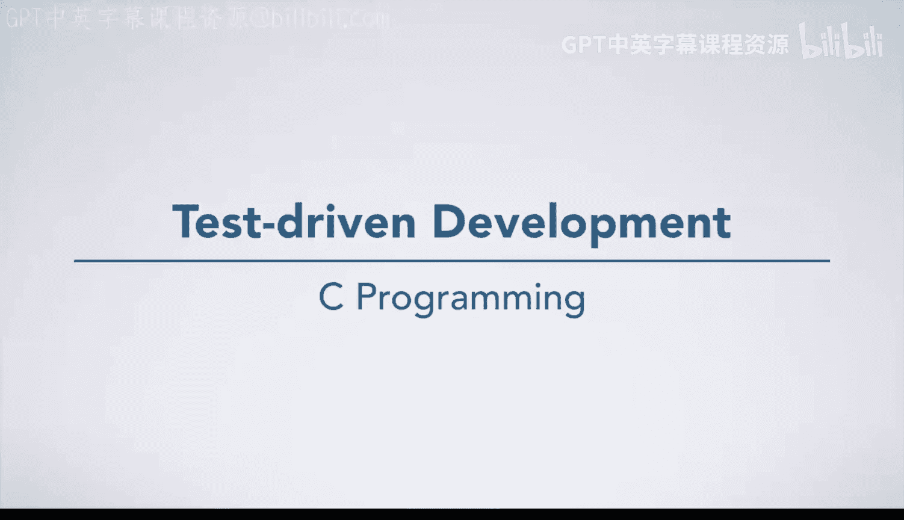

# 046：测试驱动开发

在本节课中，我们将探讨软件开发中的一个重要实践——测试驱动开发。我们将回顾七步法，并重点讲解如何将测试的思维提前到编码之前，以构建更健壮的程序。

## 回顾七步法中的测试环节

上一节我们介绍了软件开发的整体流程。现在，让我们回顾一下七步法。

在七步法中，测试是第六步，位于设计算法并将其转化为代码之后。此时，许多程序员，甚至是有经验的程序员，都急于完成问题。这种急切的心态有时会导致程序员对测试的重视程度远低于其实际所需。他们可能只运行少数几个测试用例，就宣称代码可以工作。然而，测试代码非常重要，不应被如此草率地对待。

## 从早期步骤中获取测试用例

为了更好地进行测试，我们可以将目光回溯到更早的步骤。

在第一步（理解问题并手工计算实例）中，你已经通过手工计算得出了特定输入对应的正确输出。这些**输入和输出**就可以作为我们的测试用例，尤其是我们已经有了用于比对的正确答案。

事实上，如果我们采用这种方法，可能会应用**黑盒测试**的思想，在第一步就为我们认为困难的情况设计测试用例。也就是说，我们甚至可以在开始编码之前，就思考这个问题的难点所在，并在第一步中使用这些难点案例。

## 为何要提前设计测试用例？

我们为什么要这样做？这不仅能为我们在进行到第六步时准备好一套完善的测试用例，而且越早思考这些困难案例，后期需要修改的地方就越少。如果我们第一次就能全部处理正确，那是最好的。

这种**先编写测试用例**的理念实际上有一个专门的名称。

## 测试驱动开发简介

这种方法被称为**测试驱动开发**，并在工业界得到广泛应用。这个过程与七步法自然契合，因为在第一步中开发这些测试用例非常有效。在本课程的后续部分，我们会要求你在一些作业中使用这个理念。

**测试驱动开发的核心流程**是：先编写测试用例，然后开始开发你的代码。

## 总结

本节课中，我们一起学习了测试驱动开发的基本概念。我们认识到，将测试的考量提前到编码之初，不仅有助于在开发后期进行系统验证，更能促使我们在设计阶段就深入思考问题的边界与难点，从而编写出更加可靠和健壮的代码。记住这个简单的公式：**先测试，后编码**。