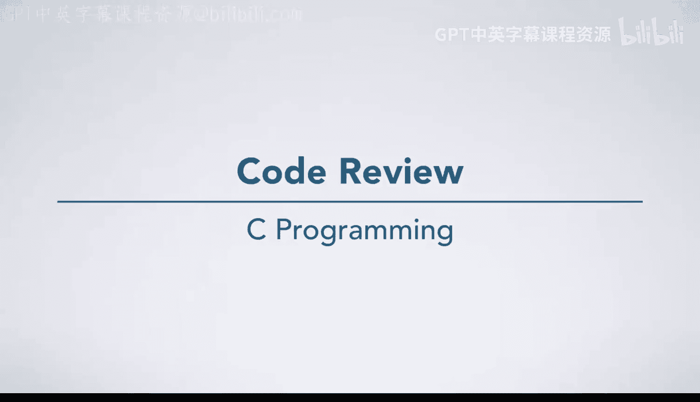
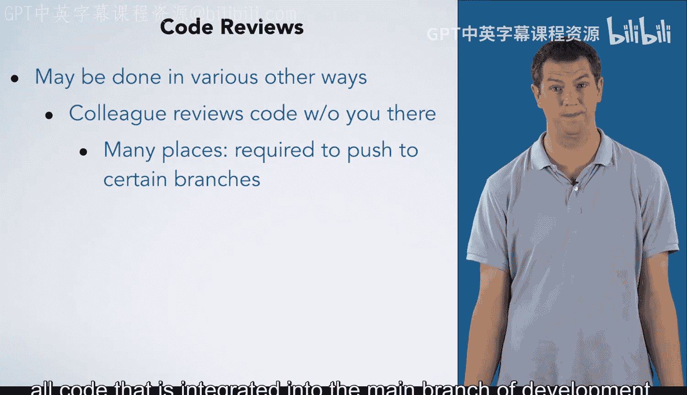

# 047：代码审查

## 概述
在本节课中，我们将学习代码审查的概念、重要性及其多种实践形式。代码审查是确保代码质量、可读性和可维护性的关键环节，它超越了单纯的功能测试。

## 测试的局限性
上一节我们介绍了测试的重要性，本节中我们来看看测试的局限性。测试非常有用，你需要疯狂地测试你的代码，并编写大量复杂的测试用例，以便发现代码中的问题。

然而，测试有其局限性。首先，你永远无法编写足够多的测试用例来保证代码完全正确。即使你编写了一百万个非常巧妙且复杂的测试用例，你的代码仍有可能在第一百万零一个测试用例上失败。

此外，测试只能告诉你代码的功能行为是否正确，即它是否产生了正确的输出。测试无法告诉你代码是否具有可读性、是否使用了良好的变量名、是否编写了适当的文档，或是否存在其他风格上的问题。当你专注于让代码运行时，这些问题听起来可能不那么重要。但是，当你参与需要多名团队成员协作、持续数月或数年的大型项目时，这些问题就变得至关重要。

## 代码审查：提升代码质量的另一种方式
因此，另一种帮助你确保高质量代码的方法是进行代码审查。

在工作环境中，与一位同事（通常是你的团队成员）坐下来，逐行检查你的代码。解释每一行代码的作用及其原因。你甚至可以边检查边绘制代码执行的示意图，以确保双方对代码中发生的事情有完全一致的理解。

在这个过程中，你的同事会向你提问并指出潜在问题。他们可能会指出他们认为你未考虑到的用例。如果你认为你已经考虑到了，你们可以讨论你的代码如何处理该用例，以及如何让未来的代码阅读者更清楚地理解这一点。他们也可能指出你的代码在文档或其他可读性方面需要改进的地方。当然，他们还可能发现其他潜在问题，范围从安全漏洞到向用户打印的信息表述不当。

## 代码审查的多种形式
代码审查可以采取多种形式，而不仅仅是我们刚才讨论的那种。

你的同事也可能在你不在场的情况下审查你的代码。事实上，在许多公司中，代码在被推送到Git仓库的主分支等特定分支之前，必须经过同行审查。这确保了所有集成到开发主分支的代码都符合特定的质量准则。

审查甚至可以在编写代码时进行，这就是结对编程中发生的情况。

在结对编程中，一位伙伴担任“驾驶员”，负责编写代码；另一位伙伴担任“领航员”，负责观察驾驶员的操作、寻找问题并思考代码的宏观走向。

我们不会深入探讨这些主题，但如果你继续学习更多软件工程课程，你几乎肯定会学到更多关于代码审查的知识，我们在此提及是为了让你有所了解。

## 总结
本节课中我们一起学习了代码审查。我们了解到，虽然测试至关重要，但它无法覆盖代码质量的所有方面，如可读性和可维护性。代码审查通过同行协作，逐行检查代码，能够发现潜在问题、改进文档和风格，是确保高质量代码实践的关键组成部分。我们还简要了解了代码审查的多种形式，包括正式审查和结对编程。