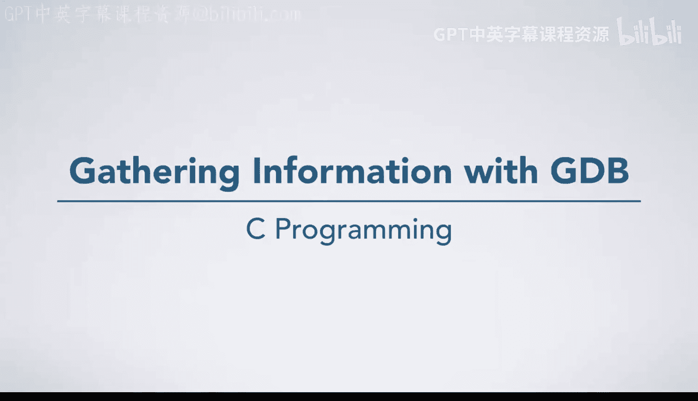
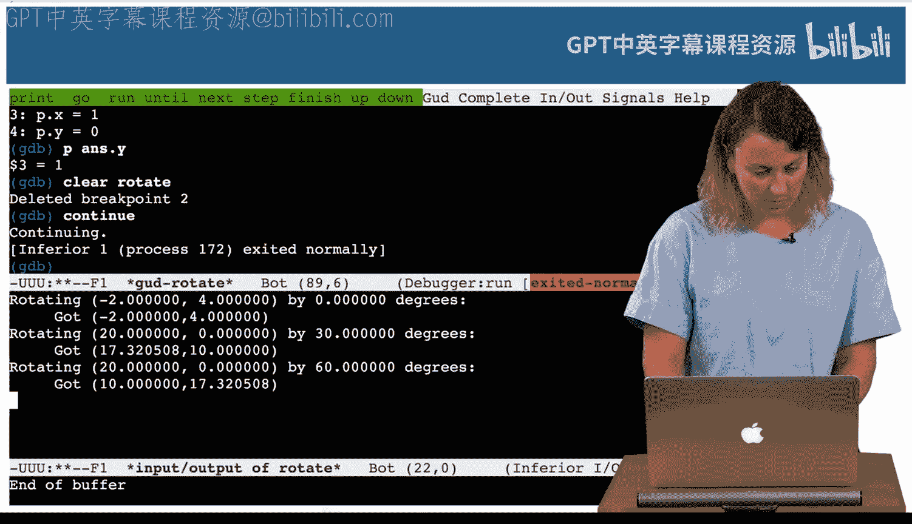

# 049：使用GDB收集信息 🐛



在本节课中，我们将学习如何使用GDB（GNU调试器）来定位和修复C语言程序中的错误。我们将通过一个名为`rotate`的程序实例，演示如何设置断点、检查变量值、单步执行代码，并最终解决一个逻辑错误。

## 程序概述与问题发现

Drew给了我一个名为`rotate`的程序，并告知其中存在一个错误。让我们先查看这个程序，了解它预期完成的功能，然后尝试找出这个错误。

程序`rotate.c`的`main`函数调用了`test_rotate`。这个程序的功能是：给定一个点（例如`(1,0)`）和一个旋转角度（例如`90`度），计算旋转后的点坐标并输出。在`test_rotate`函数中，我们使用点`(1,0)`和角度`90`进行测试，期望得到的旋转结果是`(0,1)`。`test_rotate`函数会通过断言来验证输出是否符合预期。

以下是`test_rotate`函数的核心部分：
```c
assert(rotated.x == expected.x);
assert(rotated.y == expected.y);
```
该函数会调用`rotate`函数，传入一个点和旋转角度。`rotate`函数通过调用数学头文件`math.h`中的三角函数`cosine`和`sine`来完成旋转计算。

当我们运行程序时，第一个测试用例（将`(1,0)`旋转`90`度）失败了。断言失败信息指向了y值的比较，这意味着程序在计算y坐标时出现了问题。

## 使用GDB进行调试

回到编辑器，我们可以运行调试器来观察程序运行时的变量值，从而找出不符合预期的行为。启动GDB后，程序会在进入`main`函数后暂停。由于问题很可能不在`main`函数本身，而在`test_rotate`调用的`rotate`函数中，我们可以将注意力集中在那里。

为了深入调查，我们可以在`rotate`函数内部设置一个断点。这样，当程序执行到该函数时就会暂停，允许我们检查此时的状态。

以下是设置断点并检查变量的步骤：
1.  在`rotate`函数入口处设置断点。
2.  继续运行程序直到断点处。
3.  使用`display`命令持续显示我们关心的变量值，例如`p.x`和`p.y`。

执行这些步骤后，我们观察到输入值`p.x`和`p.y`分别是`1`和`0`，符合预期。接着单步执行代码。

## 定位并分析错误

单步执行时，我们意外地进入了`sin`函数。由于我们对此不感兴趣，可以使用`finish`命令跳出该函数，回到`rotate`函数中。

继续执行下一行代码后，我们发现`p.x`的值变成了一个极小的数（接近0），这符合我们的预期（旋转后x坐标应为0）。然而，再执行一行后，`p.y`的值也变成了一个极小的数，而不是我们期望的`1`。

问题出在计算`p.y`的公式上：
```c
p.y = p.x * sin(theta) + p.y * cos(theta);
```
输入的`p.x`是`1`，`sin(90)`是`1`，所以这部分应为`1`。输入的`p.y`是`0`，`cos(90)`是`0`，所以这部分应为`0`。整个表达式理应是`1 + 0`，但结果却是`0`。

原因在于，我们在计算`p.y`时，使用的`p.x`已经是在前一行代码中被修改过的值（即旋转后的新x值，接近0），而不是原始的输入值`1`。这导致了计算错误。

## 修复程序错误

要解决这个问题，我们需要保留输入点`(x, y)`的原始值。一个有效的方法是创建一个新的`point`结构体变量（例如命名为`answer`），将计算结果分别赋值给`answer.x`和`answer.y`，最后返回这个`answer`。

修改后的`rotate`函数核心部分如下：
```c
struct point answer;
answer.x = p.x * cos(theta) - p.y * sin(theta);
answer.y = p.x * sin(theta) + p.y * cos(theta);
return answer;
```

保存修改后，重新编译程序，并再次使用GDB进行验证。在同样的断点处，我们检查`p.x`和`p.y`，确认它们保持了原始的输入值`(1,0)`。单步执行后，检查`answer.x`（接近0）和`answer.y`（为1），均符合预期。这表明错误已被修复。

清除断点，让程序运行完毕。程序成功通过了所有测试用例，包括将`(1,0)`旋转`90`度得到`(0,1)`，以及将`(0,1)`旋转`90`度得到`(-1,0)`等。所有断言均未触发失败，程序运行正确。

## 总结



本节课中，我们一起学习了使用GDB调试C程序的基本流程。我们通过一个具体的bug修复案例，实践了如何设置断点、单步执行、检查变量值，并分析了错误的根本原因——**在计算过程中意外修改了后续计算所需的原始数据**。最终的解决方案是**使用临时变量来保存计算结果，避免覆盖输入参数**。掌握这些调试技巧对于理解和解决编程中的逻辑错误至关重要。